# GMY Soru Atlası 2021–2025

Gümrük Müşavir Yardımcılığı sınavının 2021, 2022, 2023, 2024 ve 2025 yıllarına ait A kitapçıklarındaki **500 sorunun** konu, soru kalıbı, soru tipi ve dayandığı mevzuata göre analizi. Etkileşimli sürüm: `GMY_Soru_Atlasi.html` (tarayıcıda açın).

## İçindekiler

1. [Sınavın yapısı](#1-sınavın-yapısı)
2. [Yıl yıl analiz](#2-yıl-yıl-analiz)
3. [Yılların karşılaştırması](#3-yılların-karşılaştırması)
4. [Sonuç: en çok neyden, nasıl soruluyor?](#4-sonuç-en-çok-neyden-nasıl-soruluyor)
5. [Yöntem ve dosyalar](#5-yöntem-ve-dosyalar)

## 1. Sınavın yapısı

| Bölüm | Soru no | 2021 | 2022 | 2023 | 2024 | 2025 |
|---|---|---|---|---|---|---|
| Türkçe | 1–5 | 5 | 5 | 5 | 5 | 5 |
| Matematik | 6–10 | 5 | 5 | 5 | 5 | 5 |
| Tarih (İnkılap) | 11–15 | 5 | 5 | 5 | 5 | 5 |
| Anayasa / Vatandaşlık | 16–20 | 5 | 5 | 5 | 5 | 5 |
| Gümrük Mevzuatı | 21–100 | 80 | 80 | 80 | 80 | 80 |

Sınav her yıl 100 soru / 150 dakika; puanın **%80'i gümrük mevzuatından** geliyor.

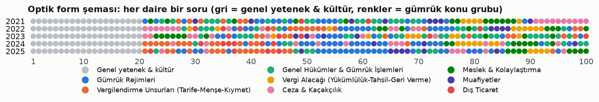

## 2. Yıl yıl analiz

### 2021

- Sınavı Ankara Üniversitesi (ASYM) hazırladı; 2022'den itibaren Hacettepe Üniversitesi hazırlıyor. 2021'in konu dağılımı bu yüzden diğer yıllardan belirgin biçimde farklı.
- En çok soru Kaçakçılık (5607) konusundan geldi: 10 soru, üstelik 91–100 arası bloğun tamamı. Beş yıl içinde tek bir konudan yılda gelen en yüksek ikinci sayı bu.
- Gümrük Müşavirliği & Temsil ve Muafiyetler 8'er soruyla ikinci sırada. Liman bayileri, kabotaj, posta kolisi listesi gibi özel işlemler (6 soru) ile tasfiye (5 soru) yalnızca bu yıl bu kadar ağırlık taşıdı.
- Gümrük Kanunu'nun idari para cezaları (md. 234–241) hiç sorulmadı. Ceza ağırlığı tamamen 5607'de.
- Soru tipinde tanım soruları zirvede (15). "Ne ad verilir" kalıbı çok sık (çeki listesi, proforma fatura, üçgen trafik, ulusal transit).
- Kalıp: %58 olumlu, %34 olumsuz kök, 7 öncüllü ve 1 eşleştirme (kontrol hatlarının renkleri). Matematikte işlem ve örüntü, tarihte Millî Mücadele ağırlıktaydı.

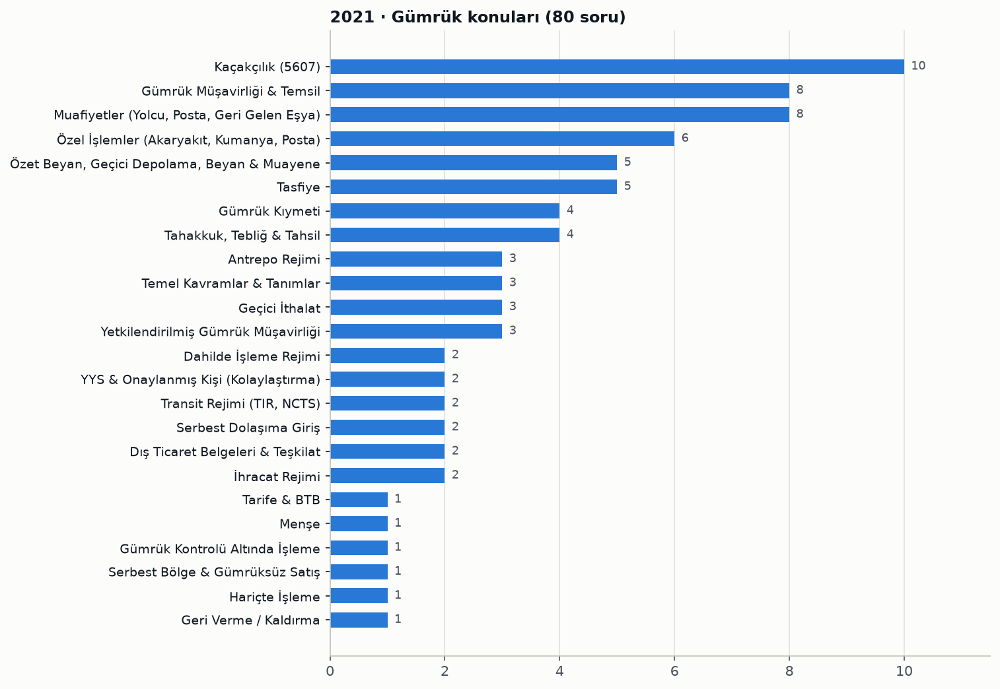

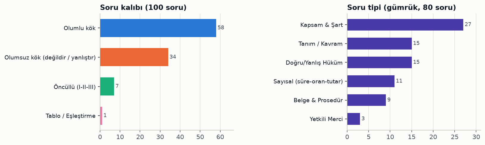

Konu tablosu ve soru numaraları

| Konu | Soru | Soru numaraları |
|---|---|---|
| Kaçakçılık (5607) | 10 | 91, 92, 93, 94, 95, 96, 97, 98, 99, 100 |
| Gümrük Müşavirliği & Temsil | 8 | 22, 37, 76, 77, 83, 84, 85, 86 |
| Muafiyetler (Yolcu, Posta, Geri Gelen Eşya) | 8 | 30, 40, 58, 64, 72, 73, 74, 90 |
| Özel İşlemler (Akaryakıt, Kumanya, Posta) | 6 | 32, 59, 65, 67, 69, 70 |
| Özet Beyan, Geçici Depolama, Beyan & Muayene | 5 | 24, 33, 36, 50, 51 |
| Tasfiye | 5 | 34, 56, 60, 62, 63 |
| Gümrük Kıymeti | 4 | 29, 31, 35, 39 |
| Tahakkuk, Tebliğ & Tahsil | 4 | 78, 79, 81, 88 |
| Antrepo Rejimi | 3 | 23, 41, 54 |
| Temel Kavramlar & Tanımlar | 3 | 26, 43, 66 |
| Geçici İthalat | 3 | 45, 53, 75 |
| Yetkilendirilmiş Gümrük Müşavirliği | 3 | 48, 57, 87 |
| Dahilde İşleme Rejimi | 2 | 21, 89 |
| YYS & Onaylanmış Kişi (Kolaylaştırma) | 2 | 25, 82 |
| Transit Rejimi (TIR, NCTS) | 2 | 28, 47 |
| Serbest Dolaşıma Giriş | 2 | 42, 55 |
| Dış Ticaret Belgeleri & Teşkilat | 2 | 49, 61 |
| İhracat Rejimi | 2 | 68, 71 |
| Tarife & BTB | 1 | 27 |
| Menşe | 1 | 38 |
| Gümrük Kontrolü Altında İşleme | 1 | 44 |
| Serbest Bölge & Gümrüksüz Satış | 1 | 46 |
| Hariçte İşleme | 1 | 52 |
| Geri Verme / Kaldırma | 1 | 80 |

Tüm sorular: konu, kalıp, tip ve öğrenilecek bilgi

| No | Cvp | Konu / alt konu | Kalıp | Tip | Öğrenilecek bilgi |
|---|---|---|---|---|---|
| 1 | D | Paragraf · Düşünceyi geliştirme yolları | Olumlu kök | Yorum / Çıkarım | Metinde düşünce oran, miktar ve yıllara ait rakamlarla desteklendiği için 'sayısal verilerden yararlanma' yolu kullanılmıştır. |
| 2 | E | Sözcükte Anlam / Deyim · Sözcükte gerçek anlam | Olumlu kök | Dil Kuralı | 'Ağacın dalları' ifadesindeki 'dal' gerçek anlamdadır; yıldız (ünlü sporcu), yüreksiz (korkak), ağaç denizi (çokluk) ve keçi (inatçı) mecaz anlamdadır. |
| 3 | C | Yazım & Noktalama · -ki eki ve ki bağlacının yazımı | Olumlu kök | Dil Kuralı | Bulunma ekinden (-de) sonra gelen sıfat yapan -ki eki bitişik yazılır; 'gerisinde ki' yerine 'gerisindeki' yazılmalıdır. |
| 4 | B | Dil Bilgisi · Gizli özne | Olumlu kök | Dil Kuralı | 'Satın almadım' yüklemindeki birinci tekil kişi eki öznenin 'ben' olduğunu gösterir; özne cümlede yazılmadığı için gizli öznedir (edilgen cümlelerdeki özne ise sözde öznedir). |
| 5 | A | Dil Bilgisi · Fiilden isim yapım eki | Olumlu kök | Dil Kuralı | 'Güleç' sözcüğü 'gül-' fiiline -eç eki getirilerek türetilmiş bir addır; borçlu, yoldaş, sarımtırak ve balıkçıl isim kök veya gövdelerinden türemiştir. |
| 6 | C | Temel İşlem & Sayılar · Çarpımlar toplamı farkı | Olumlu kök | Hesaplama | A=2+12+30+56+90=190 ve B=3+15+35+63+99=215 olduğundan B-A=25'tir. |
| 7 | A | Temel İşlem & Sayılar · İşlem tanımlama | Olumlu kök | Hesaplama | 4♦3=4+3-1=6 ve 6&2=6-2+3=7 olduğundan sonuç 7'dir. |
| 8 | D | Temel İşlem & Sayılar · Harf örüntüsü | Olumlu kök | Hesaplama | Örüntü 8 harfte bir tekrarlandığından 77'nin 8'e bölümünden kalan 5'tir ve 5. harf 'O'dur. |
| 9 | B | Problemler · Yaş problemi | Olumlu kök | Hesaplama | B+Ç=58 ve B-4=5(Ç-8)-2 denklemlerinden çocukların yaş toplamı 16, babanın yaşı 42 bulunur. |
| 10 | C | Problemler · Ağırlıklı ortalama | Olumlu kök | Hesaplama | Grup ortalaması (12×48+8×68)/20=1120/20=56 kg'dır. |
| 11 | A | Millî Mücadele · Milli Mücadele dönemi gazeteleri | Olumlu kök | Olgu Bilgisi | İrade-i Milliye, Sivas Kongresi'nden sonra Anadolu ve Rumeli Müdafaa-i Hukuk Cemiyeti'nin yayın organı olarak Sivas'ta çıkarılmıştır. |
| 12 | E | Millî Mücadele · Mudanya Ateşkes Antlaşması | Olumsuz kök (değildir / yanlıştır) | Olgu Bilgisi | Mudanya Mütarekesi'ni TBMM Hükümeti ile İngiltere, Fransa ve İtalya imzalamış (Yunanistan sonradan katılmış); Almanya taraf değildir. |
| 13 | D | Millî Mücadele · II. Dönem TBMM faaliyetleri | Olumlu kök | Olgu Bilgisi | Lozan Barış Antlaşması 23 Ağustos 1923'te II. Dönem TBMM tarafından onaylanmıştır; diğer seçenekler I. TBMM dönemine aittir. |
| 14 | C | İnkılaplar & Atatürk İlkeleri · Millet Mektepleri | Olumlu kök | Olgu Bilgisi | Millet Mektepleri 1928'de yeni Türk alfabesinin halka öğretilmesi ve yaygınlaştırılması amacıyla açılmıştır. |
| 15 | B | İnkılaplar & Atatürk İlkeleri · Halkçılık ilkesi | Olumlu kök | Tanım / Kavram | Fert, aile ve sınıf ayrıcalığını reddederek kanun önünde eşitliği ve ayrıcalıksız toplumu öngören Atatürk ilkesi Halkçılıktır. |
| 16 | B | Temel Hukuk & Devletin Nitelikleri · Anayasanın tanımı | Olumlu kök | Tanım / Kavram | Devletin temel yapısını, yönetim biçimini, temel organlarını ve bunların ilişkilerini, bireyin hak ve ödevlerini düzenleyen üst hukuk kuralı anayasadır. |
| 17 | D | Uluslararası Kuruluşlar · AB kurucu üyeleri | Olumsuz kök (değildir / yanlıştır) | Olgu Bilgisi | AB'nin kurucu üyeleri Almanya, Fransa, İtalya, Belçika, Hollanda ve Lüksemburg'dur; Yunanistan sonradan (1981) katılmıştır. |
| 18 | E | Uluslararası Kuruluşlar · Türkiye'nin üyelikleri | Olumlu kök | Olgu Bilgisi | Türkiye 1952'den beri NATO üyesidir; BDT, AB, EFTA ve OPEC üyesi değildir. |
| 19 | C | Yürütme (Cumhurbaşkanı) · Cumhurbaşkanının görev ve yetkileri | Olumsuz kök (değildir / yanlıştır) | Kapsam & Şart | Yürütme yetkisi Cumhurbaşkanına, yasama yetkisi ise TBMM'ye aittir; Cumhurbaşkanı yasama yetkisini üstlenmez. |
| 20 | A | Seçimler · Milletvekili seçilme yaşı | Olumlu kök | Sayısal (süre-oran-tutar) | 2017 Anayasa değişikliğiyle 18 yaşını dolduran her Türk milletvekili seçilebilir. |
| 21 | A | Dahilde İşleme Rejimi · DİR şartlı muafiyet sistemi | Olumlu kök | Tanım / Kavram | Serbest dolaşımda olmayan eşyanın vergileri teminata bağlanarak DİR kapsamında ithal edilip işlem görmüş ürün olarak ihracında teminatın iade edildiği sisteme şartlı muafiyet sistemi denir. |
| 22 | C | Gümrük Müşavirliği & Temsil · Temsil hakkı | Olumsuz kök (değildir / yanlıştır) | Doğru/Yanlış Hüküm | Temsilci, temsil edilen kişi namına hareket ettiğini beyan etmek, temsilin doğrudan mı dolaylı mı olduğunu belirtmek ve temsil yetki belgesini ibraz etmek zorundadır. |
| 23 | B | Antrepo Rejimi · Antrepo işleticisi | Olumsuz kök (değildir / yanlıştır) | Doğru/Yanlış Hüküm | Gümrük antreposu işletme izni yalnızca Türkiye'de yerleşik kişilere verilir; yani yerleşik olma şartı aranır. |
| 24 | E | Özet Beyan, Geçici Depolama, Beyan & Muayene · Belge saklama süresinin başlangıcı | Olumsuz kök (değildir / yanlıştır) | Doğru/Yanlış Hüküm | Serbest dolaşıma giriş veya ihracat için beyan edilen eşyada beş yıllık belge saklama süresi, beyannamenin tescil edildiği yılın başından değil sonundan itibaren işlemeye başlar. |
| 25 | A | YYS & Onaylanmış Kişi (Kolaylaştırma) · Yetkilendirilmiş yükümlü statüsü şartları | Olumsuz kök (değildir / yanlıştır) | Kapsam & Şart | GK md. 5/A'daki şartlar ciddi ihlal bulunmaması, düzenli ticari kayıt, gerektiğinde mali yeterlilik ve uygun emniyet-güvenlik standartlarıdır; 'en az iki yıldır faaliyette bulunma' Kanun'daki şartlar arasında yer almaz. |
| 26 | D | Temel Kavramlar & Tanımlar · Gümrük rejimlerinin sayısı | Olumlu kök | Sayısal (süre-oran-tutar) | Gümrük Kanunu'nda 8 rejim vardır: serbest dolaşıma giriş, transit, gümrük antrepo, dahilde işleme, gümrük kontrolü altında işleme, geçici ithalat, hariçte işleme ve ihracat. |
| 27 | A | Tarife & BTB · Gümrük tarifesinin kapsamı | Olumsuz kök (değildir / yanlıştır) | Kapsam & Şart | Gümrük tarifesi TGTC'yi, ona dayanan diğer cetvelleri, anlaşmalarla veya tek taraflı tanınan tercihli tarifeleri ve eşyanın niteliği/nihai kullanımına bağlı indirim-muafiyetleri kapsar; yalnızca serbest bölgeye konulan eşyaya şartlı muafiyet tarifenin kapsamında değildir. |
| 28 | A | Transit Rejimi (TIR, NCTS) · Ulusal transit tanımı | Olumlu kök | Tanım / Kavram | Serbest dolaşıma girmemiş eşya ile ihracat işlemleri tamamlanmış eşyanın gümrük gözetiminde TGB içinde bir noktadan diğerine taşınması transit rejimine tabidir. |
| 29 | C | Gümrük Kıymeti · Kıymet yöntemlerinin uygulama sırası | Olumlu kök | Kapsam & Şart | Beyan sahibinin yazılı talebi idarece uygun bulunursa yalnızca indirgeme yöntemi ile hesaplanmış kıymet yönteminin uygulama sırası değiştirilebilir. |
| 30 | C | Muafiyetler (Yolcu, Posta, Geri Gelen Eşya) · Geri gelen eşya süresi | Olumlu kök | Sayısal (süre-oran-tutar) | İhraç edilen serbest dolaşımdaki eşya 3 yıl içinde yeniden serbest dolaşıma girerse beyan sahibinin talebiyle ithalat vergilerinden muaf tutulur (geri gelen eşya). |
| 31 | E | Gümrük Kıymeti · Fiilen ödenen veya ödenecek fiyat | Olumsuz kök (değildir / yanlıştır) | Doğru/Yanlış Hüküm | Alıcının pazarlama dahil kendi hesabına yaptığı faaliyetler, satıcı yararına veya satıcıyla yapılan anlaşma sonucu yapılmış olsa dahi satıcıya yapılmış dolaylı ödeme sayılmaz. |
| 32 | D | Özel İşlemler (Akaryakıt, Kumanya, Posta) · Taşıtların geçici çıkışı | Olumsuz kök (değildir / yanlıştır) | Doğru/Yanlış Hüküm | Taşıtların TGB'den geçici çıkarılma süresi beş yıl değildir; düzenlemenin yerleşiklere uygulanması, Taşıt Takip Programına kayıt, triptik/gümrük geçiş karnesinin beyanname sayılması ve demiryolu araçlarında uluslararası anlaşmalara göre işlem yapılması doğrudur. |
| 33 | D | Özet Beyan, Geçici Depolama, Beyan & Muayene · Özet beyan ve gümrük gözetimi | Olumsuz kök (değildir / yanlıştır) | Doğru/Yanlış Hüküm | GK md. 29'a göre TGB'ye getirilen eşya girişinden itibaren gümrük kontrolüne değil gümrük gözetimine tabidir ve gümrük idarelerince denetlenebilir. |
| 34 | A | Tasfiye · Tasfiyede uygulanacak vergi oranı | Olumlu kök | Belge & Prosedür | Tasfiye edilen eşya için gümrük beyannamesi verilmişse satış bedelinden alınacak gümrük vergisi beyannamenin tescil tarihindeki vergi oranına göre belirlenir. |
| 35 | A | Gümrük Kıymeti · Kur çevrimi | Olumlu kök | Belge & Prosedür | Yabancı paralar, gümrük yükümlülüğünün başladığı tarihte yürürlükte olan T.C. Merkez Bankası döviz satış kuru üzerinden Türk lirasına çevrilir. |
| 36 | A | Özet Beyan, Geçici Depolama, Beyan & Muayene · GOİK verilme süreleri | Olumsuz kök (değildir / yanlıştır) | Doğru/Yanlış Hüküm | GK md. 48'e göre özet beyan kapsamı eşyaya denizyolunda 45, diğer yollarda 20 gün içinde GOİK verilir; süreleri kısaltma veya uzatmaya Bakanlık izin verir ve gerçek ihtiyacı aşan uzatma yapılamaz; gümrük müdürlüklerince 'uzatılır' ve 'elli günü aşan talepte gerekçe' hükmü Kanun'da yer almaz. |
| 37 | C | Gümrük Müşavirliği & Temsil · Gümrük müşavirliği tüzel kişiliği | Olumsuz kök (değildir / yanlıştır) | Doğru/Yanlış Hüküm | Gümrük müşavir yardımcıları da gümrük müşavirliği tüzel kişiliğine ortak olabilir; ortak olamayacakları ifadesi yanlıştır. |
| 38 | B | Menşe · Bağlayıcı menşe bilgisi başvurusu | Olumsuz kök (değildir / yanlıştır) | Kapsam & Şart | Sınıflandırmaya esas bileşimi belirlemeye yönelik tahlil metotları BTB (tarife) başvurusuna ait bilgidir; BMB başvurusunda tarife pozisyonu, bileşim, görülen işlem/işçilik ve imalat sürecini gösteren belgeler istenir. |
| 39 | D | Gümrük Kıymeti · İndirgeme yönteminde 90 gün | Olumlu kök | Sayısal (süre-oran-tutar) | Aynı veya yakın tarihte satış yoksa ithal tarihinden itibaren 90 gün içinde ithal edildiği hâl ve durumda Türkiye'de yapılan ilk satışın birim fiyatı esas alınır. |
| 40 | C | Muafiyetler (Yolcu, Posta, Geri Gelen Eşya) · Yolcu eşyasının geçici depolama süresi | Olumlu kök | Sayısal (süre-oran-tutar) | Yolcu eşyaları geçici depolama yerlerinde, talep hâlinde mücbir sebep belgesi aranmaksızın gümrük müdürlüğünce 3 aya kadar uzatılarak kalabilir. |
| 41 | E | Antrepo Rejimi · Antrepodaki eşyada işlem bitirme süresi | Olumlu kök | Sayısal (süre-oran-tutar) | Antrepodaki eşya için GOİK beyannamesi verildiğinde işlemler tescilden itibaren 30 gün içinde bitirilmelidir; bitirilmezse eşya tasfiyelik hâle gelir. |
| 42 | B | Serbest Dolaşıma Giriş · Serbest dolaşım statüsünün kaybı | Olumsuz kök (değildir / yanlıştır) | Kapsam & Şart | Nihai kullanım nedeniyle indirimli/sıfır vergiden yararlanma statü kaybına yol açmaz; beyannamenin iptali ile DİR geri ödeme, kusurlu eşya veya GOİK nedeniyle vergilerin geri verilmesi statüyü kaybettirir. |
| 43 | E | Temel Kavramlar & Tanımlar · Ekonomik etkili gümrük rejimleri | Olumsuz kök (değildir / yanlıştır) | Kapsam & Şart | Ekonomik etkili rejimler antrepo, dahilde işleme, gümrük kontrolü altında işleme, geçici ithalat ve hariçte işlemedir; transit ekonomik etkili rejim değildir. |
| 44 | D | Gümrük Kontrolü Altında İşleme · GKAİ'de işlenmiş ürün | Olumlu kök | Tanım / Kavram | GKAİ rejiminde eşyanın niteliğini veya durumunu değiştiren işlemler sonucunda elde edilen ürünlere işlenmiş ürün denir. |
| 45 | B | Geçici İthalat · Geçici ithalat rejiminin tanımı | Olumlu kök | Tanım / Kavram | Serbest dolaşımda olmayan eşyanın tam veya kısmi muafiyetle TGB'de kullanılıp olağan yıpranma dışında değişmeden yeniden ihracını sağlayan rejim geçici ithalat rejimidir. |
| 46 | E | Serbest Bölge & Gümrüksüz Satış · Serbest bölgedeki eşyanın durumu | Olumsuz kök (değildir / yanlıştır) | Doğru/Yanlış Hüküm | Serbest bölgeye konulan eşyanın kalış süresi bir ayla sınırlı değildir; eşya izne gerek olmaksızın mutat elleçlemeye ve DİR, GKAİ, geçici ithalat rejimlerine tabi tutulabilir. |
| 47 | D | Transit Rejimi (TIR, NCTS) · Transitte teminat istisnası | Olumsuz kök (değildir / yanlıştır) | Kapsam & Şart | Hava, deniz, demiryolu ve boru hattıyla yapılan transit taşımalar teminat zorunluluğunun istisnasıdır; karayolu taşımaları bu istisna kapsamında değildir. |
| 48 | C | Yetkilendirilmiş Gümrük Müşavirliği · YGM günlük rapor | Olumlu kök | Tanım / Kavram | Yetkilendirilmiş gümrük müşavirinin sayım tutanakları ve diğer önemli olaylara ilişkin bilgileri içeren raporuna günlük rapor denir. |
| 49 | B | Dış Ticaret Belgeleri & Teşkilat · Çeki listesi | Olumlu kök | Tanım / Kavram | Fatura kapsamı eşyanın çeşitli cins ve ağırlıktaki kaplara konulması hâlinde her kaptaki eşya miktarını gösteren belge çeki listesidir. |
| 50 | C | Özet Beyan, Geçici Depolama, Beyan & Muayene · Beyannamenin iptali süresi | Olumlu kök | Sayısal (süre-oran-tutar) | Eşyanın yanlışlıkla vergi ödenmesini gerektiren bir rejime tabi tutulması hâlinde beyanname iptali tescil tarihinden itibaren 3 ay içinde talep edilmelidir. |
| 51 | A | Özet Beyan, Geçici Depolama, Beyan & Muayene · Kontrol hatlarının renkleri | Tablo / Eşleştirme | Tanım / Kavram | Muayene ve belge kontrolü kırmızı hat, yalnız belge kontrolü sarı hat, OKS sahiplerinin ihracatta kontrolsüz işlem gördüğü hat mavi hat, belge kontrolü ve muayene yapılmayan hat yeşil hattır. |
| 52 | A | Hariçte İşleme · Üçgen trafik | Olumlu kök | Tanım / Kavram | Gümrük idarelerinden yalnızca birinin TGB'de olması kaydıyla rejime giriş gümrük idaresi ile rejimi kapatan gümrük idaresinin farklı olduğu duruma üçgen trafik denir. |
| 53 | C | Geçici İthalat · Kısmi muafiyet oranı | Olumlu kök | Sayısal (süre-oran-tutar) | Kısmi muafiyetle geçici ithal edilen eşya için her ay, eşya serbest dolaşıma girseydi alınacak vergilerin %3'ü alınır. |
| 54 | A | Antrepo Rejimi · A tipi antrepo | Olumlu kök | Tanım / Kavram | İşleticinin stok kayıtlarını tuttuğu ve eşyadaki noksanlıktan doğan gümrük vergisinden sorumlu olduğu genel antrepo A tipi antrepodur. |
| 55 | E | Serbest Dolaşıma Giriş · Gümrük Statü Belgesi | Olumsuz kök (değildir / yanlıştır) | Doğru/Yanlış Hüküm | Hatalı beyan anlaşıldığında Gümrük Statü Belgesi iptal edilip yenisi düzenlenir; ancak iptal edilen belgeler imha edilmez, saklanır. |
| 56 | B | Tasfiye · Tasfiye yöntemleri | Öncüllü (I-II-III) | Kapsam & Şart | Tasfiyelik eşya ihale yoluyla satış, yeniden ihraç amaçlı satış, perakende satış ve imha (ayrıca devir) yöntemleriyle tasfiye edilir; mutat elleçleme bir tasfiye yöntemi değildir. |
| 57 | D | Yetkilendirilmiş Gümrük Müşavirliği · YGM rapor türleri | Olumsuz kök (değildir / yanlıştır) | Kapsam & Şart | YGM Tebliği'nde olumlu, olumsuz ve şartlı tespit raporları ile tespit raporu bulunur; 'tasdik raporu' YGM raporları arasında yer almaz. |
| 58 | B | Muafiyetler (Yolcu, Posta, Geri Gelen Eşya) · Ticari faaliyetle bağlantılı istisnalar | Olumsuz kök (değildir / yanlıştır) | Kapsam & Şart | Sermaye malları ancak işyerinin Türkiye'ye nakli dolayısıyla ithal edildiğinde istisnadan yararlanır; işyeri nakli dışında ithal edilen sermaye malları istisna kapsamında değildir. |
| 59 | C | Özel İşlemler (Akaryakıt, Kumanya, Posta) · Posta gönderilerinde kontrol ve muayene | Öncüllü (I-II-III) | Kapsam & Şart | Gelen koliler, gönderilen posta çantaları ve iade edilen eşyalar gümrük kontrol ve muayenesine tabidir; içinde eşya bulunmadığı anlaşılan giden mektuplar tabi değildir. |
| 60 | D | Tasfiye · İhaleyle tasfiyede rejim başvurusu | Olumlu kök | Belge & Prosedür | İhale yoluyla satış suretiyle tasfiye edilecek eşyanın bir gümrük rejimine tabi tutulması ihale ilanının yayımlandığı tarihe kadar istenebilir. |
| 61 | D | Dış Ticaret Belgeleri & Teşkilat · Proforma fatura | Olumlu kök | Tanım / Kavram | Malın niteliklerini ve birim fiyatını içeren, anlaşma aşamasında satıcının alıcıya gönderdiği teklif niteliğindeki belge proforma faturadır. |
| 62 | A | Tasfiye · Şerhli taşıtların tasfiyesi | Olumlu kök | Belge & Prosedür | Satılamaz, devredilemez, haciz, rehin, ipotek gibi şerhler ayrıca bir işleme gerek olmaksızın tasfiye kararının alındığı tarihten itibaren kalkmış sayılır. |
| 63 | B | Tasfiye · Tasfiyelik eşya | Olumsuz kök (değildir / yanlıştır) | Kapsam & Şart | Antrepodaki eşya için GOİK beyannamesi tescilinden sonra işlemleri on günde değil otuz gün içinde bitirilmeyen eşya tasfiyelik olur; bu nedenle 'on gün' ifadesi tasfiye hâli değildir. |
| 64 | A | Muafiyetler (Yolcu, Posta, Geri Gelen Eşya) · Geçici ihracatta süre aşımı | Olumlu kök | Belge & Prosedür | Süresi aşılarak geri getirilen eşyaya usulsüzlük cezası kesilir, gümrük vergileri tahsil edilir ve serbest dolaşıma giriş rejimi hükümleri uygulanır. |
| 65 | E | Özel İşlemler (Akaryakıt, Kumanya, Posta) · Posta kolisi listesi | Olumsuz kök (değildir / yanlıştır) | Kapsam & Şart | Posta koli listesinde yıllık müteselsil sıra numarası, çıkış ülkesi, kolinin sayısı-marka-numarası ve geldiği yol yer alır; muayene eden memurun adres bilgileri yer almaz. |
| 66 | E | Temel Kavramlar & Tanımlar · Vergilendirmenin temel unsurları | Öncüllü (I-II-III) | Kapsam & Şart | Gümrük vergisinin hesaplanmasında eşyanın tarife sınıflandırması, menşei ve gümrük kıymeti birlikte dikkate alınır. |
| 67 | B | Özel İşlemler (Akaryakıt, Kumanya, Posta) · Posta eşyasının sevki | Olumlu kök | Belge & Prosedür | Mektup postası dışında kalan eşyanın başka bir gümrük idaresine sevki transit rejimi hükümleri çerçevesinde yapılır. |
| 68 | D | İhracat Rejimi · Fiili ihracat tanımı | Olumlu kök | Tanım / Kavram | Eşyanın beyanname tescilindeki durum ve niteliğini gümrük kontrolünden çıkarken de aynen koruyarak TGB'yi terk etmesine fiili ihracat denir. |
| 69 | E | Özel İşlemler (Akaryakıt, Kumanya, Posta) · Liman bayilerinin nitelikleri | Olumsuz kök (değildir / yanlıştır) | Kapsam & Şart | Liman bayilerinde anonim/limited şirket olma, en az 50.000 TL ödenmiş sermaye, 200 DWT tanker veya toplu teminat ve yöneticilerin belirli suçlardan mahkûm olmaması aranır; TGB dışına sefer yapmama şartı yoktur. |
| 70 | A | Özel İşlemler (Akaryakıt, Kumanya, Posta) · Kabotajda yakıt tespiti | Olumlu kök | Belge & Prosedür | Kabotaja girecek gemilerin yabancı limanlardan aldığı ve sarf ettiği yakıt arasındaki fark seyir jurnali ve devriçark defterine göre belirlenir. |
| 71 | C | İhracat Rejimi · Gümrük beyannamesinin içeriği | Olumlu kök | Tanım / Kavram | Gönderici-alıcı, kıymet, tarife, menşe, taşıma ve vergi bilgilerini içeren, ihracatçı birliği onayından sonra gümrük idaresine verilen belge gümrük beyannamesidir. |
| 72 | D | Muafiyetler (Yolcu, Posta, Geri Gelen Eşya) · Diplomatik muafiyet kapsamı | Olumsuz kök (değildir / yanlıştır) | Kapsam & Şart | Milletlerarası resmi kuruluşların misyon şefleri ve diplomatik memurları ancak Türkiye'de ikamet etmeleri hâlinde diplomatik muafiyetten yararlanır; ikamet etmeyenler yararlanamaz. |
| 73 | E | Muafiyetler (Yolcu, Posta, Geri Gelen Eşya) · Bilgi materyali istisnası | Öncüllü (I-II-III) | Kapsam & Şart | Yayın veya patent haklarını koruyan örgütlere gönderilen eşya, turistik reklamcılık malzemeleri ve ticari değeri olmayan belge ve eşyanın tamamı bilgi materyali olarak gümrük vergisinden istisnadır. |
| 74 | E | Muafiyetler (Yolcu, Posta, Geri Gelen Eşya) · Eğitim-bilim ve tıbbi eşya istisnası | Öncüllü (I-II-III) | Kapsam & Şart | Eğitim-bilim-kültür eşyası ve bilimsel aletler, tıbbi teşhis-tedavi cihazları, Ar-Ge eşyası ve ilaç kalite kontrol maddelerinin tamamı bu istisna kapsamındadır. |
| 75 | A | Geçici İthalat · Geçici ithalat rejiminin tanımı | Olumlu kök | Tanım / Kavram | Serbest dolaşımda olmayan eşyanın ithalat vergilerinden tam/kısmi muaf olarak TGB'de kullanılıp olağan yıpranma dışında değişmeden yeniden ihracını sağlayan rejim geçici ithalattır. |
| 76 | E | Gümrük Müşavirliği & Temsil · Dolaylı temsil ve vekâletname | Olumlu kök | Doğru/Yanlış Hüküm | Dolaylı temsil yoluyla iş takibini eşya sahibince verilmiş noter tasdikli vekâletnameyi haiz gümrük müşavirleri yapar; kamu kurum ve kuruluşlarının vekâletnamelerinde noter onayı aranmaz. |
| 77 | C | Gümrük Müşavirliği & Temsil · İzin belgesinin harca tabiliği | Olumlu kök | Kapsam & Şart | Gümrük müşavirlerine mesleki faaliyete başlamaları için verilen izin belgeleri harca tabidir. |
| 78 | B | Tahakkuk, Tebliğ & Tahsil · Hatalı beyanda faiz | Olumlu kök | Tanım / Kavram | Hatalı beyan sonucu hiç veya noksan alınan gümrük vergilerine, yükümlülüğün başladığı tarih ile kesinleştiği tarih arası için uygulanan fer'i kamu alacağı faizdir. |
| 79 | E | Tahakkuk, Tebliğ & Tahsil · Tahakkuk, tebliğ ve tahsil | Olumsuz kök (değildir / yanlıştır) | Doğru/Yanlış Hüküm | Gümrük vergileri ceza davası açılması şartına bağlı olmaksızın 6183 sayılı Kanun'daki tahsil zamanaşımı süreleri içinde tahsil edilir; ceza davası koşulu üç yıllık tebligat süresinin uzamasıyla ilgilidir. |
| 80 | C | Geri Verme / Kaldırma · Geri verme ve kaldırmanın kapsamı | Olumsuz kök (değildir / yanlıştır) | Doğru/Yanlış Hüküm | Geri verme ve kaldırma hükümleri gümrük vergilerine ilişkindir; 6183 sayılı Kanun kapsamında tatbik edilen para cezalarına uygulanmaz. |
| 81 | C | Tahakkuk, Tebliğ & Tahsil · Ödeme süresinin uzatılması | Olumlu kök | Doğru/Yanlış Hüküm | Gümrük vergilerinin ödeme süresi uzatıldığında 6183 sayılı Kanun uyarınca tecil faizi alınır. |
| 82 | B | YYS & Onaylanmış Kişi (Kolaylaştırma) · YYS sahiplerinde teminat oranı | Olumlu kök | Sayısal (süre-oran-tutar) | Yetkilendirilmiş yükümlü sertifikası sahiplerinden bu rejimlerde talep hâlinde ithalat vergilerinin %10'u oranında teminat alınır. |
| 83 | C | Gümrük Müşavirliği & Temsil · GMY olma şartları | Olumsuz kök (değildir / yanlıştır) | Kapsam & Şart | GMY olmak için TC vatandaşlığı, medeni hakları kullanma ehliyeti, memuriyetten çıkarılmamış olma ve sayılan suçlardan hüküm giymemiş olma aranır; bir gümrük müşaviri yanında üç yıl staj yapma şartı sayılmamıştır. |
| 84 | A | Gümrük Müşavirliği & Temsil · Bilgi-belge değişikliği bildirimi | Olumlu kök | Sayısal (süre-oran-tutar) | Gümrük müşavirleri izin belge numarası, şirket adı, temsile yetkili kişiler gibi bilgilerdeki değişiklikleri bir hafta içinde gümrük müşavirleri derneklerine bildirir. |
| 85 | E | Gümrük Müşavirliği & Temsil · Serbest meslek makbuzu | Olumlu kök | Belge & Prosedür | Bir şirkete bağlı olmaksızın dolaylı temsilci olarak iş takip eden gümrük müşavirleri 213 sayılı VUK'a göre serbest meslek makbuzu düzenler. |
| 86 | A | Gümrük Müşavirliği & Temsil · Asgari ücret tarifesinde indirim | Olumlu kök | Sayısal (süre-oran-tutar) | Sektörel dış ticaret şirketleri, dış ticaret sermaye şirketleri ile OKS, onaylanmış ihracatçı ve YYS sahibi firmaların ihracat işlemlerinde asgari ücretlerde %25 indirim uygulanabilir. |
| 87 | E | Yetkilendirilmiş Gümrük Müşavirliği · Tecil-taksit tespit raporu kodu | Olumlu kök | Belge & Prosedür | Tecil ve taksitlendirme talep eden yükümlülerin çok zor durumda olup olmadığını tespit için düzenlenen YGM raporu ZD1 koduyla kodlanır. |
| 88 | C | Tahakkuk, Tebliğ & Tahsil · Çok zor durum tespiti formülü | Olumsuz kök (değildir / yanlıştır) | Kapsam & Şart | Çok zor durum tespitinde kasa, banka, kısa vadeli alacaklar ve kısa vadeli borçlar hesapları dikkate alınır; stoklar formülde yer almaz. |
| 89 | B | Dahilde İşleme Rejimi · Telafi edici vergi | Olumlu kök | Tanım / Kavram | Tercihli tarifeden yararlanma bünyedeki serbest dolaşımda olmayan eşyanın vergilerinin ödenmesine bağlıysa doğan yükümlülük kapsamında ödenen vergiye telafi edici vergi denir. |
| 90 | E | Muafiyetler (Yolcu, Posta, Geri Gelen Eşya) · Posta ve hızlı kargoda yetkili makam | Olumlu kök | Yetkili Merci | Posta ve hızlı kargo taşımacılığıyla gelen veya gönderilen eşyanın miktarını ve değerini belirlemeye Cumhurbaşkanı yetkilidir. |
| 91 | D | Kaçakçılık (5607) · Kaçakçıların kamuoyuna ilanı | Olumlu kök | Kapsam & Şart | Kaçakçılık yapan kişinin kamuoyuna ilan edilebilmesi için hakkında verilen mahkûmiyet kararının kesinleşmiş olması gerekir. |
| 92 | E | Kaçakçılık (5607) · Akaryakıtın tasfiyesi | Olumlu kök | Kapsam & Şart | 5607 sayılı Kanun'da el konulan akaryakıtın tasfiyesi bağımsız bir hükümle özel olarak düzenlenmiştir. |
| 93 | C | Kaçakçılık (5607) · Kaçakçılıkla mücadele görevlileri | Olumsuz kök (değildir / yanlıştır) | Yetkili Merci | Mülki amirler, Emniyet, Jandarma, Sahil Güvenlik ve Ticaret Bakanlığı personeli görevlidir; gümrük sahasında görev yapan özel güvenlik personeli bu kapsamda değildir. |
| 94 | D | Kaçakçılık (5607) · İzleme tutanağının unsurları | Olumsuz kök (değildir / yanlıştır) | Kapsam & Şart | Tutanakta düzenleme yeri, ilgilinin kimlik bilgileri, suç konusu eşyanın miktarı ve olaya ilişkin kanıtlar bulunur; düzenleyenlerin yerleşim yeri bilgileri zorunlu unsur değildir. |
| 95 | E | Kaçakçılık (5607) · Akaryakıt yönetmeliğinde yetkili bakanlıklar | Öncüllü (I-II-III) | Yetkili Merci | Yönetmelikte öngörülmeyen durumları konusuna göre Hazine ve Maliye, Ticaret ve İçişleri Bakanlıkları inceleyip sonuçlandırır; Adalet Bakanlığı bu kapsamda değildir. |
| 96 | D | Kaçakçılık (5607) · Eşya türüne göre ceza artırımı | Olumsuz kök (değildir / yanlıştır) | Kapsam & Şart | Tütün, yaprak sigara kâğıdı, etil alkol ve alkollü içki gibi eşyada ceza yarısından iki katına kadar artırılır; elektronik sigara içme cihazı bu artırım kapsamında değildir. |
| 97 | E | Kaçakçılık (5607) · KMK md. 9 kapsamındaki yetkiler | Öncüllü (I-II-III) | Kapsam & Şart | 5607 md. 9, gümrük bölgesine kanuni yollar dışından girenler ile eşyalarını durdurma, el koyma ve arama yetkisi verir; gözaltı ve teknik araçlarla izleme bu maddede yer almaz. |
| 98 | B | Kaçakçılık (5607) · Taşıma aracının müsaderesi | Olumsuz kök (değildir / yanlıştır) | Doğru/Yanlış Hüküm | Kaçak eşya taşımada kullanılan aracın müsaderesi 3628 sayılı Kanun'a göre değil, 5237 sayılı TCK'nın 54. maddesine göre yapılır. |
| 99 | D | Kaçakçılık (5607) · 5607 uygulama yönetmelikleri | Olumsuz kök (değildir / yanlıştır) | Kapsam & Şart | 5607'ye ilişkin ikramiye, el konulan eşya, el konulan akaryakıt ve vergisi eksik ödenen kara taşıtlarının iadesi hakkında yönetmelik çıkarılmış; alıkonulan tarım ürünleri hakkında çıkarılmamıştır. |
| 100 | B | Kaçakçılık (5607) · Birlikte işlemede ceza artırımı | Olumlu kök | Sayısal (süre-oran-tutar) | 5607'de tanımlanan suçlar üç veya daha fazla kişi tarafından birlikte işlenirse verilecek ceza yarı oranında artırılır. |

### 2022

- Yılın konusu Gümrük Kıymeti: 11 soru (47–56 ve 98–99) ile beş yılın tek konudan gelen en yüksek sayısı. Aynı eşya, benzer eşya, ilişkili kişiler, royalti, hesaplanmış kıymet, komisyonlar ve kur çevrimi soruldu.
- Sınav Kaçakçılık bloğuyla açıldı (21–27, 7 soru). Ardından özet beyan, geçici depolama, beyan ve muayene (7) ile GK idari para cezaları ve itiraz (6) geliyor.
- Olumsuz kök oranı %42 ile beş yılın en yüksek değeri. "Hangisi yanlıştır / değildir" kalıbı her 5 sorudan 2'sinde var.
- 2009/15481 Karar'dan 5 soru geldi (hediyelik eşya limiti 150/430 Avro, taşıt muafiyeti, kişisel/şahsi eşya). Ayrıca o yıla ait 241/1 usulsüzlük cezası tutarı (235 TL) soruldu; güncel tutarlar takip edilmeli.
- Matematik okul düzeyinde temel işlemdi (denklem, bileşik kesir, üslü sayılar, bölünebilme). 7 ve 8. sorular PDF'te görsel olduğu için sayfa görüntüsünden doğrulandı.

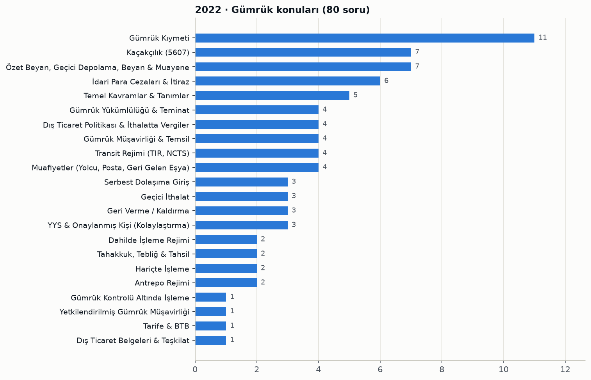

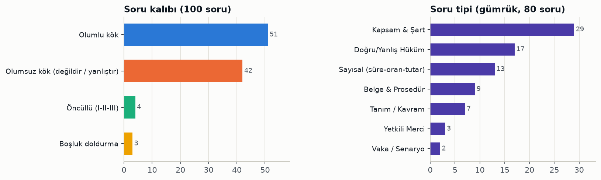

Konu tablosu ve soru numaraları

| Konu | Soru | Soru numaraları |
|---|---|---|
| Gümrük Kıymeti | 11 | 44, 47, 48, 49, 50, 51, 52, 53, 55, 98, 99 |
| Kaçakçılık (5607) | 7 | 21, 22, 23, 24, 25, 26, 27 |
| Özet Beyan, Geçici Depolama, Beyan & Muayene | 7 | 32, 45, 77, 78, 80, 82, 96 |
| İdari Para Cezaları & İtiraz | 6 | 36, 42, 65, 66, 69, 70 |
| Temel Kavramlar & Tanımlar | 5 | 28, 31, 33, 41, 62 |
| Gümrük Yükümlülüğü & Teminat | 4 | 29, 34, 87, 92 |
| Dış Ticaret Politikası & İthalatta Vergiler | 4 | 30, 35, 38, 43 |
| Gümrük Müşavirliği & Temsil | 4 | 63, 64, 79, 100 |
| Transit Rejimi (TIR, NCTS) | 4 | 73, 74, 75, 76 |
| Muafiyetler (Yolcu, Posta, Geri Gelen Eşya) | 4 | 83, 84, 85, 86 |
| Serbest Dolaşıma Giriş | 3 | 37, 39, 40 |
| Geçici İthalat | 3 | 57, 60, 61 |
| Geri Verme / Kaldırma | 3 | 89, 90, 91 |
| YYS & Onaylanmış Kişi (Kolaylaştırma) | 3 | 93, 94, 95 |
| Dahilde İşleme Rejimi | 2 | 46, 97 |
| Tahakkuk, Tebliğ & Tahsil | 2 | 54, 88 |
| Hariçte İşleme | 2 | 58, 59 |
| Antrepo Rejimi | 2 | 68, 72 |
| Gümrük Kontrolü Altında İşleme | 1 | 56 |
| Yetkilendirilmiş Gümrük Müşavirliği | 1 | 67 |
| Tarife & BTB | 1 | 71 |
| Dış Ticaret Belgeleri & Teşkilat | 1 | 81 |

Tüm sorular: konu, kalıp, tip ve öğrenilecek bilgi

| No | Cvp | Konu / alt konu | Kalıp | Tip | Öğrenilecek bilgi |
|---|---|---|---|---|---|
| 1 | D | Paragraf · Paragrafta ana düşünce | Olumlu kök | Yorum / Çıkarım | Parçada asıl vurgulanan düşünce, hızlı kentleşmenin komşulukları yok ederek insanı yalnızlığa ittiğidir. |
| 2 | B | Sözcükte Anlam / Deyim · Deyimin açıklamasıyla verilmesi | Olumsuz kök (değildir / yanlıştır) | Dil Kuralı | 'Kılı kırk yarmak' deyimi cümlede açıklaması olmadan kullanılmıştır; diğer cümlelerde deyimler açıklamalarıyla birlikte verilmiştir. |
| 3 | C | Yazım & Noktalama · 'Hiçbir şey' sözcüğünün yazımı | Olumsuz kök (değildir / yanlıştır) | Dil Kuralı | 'Hiçbir' bitişik, 'şey' ayrı yazılır; doğrusu 'hiçbir şey' olduğundan 'hiç birşey' yazımı yanlıştır. |
| 4 | C | Paragraf · Anlatım akışını bozan cümle | Olumlu kök | Yorum / Çıkarım | Paragraf anlama-anlaşılma üzerine kurulu olduğundan insanlar arasındaki yüzyıllık mücadeleden söz eden III. cümle akışı bozar. |
| 5 | E | Yazım & Noktalama · Kesme işaretinin kullanımı | Olumsuz kök (değildir / yanlıştır) | Dil Kuralı | Özel adlara getirilen yapım ekleri kesme işaretiyle ayrılmaz; 'Ankara'lı' yerine 'Ankaralı' yazılmalıdır. |
| 6 | C | Temel İşlem & Sayılar · Birinci dereceden denklem | Olumlu kök | Hesaplama | 5x-12=2x ise 3x=12 olur ve x=4 bulunur. |
| 7 | E | Temel İşlem & Sayılar · Kesirli ifade (bileşik kesir) | Olumlu kök | Hesaplama | Pay 3/2, payda 1/3 olur; 3/2 ÷ 1/3 = 9/2. |
| 8 | D | Temel İşlem & Sayılar · Üslü sayılarda karşılaştırma | Olumsuz kök (değildir / yanlıştır) | Hesaplama | 9² = 81 ve 3⁴ = 81 olduğundan "9² < 3⁴" eşitsizliği yanlıştır. |
| 9 | A | Temel İşlem & Sayılar · Kat, çarpan ve bölen | Öncüllü (I-II-III) | Hesaplama | 1-65 arasında 6'nın 10 katı (6-60) vardır; 12, 30'un çarpanı değildir ve 18'in en büyük böleni 18 olduğundan yalnız I doğrudur. |
| 10 | A | Geometri · Dikdörtgende üçgen alanı | Olumlu kök | Hesaplama | E, 6 cm'lik kenarın orta noktası olduğundan BCE dik üçgeninin alanı (10·3)/2 = 15 cm²'dir. |
| 11 | E | Osmanlı Son Dönem & I. Dünya Savaşı · Misak-ı Milli esasları | Olumsuz kök (değildir / yanlıştır) | Olgu Bilgisi | Misak-ı Milli'de sınırların İtilaf Devletlerinin onayıyla belirleneceğine dair bir esas yoktur; bölünmezlik, Elviye-i Selase'de halkoylaması, azınlık haklarında karşılıklılık ve kapitülasyonların reddi esastır. |
| 12 | D | Osmanlı Son Dönem & I. Dünya Savaşı · Mondros Ateşkes Antlaşması | Olumlu kök | Olgu Bilgisi | Osmanlı Devleti I. Dünya Savaşı'ndan 30 Ekim 1918'de imzalanan Mondros Ateşkes Antlaşması ile çekilmiştir. |
| 13 | B | Millî Mücadele · Amasya Genelgesi | Olumlu kök | Olgu Bilgisi | Vatanın bütünlüğü ve milletin istiklalinin tehlikede olduğu, milletin istiklalini yine milletin azim ve kararının kurtaracağı ilk kez Amasya Genelgesi'nde ifade edilmiştir. |
| 14 | C | İnkılaplar & Atatürk İlkeleri · Halkçılık ilkesinin amacı | Olumlu kök | Tanım / Kavram | Halkçılığın temel amacı sınıfsız, imtiyazsız, kaynaşmış bir kitle (toplum) yaratmaktır. |
| 15 | A | Atatürk Dönemi Dış Politika · Lozan'da çözülemeyen sorunlar | Olumlu kök | Olgu Bilgisi | Lozan'da Türkiye aleyhine düzenlenen Boğazlar sorunu 1936 Montrö Boğazlar Sözleşmesi ile Türkiye lehine çözülmüştür. |
| 16 | D | Temel Hukuk & Devletin Nitelikleri · Pozitif hukuk tanımı | Olumlu kök | Tanım / Kavram | Bir ülkede belli bir zamanda yürürlükte olan ve uygulanan hukuk kurallarına pozitif hukuk denir. |
| 17 | D | Yasama (TBMM) · TBMM milletvekili sayısı | Olumlu kök | Sayısal (süre-oran-tutar) | Türkiye Büyük Millet Meclisi 600 milletvekilinden oluşur. |
| 18 | C | Yürütme (Cumhurbaşkanı) · Cumhurbaşkanlığı kararnameleri | Olumsuz kök (değildir / yanlıştır) | Doğru/Yanlış Hüküm | Olağan dönem Cumhurbaşkanlığı kararnameleri kanunlarda değişiklik yapamaz; CBK ile kanunda farklı hükümler bulunursa kanun hükümleri uygulanır. |
| 19 | A | Yargı · Siyasi partilerin mali denetimi | Olumlu kök | Yetkili Merci | Siyasi partilerin mali denetimi Anayasa Mahkemesi tarafından yapılır. |
| 20 | C | Yasama (TBMM) · Yasama işlemi türleri | Olumlu kök | Kapsam & Şart | Kanun TBMM'nin yaptığı bir yasama işlemidir; yönetmelik, genelge, tüzük ve talimat idari (yürütme) işlemleridir. |
| 21 | C | Kaçakçılık (5607) · 5607'de tanımlar ve artırımlar | Olumsuz kök (değildir / yanlıştır) | Doğru/Yanlış Hüküm | 5607'ye göre gümrüklenmiş değer, ithal eşyası için CIF kıymeti ile ödenmesi gereken gümrük vergileri toplamını, ihraç eşyası için FOB kıymetini ifade eder; yalnızca CIF kıymeti değildir. |
| 22 | D | Kaçakçılık (5607) · Kaçakçılıkta örgüt artırımı | Olumlu kök | Sayısal (süre-oran-tutar) | 5607 sayılı Kanun'da tanımlanan suçların bir örgütün faaliyeti çerçevesinde işlenmesi halinde verilecek ceza iki kat artırılır. |
| 23 | E | Kaçakçılık (5607) · Tehlikeli ve zararlı atık eşya | Olumlu kök | Belge & Prosedür | Kaçakçılık konusu eşya toplum ve çevre sağlığı yönünden tehlikeli ve zararlı eşya ya da atık ise soruşturma başlatılmakla birlikte eşya gümrük yetkililerince derhal getirildiği ülkeye iade edilir. |
| 24 | B | Kaçakçılık (5607) · Kaçakçılık suçlarının cezaları | Olumlu kök | Doğru/Yanlış Hüküm | Eşyayı aldatıcı işlem ve davranışlarla gümrük vergilerini kısmen veya tamamen ödemeden ülkeye sokan kişi iki yıldan beş yıla kadar hapis ve on bin güne kadar adli para cezası ile cezalandırılır. |
| 25 | D | Kaçakçılık (5607) · Kaçakçılıkla mücadelede görevliler | Olumsuz kök (değildir / yanlıştır) | Yetkili Merci | 5607'ye göre mülki amirler, Emniyet, Jandarma ve Sahil Güvenlik personeli görevli olup Kara Kuvvetleri Komutanlığı Sınır Birlikleri personeli bu görevliler arasında sayılmamıştır. |
| 26 | D | Kaçakçılık (5607) · Kaçakçılık davasına katılma | Olumlu kök | Yetkili Merci | 5607 sayılı Kanun'da tanımlanan suçlardan açılan davalarda ilgili gümrük idaresi başvurusu üzerine davaya katılan olarak kabul edilir. |
| 27 | B | Kaçakçılık (5607) · Kaçakçılık fiillerinin kapsamı | Olumsuz kök (değildir / yanlıştır) | Kapsam & Şart | Muaf olarak ithal edilen eşyayı süresi içinde yurt dışına çıkarmamak 5607'de kaçakçılık fiili olarak sayılmamıştır; izinsiz akaryakıt üretimi, boru hattından alınan ürünlerin satışı, bandrol taklidi ve transit eşyayı gümrük bölgesinde bırakmak kaçakçılık fiilidir. |
| 28 | D | Temel Kavramlar & Tanımlar · Gümrük rejimleri listesi | Olumsuz kök (değildir / yanlıştır) | Kapsam & Şart | Geçici ihracat ayrı bir gümrük rejimi değildir; gümrük rejimleri serbest dolaşıma giriş, transit, antrepo, dahilde işleme, GKAİ, geçici ithalat, hariçte işleme ve ihracattır. |
| 29 | B | Gümrük Yükümlülüğü & Teminat · İhracatta yükümlülüğün başlaması | Olumlu kök | Kapsam & Şart | İhracat vergilerine tabi eşyanın gümrük beyannamesi kapsamında ihracında gümrük yükümlülüğü beyannamenin tescil tarihinde başlar. |
| 30 | B | Dış Ticaret Politikası & İthalatta Vergiler · Fikri haklarda re'sen alıkoyma | Olumlu kök | Sayısal (süre-oran-tutar) | Fikri ve sınai hakları ihlal ettiğine dair açık deliller bulunan eşya gümrük idaresince en fazla 3 iş günü süreyle re'sen alıkonulabilir. |
| 31 | C | Temel Kavramlar & Tanımlar · GOİK kapsamı | Olumsuz kök (değildir / yanlıştır) | Kapsam & Şart | GOİK; bir gümrük rejimine tabi tutma, serbest bölgeye giriş, yeniden ihracat, imha ve gümrüğe terki kapsar; serbest dolaşımdaki eşyanın OSB'deki bir firmaya satışı GOİK değildir. |
| 32 | A | Özet Beyan, Geçici Depolama, Beyan & Muayene · Özet beyan sonrası GOİK süresi | Olumlu kök | Sayısal (süre-oran-tutar) | Özet beyan kapsamı eşyaya denizyolu ile gelenlerde 45 gün, diğer yollarla (karayolu dahil) gelenlerde 20 gün içinde GOİK verilir. |
| 33 | B | Temel Kavramlar & Tanımlar · Ekonomik etkili rejimler | Olumsuz kök (değildir / yanlıştır) | Kapsam & Şart | Ekonomik etkili gümrük rejimleri antrepo, dahilde işleme, GKAİ, geçici ithalat ve hariçte işlemedir; transit rejimi bunlar arasında değildir. |
| 34 | D | Gümrük Yükümlülüğü & Teminat · Gümrük yükümlülüğünün sona ermesi | Olumsuz kök (değildir / yanlıştır) | Kapsam & Şart | Gümrük yükümlülüğü vergilerin ödenmesi veya kaldırılması, beyannamenin iptali ve kanuna aykırı giren eşyanın müsaderesi ile sona erer; beyannamenin düzeltilmesi yükümlülüğü sona erdirmez. |
| 35 | A | Dış Ticaret Politikası & İthalatta Vergiler · İthalat Rejimi Kararı listeleri | Olumsuz kök (değildir / yanlıştır) | Doğru/Yanlış Hüküm | İthalat Rejimi Kararı'nda I sayılı liste tarım ürünlerini, IV sayılı liste balık ve diğer su ürünlerini gösterir; I sayılı listenin su ürünlerini gösterdiği ifadesi yanlıştır. |
| 36 | B | İdari Para Cezaları & İtiraz · Lisans/izin eksikliğinde GK 235 | Olumsuz kök (değildir / yanlıştır) | Doğru/Yanlış Hüküm | Bu durumda fark gümrük vergileri alınır ve eşya mahrecine iade, transit veya terk edilebilir; ancak idari para cezası 'gümrük vergileri tutarında' değil, eşyanın gümrüklenmiş değeri esas alınarak verilir. |
| 37 | C | Serbest Dolaşıma Giriş · Nihai kullanım izni | Olumsuz kök (değildir / yanlıştır) | Doğru/Yanlış Hüküm | Nihai kullanım kapsamındaki eşya bir izin hak sahibinden başka bir izin hak sahibine devredilebilir; devredilemeyeceği ifadesi yanlıştır. |
| 38 | E | Dış Ticaret Politikası & İthalatta Vergiler · İthalatta alınan vergi ve fonlar | Olumsuz kök (değildir / yanlıştır) | Kapsam & Şart | İthalatta ek mali yükümlülük, KDV, ÖTV ve ilave gümrük vergisi alınır; ticari ithalatta TRT bandrolü ithalatta alınan vergi ve fonlar arasında sayılmaz. |
| 39 | E | Serbest Dolaşıma Giriş · Serbest dolaşım statüsünün kaybı | Olumsuz kök (değildir / yanlıştır) | Kapsam & Şart | Serbest dolaşım statüsü beyannamenin iptali ve GK 213-214 ile geri ödeme sistemli DİR kapsamındaki geri verme/kaldırma ile sona erer; beyannamede düzeltme yapılması statüyü sona erdirmez. |
| 40 | D | Serbest Dolaşıma Giriş · TGB'ye getirilmeden serbest dolaşım | Olumlu kök | Kapsam & Şart | Kararda belirtilen şartların sağlanması koşuluyla Türk Bayrağı çekilmiş gemiler Türkiye Gümrük Bölgesi'ne getirilmeksizin serbest dolaşıma sokulabilir. |
| 41 | D | Temel Kavramlar & Tanımlar · 'Gümrük vergileri' deyimi | Olumlu kök | Tanım / Kavram | GK md. 3'e göre 'gümrük vergileri', ilgili mevzuat uyarınca eşyaya uygulanan ithalat vergilerinin ya da ihracat vergilerinin tümünü ifade eder. |
| 42 | B | İdari Para Cezaları & İtiraz · İthali yasak eşyada GK 235/1 | Olumlu kök | Sayısal (süre-oran-tutar) | Serbest dolaşıma giriş rejiminde eşyanın ithalinin yasak olduğu tespit edilirse fark vergiler alınır ve eşyanın gümrüklenmiş değerinin dört katı idari para cezası verilir. |
| 43 | B | Dış Ticaret Politikası & İthalatta Vergiler · Tarife kontenjanı tanımı | Olumlu kök | Tanım / Kavram | Belirli bir dönem itibarıyla gümrük vergisi ve/veya diğer mali yüklerde indirim yapılan ya da muafiyet sağlanan ithalatın miktar veya değerine tarife kontenjanı denir. |
| 44 | A | Gümrük Kıymeti · Satış bedeli yönteminin uygulanabilirliği | Olumlu kök | Kapsam & Şart | İlişkili firmalardan yapılan ithalatta ilişki fiyatı etkilememişse satış bedeli yöntemi uygulanabilir; ayrı tüzel kişiliği olmayan şubeler, finansal kiralama, ödünç ve imha için ödemeli gönderimler satış sayılmaz. |
| 45 | B | Özet Beyan, Geçici Depolama, Beyan & Muayene · Miras eşyasının beyanı | Olumlu kök | Belge & Prosedür | Türkiye'de vefat eden yabancıların ülkelerindeki kanuni mirasçılarına intikal eden kişisel eşya ve ev eşyası sözlü beyan formu ile beyan edilir. |
| 46 | C | Dahilde İşleme Rejimi · Telafi edici vergi | Olumlu kök | Tanım / Kavram | Tercihli tarife uygulaması bünyedeki serbest dolaşımda olmayan eşyanın ithalat vergilerinin ödenmesi koşuluna bağlıysa, DİR şartlı muafiyet sistemi kapsamında ödenen bu vergiye telafi edici vergi denir. |
| 47 | E | Gümrük Kıymeti · Royalti ve lisans ücreti tanımı | Olumsuz kök (değildir / yanlıştır) | Kapsam & Şart | Royalti ve lisans ücreti tanımı patent, dizayn, model, tescilli tasarım gibi hakları kapsar; mizanpaj bu tanımda yer almaz. |
| 48 | A | Gümrük Kıymeti · Aynı eşya tanımı | Olumsuz kök (değildir / yanlıştır) | Kapsam & Şart | Aynı eşya; fiziksel özellik, kalite ve tanındığı özellikler dahil her bakımdan aynı olan ve aynı ülkede üretilmiş eşyadır; aynı kişi tarafından üretilmiş olması zorunlu değildir. |
| 49 | E | Gümrük Kıymeti · Satış bedelini engelleyen kısıtlamalar | Olumlu kök | Kapsam & Şart | Kanunla veya yetkili mercilerce konulan, yeniden satış bölgesini sınırlayan ya da kıymeti önemli ölçüde etkilemeyen kısıtlamalar dışındaki, eşyanın kullanım yeri ve şekline ilişkin kısıtlamalar satış bedelinin esas alınmasını engeller. |
| 50 | E | Gümrük Kıymeti · Son yöntemde esas alınmayacaklar | Olumsuz kök (değildir / yanlıştır) | Kapsam & Şart | Son yöntemde önceki yöntemlerin makul bir esneklikle uygulanmasıyla bulunan kıymet esas alınabilir; Türkiye'deki iç satış fiyatı, ihraç ülkesi iç piyasa fiyatı, üçüncü ülkeye ihraç fiyatı ve asgari kıymetler esas alınamaz. |
| 51 | E | Gümrük Kıymeti · Kıymete ilave edilen komisyonlar | Olumsuz kök (değildir / yanlıştır) | Kapsam & Şart | Satış komisyonu, tellaliye, ambalaj bedeli ve tek eşya muamelesi gören kap maliyeti kıymete eklenir; satın alma komisyonu gümrük kıymetine dahil edilmez. |
| 52 | E | Gümrük Kıymeti · Fiilen ödenen veya ödenecek fiyat | Olumsuz kök (değildir / yanlıştır) | Doğru/Yanlış Hüküm | Alıcının pazarlama dahil kendi hesabına yaptığı faaliyetler satıcıya yapılmış dolaylı ödeme sayılmaz ve gümrük kıymetine dahil edilmez. |
| 53 | E | Gümrük Kıymeti · Hesaplanmış kıymet unsurları | Olumsuz kök (değildir / yanlıştır) | Kapsam & Şart | Hesaplanmış kıymet; malzeme ve imalat maliyetleri, aynı sınıf eşyanın satışındaki mutat kâr ve genel giderler ile nakliye-sigorta giderlerinin toplamıdır; pazarlama giderleri ayrıca toplama eklenmez. |
| 54 | A | Tahakkuk, Tebliğ & Tahsil · Hatalı beyanda faiz uygulaması | Olumlu kök | Tanım / Kavram | Beyan sahibinin hatalı beyanı sonucu hiç veya noksan alınan gümrük vergilerine, yükümlülüğün başladığı tarih ile vergilerin kesinleştiği tarih arasındaki süre için faiz uygulanır. |
| 55 | B | Gümrük Kıymeti · Kıymette kur çevrimi | Olumlu kök | Belge & Prosedür | Gümrük vergisine esas kıymetin tespitinde fatura veya belgelerdeki yabancı paralar T.C. Merkez Bankası döviz satış kurları üzerinden Türk Lirasına çevrilir. |
| 56 | E | Gümrük Kontrolü Altında İşleme · GKAİ'de işlem görmüş ürün kıymeti | Öncüllü (I-II-III) | Kapsam & Şart | GKAİ'de işlem görmüş ürünün kıymeti ilgilinin tercihine göre üçüncü ülkedeki aynı/benzer eşya kıymeti, ithal eşya kıymeti ile işleme maliyetinin toplamı, ilişkiden etkilenmemiş satış fiyatı veya Türkiye'deki satış fiyatı esas alınarak belirlenebilir. |
| 57 | A | Geçici İthalat · Taşıt takip programları | Olumlu kök | Belge & Prosedür | Geçici İthal Edilen Kara Taşıtları Tebliği'ne göre eşya ve yolcu taşımayan tüzel kişilikler adına kayıtlı otomobiller 1 No.lu Taşıt Takip Programına kaydedilir. |
| 58 | B | Hariçte İşleme · Üçgen trafikte INF 2 formu | Olumlu kök | Belge & Prosedür | Hariçte işleme rejiminde üçgen trafikte işlem görmüş ürünlerin muafiyetten yararlanması için geçici ihraç eşyasına ilişkin bilgiler INF 2 bilgi formu ile bildirilir. |
| 59 | D | Hariçte İşleme · Bedelli tamirde vergilendirme | Boşluk doldurma | Kapsam & Şart | Bedel karşılığı tamir edilen eşyada ithalat vergileri, gümrük kıymeti olarak tamir masraflarına eşit tutar dikkate alınarak serbest dolaşıma giriş beyannamesinin tescil tarihindeki vergi oranı ve unsurlarına göre belirlenir. |
| 60 | E | Geçici İthalat · Geçici ithalat genel hükümleri | Olumsuz kök (değildir / yanlıştır) | Doğru/Yanlış Hüküm | Geçici ithalat rejimi kapsamındaki eşya bir başkasına satılamaz; tüketilebilir ve ayniyeti tespit edilemeyen eşya rejimden yararlandırılmaz, kısmi muafiyette her ay için vergilerin %3'ü dışında kalan tutar teminata bağlanır. |
| 61 | A | Geçici İthalat · CPD karnesi | Olumlu kök | Belge & Prosedür | Ticari ve kişisel kullanıma mahsus kara taşıtları için ulusal ve uluslararası kefil kuruluşlarca verilen teminat hükmündeki belge Gümrüklerden Geçiş Karnesi (CPD)'dir. |
| 62 | D | Temel Kavramlar & Tanımlar · Şartlı muafiyet düzenlemesi | Boşluk doldurma | Kapsam & Şart | Şartlı muafiyet düzenlemesi, serbest dolaşımda olmayan eşyaya transit, antrepo, şartlı muafiyet sistemli DİR, GKAİ ve geçici ithalat rejimlerinin uygulanmasıdır; hariçte işleme dahil değildir. |
| 63 | E | Gümrük Müşavirliği & Temsil · Mesleğe engel suçlar | Olumsuz kök (değildir / yanlıştır) | Kapsam & Şart | İrtikap, yalan yere şahadet, iftira ve dolandırıcılıktan hüküm giymek gümrük müşavirliğine engeldir; görevi kötüye kullanma sayılan engel suçlar arasında değildir. |
| 64 | D | Gümrük Müşavirliği & Temsil · İzin belgesinin tedbiren alınması | Olumlu kök | Sayısal (süre-oran-tutar) | Mevzuata aykırı hareketi görülen gümrük müşaviri ve yardımcılarının izin belgeleri tedbir mahiyetinde en fazla 6 ay süreyle geçici olarak alınabilir. |
| 65 | E | İdari Para Cezaları & İtiraz · 241/1 usulsüzlük cezası tutarı | Olumlu kök | Sayısal (süre-oran-tutar) | GK 241/1 maddesindeki usulsüzlük cezası 2022 yılı için yeniden değerleme ile 235 TL olarak uygulanmıştır. |
| 66 | C | İdari Para Cezaları & İtiraz · İtiraz süresi | Olumlu kök | Sayısal (süre-oran-tutar) | GK 242'ye göre tebliğ edilen vergi, ceza ve idari kararlara karşı tebliğden itibaren 15 gün içinde bir üst makama, üst makam yoksa aynı makama itiraz edilir. |
| 67 | D | Yetkilendirilmiş Gümrük Müşavirliği · YGM rapor kodları | Olumlu kök | Belge & Prosedür | YGM Tebliği'ne göre genel antrepoya eşya giriş çıkış işlemlerinin tespitine ilişkin rapor AN8 kodlu rapordur. |
| 68 | E | Antrepo Rejimi · E tipi antrepo | Olumlu kök | Tanım / Kavram | E tipi antrepoda eşya, izin hak sahibinin antrepo addedilen depolama yerine ulaştığında stok kayıtlarına alınır. |
| 69 | B | İdari Para Cezaları & İtiraz · Antrepoda izinsiz elleçleme cezası | Olumlu kök | Sayısal (süre-oran-tutar) | Antrepodaki eşyanın asli niteliği değiştirilmeden gümrük izni alınmaksızın elleçlenmesi (kap değiştirme) halinde usulsüzlük cezası dört kat uygulanır. |
| 70 | E | İdari Para Cezaları & İtiraz · Antrepo beyanında farklılık cezası | Olumlu kök | Vaka / Senaryo | Antrepo beyanında farklı çıkan eşyanın ithali kamu kurumu iznine tabi ve beyan edilenden belirgin şekilde farklı cinste ise farklı çıkan eşyanın gümrüklenmiş değerinin iki katı idari para cezası verilir. |
| 71 | D | Tarife & BTB · BTB başvuru belgeleri | Olumsuz kök (değildir / yanlıştır) | Kapsam & Şart | BTB başvurusunda hak sahibi/başvuran bilgileri, eşyanın ayrıntılı tanımı ve numune, fotoğraf vb. belgeler istenir; daha önce yapılmış ithalat/ihracata ait beyanname ve eklerinin orijinal nüshaları istenmez. |
| 72 | E | Antrepo Rejimi · Antrepo tipleri ve süreler | Öncüllü (I-II-III) | Doğru/Yanlış Hüküm | Dört öncül de yanlıştır: C tipi antrepo özel antrepodur, F tipi genel antrepodur, gümrük kapılarındaki satış mağazalarına izin vermeye Bölge Müdürlüğü yetkili değildir ve eşyanın antrepoda kalış süresi sınırlı değildir. |
| 73 | E | Transit Rejimi (TIR, NCTS) · TIR taşıt onay belgesi | Olumsuz kök (değildir / yanlıştır) | Kapsam & Şart | TIR işlemlerinde yarı römork, brandalı taşıt, tanker ve panelvan için taşıt onay belgesi düzenlenebilir; binek otomobil için düzenlenemez. |
| 74 | C | Transit Rejimi (TIR, NCTS) · TIR'da güzergah ve süre ihlali | Olumlu kök | Doğru/Yanlış Hüküm | TIR taşımalarında güzergah ihlali yaptığı tespit edilen taşıtlar için GK 241. maddenin altıncı fıkrası uyarınca para cezası uygulanır. |
| 75 | C | Transit Rejimi (TIR, NCTS) · NATO SOFA transiti - Form 302 | Olumlu kök | Belge & Prosedür | NATO SOFA kapsamında eşyanın Türkiye Gümrük Bölgesi'nde transiti Form 302 belgesinin ibrazı ile yapılır. |
| 76 | D | Transit Rejimi (TIR, NCTS) · Transitte teminat aranmayan haller | Olumsuz kök (değildir / yanlıştır) | Kapsam & Şart | Transit rejiminde boru hattı ile yapılan taşımalarda teminat aranmaz. |
| 77 | C | Özet Beyan, Geçici Depolama, Beyan & Muayene · Beyannamede düzeltme | Olumlu kök | Doğru/Yanlış Hüküm | GK 63'e göre beyannamede düzeltme gümrük idaresinin iznine bağlıdır ve GK 73 hükümleri saklı kalmak üzere eşyanın tesliminden sonra düzeltmeye izin verilmez. |
| 78 | E | Özet Beyan, Geçici Depolama, Beyan & Muayene · Beyanname yerine geçen belgeler | Olumsuz kök (değildir / yanlıştır) | Belge & Prosedür | Sözlü beyan formu, elçilik mektubu, CPD karnesi ve yolcu beraberi numune, sergi ve fuar eşyası beyan formu beyanname yerine kullanılabilir; CIM taşıma belgesi beyanname yerine kullanılmaz. |
| 79 | D | Gümrük Müşavirliği & Temsil · Doğrudan ve dolaylı temsil | Olumsuz kök (değildir / yanlıştır) | Doğru/Yanlış Hüküm | Dolaylı temsilde temsilci kendi adına ancak başkasının hesabına hareket eder; doğrudan temsilde ise başkasının adına ve hesabına hareket eder. |
| 80 | A | Özet Beyan, Geçici Depolama, Beyan & Muayene · Muayene ve numune alma | Olumlu kök | Doğru/Yanlış Hüküm | Gümrük idareleri beyan kapsamı eşyayı muayene edebilir ve ayrıntılı muayene veya tahlil amacıyla numune alabilir. |
| 81 | E | Dış Ticaret Belgeleri & Teşkilat · Çeki listesi tanımı | Olumlu kök | Tanım / Kavram | Bir fatura kapsamı eşyanın çeşitli cins ve ağırlıktaki kaplarda ne miktarda bulunduğunu gösteren belgeye çeki listesi denir. |
| 82 | B | Özet Beyan, Geçici Depolama, Beyan & Muayene · İhracatta geçici depolama süresi | Boşluk doldurma | Sayısal (süre-oran-tutar) | İhracat veya yeniden ihracat amacıyla geçici depolama yerine konulan eşya burada bir ay kalabilir; süre içinde talep edilirse gümrük müdürlüğünce en çok üç aya kadar ek süre verilebilir. |
| 83 | D | Muafiyetler (Yolcu, Posta, Geri Gelen Eşya) · Taşıt muafiyetinden yararlananlar | Olumsuz kök (değildir / yanlıştır) | Kapsam & Şart | Türk vatandaşlığından izinle çıkıp yabancı ülke vatandaşlığı alan kişilerin kullanılmış özel nakil vasıtalarını gümrük vergisinden muaf olarak serbest dolaşıma sokmasına izin verilmez. |
| 84 | E | Muafiyetler (Yolcu, Posta, Geri Gelen Eşya) · 2009/15481 Karar muafiyet hükümleri | Olumsuz kök (değildir / yanlıştır) | Doğru/Yanlış Hüküm | Otobüslerin standart depolarındaki yakıt için Kararda öngörülen muafiyet sınırı 550 litre değildir; 15 yaş üstü yolcuların hediyelik eşyası için 430 Avro sınırı ve kiralık konut ev eşyası muafiyeti ise doğrudur. |
| 85 | D | Muafiyetler (Yolcu, Posta, Geri Gelen Eşya) · Kişisel ve şahsi eşya tanımları | Olumsuz kök (değildir / yanlıştır) | Tanım / Kavram | Şahsi eşya, kişisel eşyayı da kapsayan; ev eşyası, özel nakil vasıtaları ve aile ihtiyaçlarını içeren daha geniş bir kavram olduğundan ikisinin kapsamı aynı değildir. |
| 86 | B | Muafiyetler (Yolcu, Posta, Geri Gelen Eşya) · Hediyelik eşya muafiyet limiti | Olumlu kök | Sayısal (süre-oran-tutar) | Yolcu beraberi hediyelik eşya muafiyet limiti 15 yaş altı yolcular için 150 Avro, 15 yaş üstü yolcular için 430 Avro'dur. |
| 87 | B | Gümrük Yükümlülüğü & Teminat · Gümrük müşavirinin müteselsil sorumluluğu | Öncüllü (I-II-III) | Vaka / Senaryo | Gümrük müşaviri hesabına beyanda bulunduğu kişiyle birlikte ilave tahakkuk eden vergiden müştereken ve müteselsilen sorumlu olduğundan vergi bir kez ödenir; ikisinin ayrı ayrı tamamını ödemesi gerekmez. |
| 88 | B | Tahakkuk, Tebliğ & Tahsil · Ek tahakkukta ödeme süresi | Olumlu kök | Sayısal (süre-oran-tutar) | Kontrol sonucu hiç veya noksan alındığı belirlenen gümrük vergileri yükümlüye tebliğ edildiği tarihten itibaren 15 gün içinde ödenir. |
| 89 | C | Geri Verme / Kaldırma · Geri verme başvurusu ve süreleri | Olumsuz kök (değildir / yanlıştır) | Doğru/Yanlış Hüküm | GK 211 uyarınca yapılacak geri verme veya kaldırma işlemlerinde başvuru süresi bir yıl değil, tebliğden itibaren üç yıldır. |
| 90 | A | Geri Verme / Kaldırma · Geri vermede yetkili birim | Olumlu kök | Yetkili Merci | 250.000 TL tutarında tahsil edilmiş gümrük vergisinin geri verilmesi talebini ilgili gümrük müdürlüğü değerlendirir. |
| 91 | D | Geri Verme / Kaldırma · Uluslararası anlaşmayla geri verme | Olumlu kök | Sayısal (süre-oran-tutar) | Türkiye'nin taraf olduğu uluslararası anlaşmalar çerçevesinde gümrük vergilerinin geri verilmesi için başvuru, vergilerin tebliğinden itibaren 1 yıl içinde yapılır. |
| 92 | E | Gümrük Yükümlülüğü & Teminat · Kabul edilmeyen teminatlar | Olumsuz kök (değildir / yanlıştır) | Kapsam & Şart | Gümrük işlemlerinde nakit Türk Lirası, süresiz banka teminat mektubu, DİBS ve Merkez Bankasınca kabul edilen dövizler teminat olarak kabul edilir; kesin kefalet senedi kabul edilmez. |
| 93 | C | YYS & Onaylanmış Kişi (Kolaylaştırma) · YYS başvurusunda faaliyet süresi | Olumlu kök | Sayısal (süre-oran-tutar) | Yetkilendirilmiş yükümlü statüsü için başvuracak Türkiye Gümrük Bölgesi'nde yerleşik kişilerin en az 3 yıldır faaliyette bulunması gerekir. |
| 94 | C | YYS & Onaylanmış Kişi (Kolaylaştırma) · OKS kolaylıkları | Olumsuz kök (değildir / yanlıştır) | Kapsam & Şart | Onaylanmış kişi statüsü sahipleri eksik beyan, kısmi ve götürü teminat ile mavi hat uygulamalarından yararlanır; yeşil hat bu kolaylıklar arasında değildir. |
| 95 | B | YYS & Onaylanmış Kişi (Kolaylaştırma) · Mavi hat uygulaması | Olumlu kök | Doğru/Yanlış Hüküm | Mavi hat, onaylanmış kişi statüsü sahiplerince sadece ihracat beyannamelerinde yararlanılan hattır. |
| 96 | C | Özet Beyan, Geçici Depolama, Beyan & Muayene · Numune ve tahlil işlemleri | Olumsuz kök (değildir / yanlıştır) | Doğru/Yanlış Hüküm | Eşya sahibi veya temsilcileri beyana konu eşyanın tahlili için gümrük laboratuvarlarına doğrudan numune gönderemez; numuneler gümrük idaresince gönderilir. |
| 97 | D | Dahilde İşleme Rejimi · DİR'in amaçları | Olumsuz kök (değildir / yanlıştır) | Kapsam & Şart | DİR'in amaçları dünya fiyatlarından hammadde temini, ihracatı artırma, ihraç ürünlerini çeşitlendirme ve ihraç pazarlarını geliştirmektir; ithalatı artırarak ithalatçıyı desteklemek amaçları arasında değildir. |
| 98 | A | Gümrük Kıymeti · Benzer eşya tanımı | Olumsuz kök (değildir / yanlıştır) | Kapsam & Şart | Benzer eşya aynı işlevi görebilen, ticari olarak birbirini ikame edebilen, benzer özellik ve unsurlara sahip eşyadır; aynı ticari markayı taşıması gerekmez. |
| 99 | E | Gümrük Kıymeti · Alıcı-satıcı arasında ilişki | Olumsuz kök (değildir / yanlıştır) | Kapsam & Şart | Birbirinin memuru/idarecisi olma, işçi-işveren ilişkisi ve doğrudan/dolaylı kontrol ilişki sayılır; yalnızca tek acente olarak iş ilişkisi içinde bulunmak ilişki varlığı için yeterli değildir. |
| 100 | C | Gümrük Müşavirliği & Temsil · Müşavir yardımcısı ve stajyer yetkileri | Olumsuz kök (değildir / yanlıştır) | Doğru/Yanlış Hüküm | Stajyerler gümrük idarelerinde iş takibi yapamaz; gümrük müşavir yardımcıları ise bir gümrük müşavirinin yanında onun adına iş takip edebilir. |

### 2023

- Kanun'un genel hükümleri yılı: Temel Kavramlar (11) ve Özet Beyan / Beyan & Muayene (11) birlikte gümrük sorularının %27,5'ini oluşturuyor. Gümrük idaresi, gümrük statüsü, yükümlü, Türkiye Gümrük Bölgesi, Kanun'un amacı ve brüt ağırlık tanımları soruldu.
- Sorular "Gümrük Kanunu'na göre…" diye başlıyor: 46/80 soru doğrudan 4458'e dayanıyor (beş yılın en yükseği).
- Meslek mevzuatı 8 soru: disiplin cezaları (uyarma, kınama, 6 ay–1 yıl alıkoyma, meslekten çıkarma), sınava en fazla 3 kez giriş hakkı, 5 yıl belge saklama.
- Sayısal sorular zirvede (19): BTB 6 yıl, BMB 3 yıl, 45/20 gün, tebligat zamanaşımı 3 yıl, kısmi muafiyet %3.
- En kolay sınav: 49 soru kolay, yalnızca 8 soru zor. Transit, serbest dolaşım, kolaylaştırma (YYS/OKS) ve tasfiyeden hiç soru gelmedi. Matematiğin 5 sorusu da günlük hayat problemiydi.

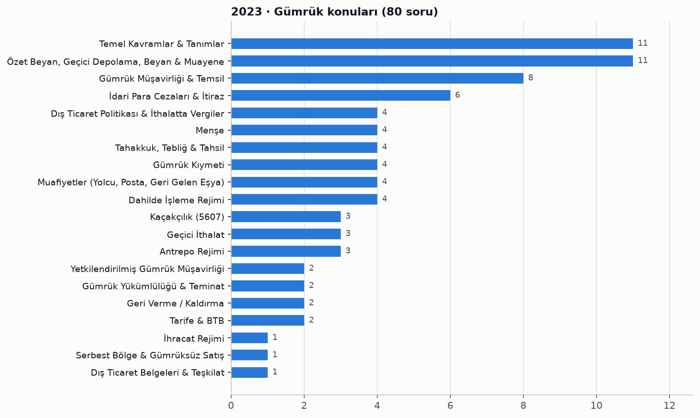

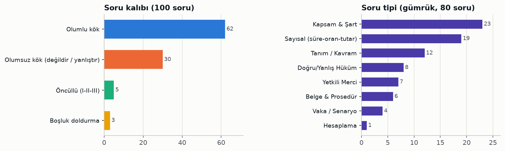

Konu tablosu ve soru numaraları

| Konu | Soru | Soru numaraları |
|---|---|---|
| Temel Kavramlar & Tanımlar | 11 | 31, 57, 63, 66, 67, 71, 75, 83, 91, 92, 97 |
| Özet Beyan, Geçici Depolama, Beyan & Muayene | 11 | 38, 39, 40, 74, 78, 80, 81, 84, 90, 93, 95 |
| Gümrük Müşavirliği & Temsil | 8 | 23, 24, 25, 26, 27, 28, 89, 94 |
| İdari Para Cezaları & İtiraz | 6 | 21, 29, 30, 33, 43, 60 |
| Dış Ticaret Politikası & İthalatta Vergiler | 4 | 36, 45, 49, 72 |
| Menşe | 4 | 41, 42, 64, 87 |
| Tahakkuk, Tebliğ & Tahsil | 4 | 44, 61, 70, 77 |
| Gümrük Kıymeti | 4 | 46, 47, 79, 98 |
| Muafiyetler (Yolcu, Posta, Geri Gelen Eşya) | 4 | 48, 50, 53, 59 |
| Dahilde İşleme Rejimi | 4 | 55, 56, 65, 99 |
| Kaçakçılık (5607) | 3 | 22, 51, 73 |
| Geçici İthalat | 3 | 34, 37, 54 |
| Antrepo Rejimi | 3 | 35, 62, 85 |
| Yetkilendirilmiş Gümrük Müşavirliği | 2 | 32, 82 |
| Gümrük Yükümlülüğü & Teminat | 2 | 68, 88 |
| Geri Verme / Kaldırma | 2 | 69, 76 |
| Tarife & BTB | 2 | 86, 96 |
| İhracat Rejimi | 1 | 52 |
| Serbest Bölge & Gümrüksüz Satış | 1 | 58 |
| Dış Ticaret Belgeleri & Teşkilat | 1 | 100 |

Tüm sorular: konu, kalıp, tip ve öğrenilecek bilgi

| No | Cvp | Konu / alt konu | Kalıp | Tip | Öğrenilecek bilgi |
|---|---|---|---|---|---|
| 1 | C | Cümlede Anlam · Cümlede pişmanlık anlamı | Olumlu kök | Dil Kuralı | "-meliydi" (gereklilik kipinin hikâyesi) ile kurulan "İyi tanımadığım birine bu kadar güvenmemeliydim." cümlesi pişmanlık anlamı taşır. |
| 2 | C | Sözcükte Anlam / Deyim · Cümlede deyim kullanımı | Olumlu kök | Dil Kuralı | "Ağzını aramak" birinin bir konudaki düşüncesini dolaylı yoldan öğrenmeye çalışmak anlamında bir deyimdir. |
| 3 | E | Dil Bilgisi · Ünsüz yumuşaması istisnası | Olumsuz kök (değildir / yanlıştır) | Dil Kuralı | "Kibrit" sözcüğü ünlüyle başlayan ek aldığında yumuşamaz (kibriti); kitap-kitabı, dört-dördü, kemik-kemiği, sonuç-sonucu yumuşar. |
| 4 | C | Sözcükte Anlam / Deyim · Sesteş sözcükler | Olumsuz kök (değildir / yanlıştır) | Dil Kuralı | "Seç" sözcüğünün sesteşi yoktur; yüz, yol, kurum ve çay sözcüklerinin farklı anlamlı sesteşleri vardır. |
| 5 | D | Sözcükte Anlam / Deyim · Sözcükte mecaz anlam | Olumlu kök | Dil Kuralı | "Aklım karışıyor" ifadesinde "karışmak" zihnin bulanması anlamında mecazdır; diğer cümlelerde gerçek anlamda kullanılmıştır. |
| 6 | C | Problemler · Yaş problemi | Olumlu kök | Hesaplama | Bugünkü yaş toplamı 15+12=27 olup 5 yıl sonra her biri 5 yaş büyüyeceğinden toplam 27+10=37 olur. |
| 7 | E | Problemler · Uzunluk ölçü birimi dönüşümü | Olumsuz kök (değildir / yanlıştır) | Hesaplama | 22 km - 1500 m = 20.500 m (2.050.000 cm) olduğundan "21500 cm" sonucu yanlıştır. |
| 8 | C | Problemler · Litre ile bölme problemi | Olumlu kök | Hesaplama | 675 / 5 = 135 teneke zeytinyağı gönderilir. |
| 9 | B | Problemler · Saat ve zaman problemi | Olumlu kök | Hesaplama | 25+45+55+60 = 185 dakika (3 saat 5 dakika) eklenince ödeve 18:05'te başlanır. |
| 10 | A | Problemler · Ağırlık ölçüsü problemi | Olumlu kök | Hesaplama | 2.550 kg × 5 × 7 = 89.250 kg, yani 89 ton 250 kg kömür taşınır. |
| 11 | B | İnkılaplar & Atatürk İlkeleri · Cumhuriyetin ilanı | Olumlu kök | Olgu Bilgisi | Cumhuriyet 29 Ekim 1923'te ilan edilmiştir. |
| 12 | A | İnkılaplar & Atatürk İlkeleri · Atatürk'ün doğum yeri ve yılı | Olumlu kök | Olgu Bilgisi | Mustafa Kemal Atatürk 1881 yılında Selanik'te doğmuştur. |
| 13 | D | İnkılaplar & Atatürk İlkeleri · Atatürk ilkeleri | Olumsuz kök (değildir / yanlıştır) | Olgu Bilgisi | Atatürk ilkeleri cumhuriyetçilik, milliyetçilik, halkçılık, devletçilik, laiklik ve inkılapçılıktır; tesanütçülük bunlardan biri değildir. |
| 14 | B | Millî Mücadele · Başkomutan Meydan Muharebesi | Olumlu kök | Olgu Bilgisi | Milli Mücadele'nin zaferle sonuçlanmasını sağlayan son muharebe Başkomutan Meydan Muharebesi'dir (1922). |
| 15 | C | Atatürk Dönemi Dış Politika · Hatay'ın anavatana katılması | Olumlu kök | Olgu Bilgisi | Hatay 1939 yılında Türkiye Cumhuriyeti sınırlarına dahil edilmiştir. |
| 16 | E | Temel Hukuk & Devletin Nitelikleri · Değiştirilemez hükümler | Olumsuz kök (değildir / yanlıştır) | Kapsam & Şart | Devletin şekli, nitelikleri, dili, bayrağı, milli marşı ve başkenti değiştirilemez; Cumhurbaşkanlığı konutunun yeri bu hükümler arasında yoktur. |
| 17 | D | Seçimler · Seçimlerin genel esasları | Olumlu kök | Kapsam & Şart | Seçimler serbest, eşit, gizli, tek dereceli, genel oy ve açık sayım-döküm esaslarına göre yargı yönetim ve denetiminde yapılır. |
| 18 | A | Temel Hukuk & Devletin Nitelikleri · Normlar hiyerarşisi | Olumlu kök | Olgu Bilgisi | Normlar hiyerarşisinde en üstte Anayasa bulunur. |
| 19 | C | Yürütme (Cumhurbaşkanı) · Cumhurbaşkanlığı seçim periyodu | Olumlu kök | Sayısal (süre-oran-tutar) | Cumhurbaşkanlığı ve TBMM seçimleri beş yılda bir aynı günde yapılır. |
| 20 | E | Temel Hukuk & Devletin Nitelikleri · Cumhuriyetin nitelikleri | Olumsuz kök (değildir / yanlıştır) | Kapsam & Şart | Türkiye demokratik, laik ve sosyal bir hukuk devletidir; üniter yapıda olup federal devlet niteliği taşımaz. |
| 21 | C | İdari Para Cezaları & İtiraz · Usulsüzlük cezasının niteliği | Olumlu kök | Tanım / Kavram | Gümrük Kanunu'nda vergi kaybına neden olan işlemlere ilişkin cezalar bölümü dışında kalan maddelere dayanan para cezaları usulsüzlük cezasıdır. |
| 22 | D | Kaçakçılık (5607) · Kaçakçılıkla mücadelede görevliler | Olumsuz kök (değildir / yanlıştır) | Yetkili Merci | 5607'ye göre mülki amirler, Emniyet, Jandarma, Sahil Güvenlik ve gümrük muhafaza birimleri görevlidir; özel güvenlik çalışanları görevli değildir. |
| 23 | D | Gümrük Müşavirliği & Temsil · Müşavirlerin belge saklama süresi | Olumlu kök | Sayısal (süre-oran-tutar) | Gümrük müşavirleri düzenledikleri fatura, makbuz ve masraf belgelerinin asıl ve örneklerini 5 yıl saklamak zorundadır. |
| 24 | C | Gümrük Müşavirliği & Temsil · Disiplin cezalarında zamanaşımı | Olumlu kök | Sayısal (süre-oran-tutar) | Adli kovuşturma konusu olan haller dışında, disiplin cezaları aykırılığın tespitinden itibaren 3 yıl içinde uygulanmazsa zamanaşımına uğrar. |
| 25 | E | Gümrük Müşavirliği & Temsil · Meslekten çıkarma halleri | Olumlu kök | Vaka / Senaryo | Kaçakçılık suçundan mahkûmiyet kararı kesinleşen meslek mensuplarına meslekten çıkarma cezası verilir. |
| 26 | D | Gümrük Müşavirliği & Temsil · Değişikliklerin derneğe bildirilmesi | Olumlu kök | Sayısal (süre-oran-tutar) | Gümrük müşavirleri izin belgesi no, şirket adı, temsile yetkili kişiler gibi bilgilerdeki değişiklikleri bir hafta içinde derneklerine bildirir. |
| 27 | C | Gümrük Müşavirliği & Temsil · Disiplin cezası türleri | Olumsuz kök (değildir / yanlıştır) | Kapsam & Şart | Disiplin cezaları uyarma, kınama, geçici olarak mesleki faaliyetten alıkoyma ve meslekten çıkarmadır; izin belgesinin tedbiren geri alınması disiplin cezası değildir. |
| 28 | C | Gümrük Müşavirliği & Temsil · Geçici alıkoyma cezası süresi | Olumlu kök | Sayısal (süre-oran-tutar) | Geçici olarak mesleki faaliyetten alıkoyma cezası 6 aydan az, 1 yıldan fazla olamaz. |
| 29 | C | İdari Para Cezaları & İtiraz · Temsil yetkisiz iş takibi cezası | Olumlu kök | Sayısal (süre-oran-tutar) | Geçerli temsil yetkisi olmadan başka kişi adına veya hesabına iş takip edene 241/1'deki miktarın 4 katı usulsüzlük cezası uygulanır. |
| 30 | A | İdari Para Cezaları & İtiraz · Stajyer bildirimi usulsüzlük cezası | Olumlu kök | Sayısal (süre-oran-tutar) | GY Ek-82'ye göre stajyer ve GMY işe başlayış/ayrılış bildiriminin süresinde yapılmaması halinde 241/1 uyarınca belirlenen tutar (1 kat) uygulanır. |
| 31 | D | Temel Kavramlar & Tanımlar · GOİK deyiminin kapsamı | Olumsuz kök (değildir / yanlıştır) | Kapsam & Şart | GOİK; rejime tabi tutma, serbest bölgeye girme, yeniden ihraç, imha ve gümrüğe terki kapsar; geçici depolama yerine konulma GOİK değildir. |
| 32 | B | Yetkilendirilmiş Gümrük Müşavirliği · YGM antrepo rapor sınırı | Boşluk doldurma | Sayısal (süre-oran-tutar) | Yetkilendirilmiş gümrük müşavirleri iki genel antrepoyu geçmemek üzere toplam dört antrepo için rapor düzenleyebilir. |
| 33 | B | İdari Para Cezaları & İtiraz · Tarife farkı vergi kaybı cezası | Olumlu kök | Sayısal (süre-oran-tutar) | Kontrolde tarife değişip vergi farkı %5'i aşarsa ithalat vergilerinden ayrı olarak farkın 3 katı para cezası uygulanır. |
| 34 | B | Geçici İthalat · Fuar ve sergi eşyası | Olumlu kök | Belge & Prosedür | Fuar ve sergi yerlerinde sergilenmek üzere getirilen eşyaya geçici ithalat rejimi hükümleri uygulanır. |
| 35 | D | Antrepo Rejimi · Elleçleme izni veren makam | Olumlu kök | Yetkili Merci | Antrepolardaki elleçleme faaliyetlerine gümrük müdürlüğü izin verir. |
| 36 | B | Dış Ticaret Politikası & İthalatta Vergiler · Ticaret politikası önlemleri | Olumsuz kök (değildir / yanlıştır) | Kapsam & Şart | Gözetim, kota, ithalat ve ihracat yasakları ticaret politikası önlemidir; gümrük vergisi bir ticaret politikası önlemi sayılmaz. |
| 37 | B | Geçici İthalat · Kısmi muafiyette aylık vergi oranı | Olumlu kök | Sayısal (süre-oran-tutar) | Kısmi muafiyette her ay için, tescil tarihinde serbest dolaşıma girseydi alınacak vergilerin %3'ü tahsil edilir. |
| 38 | B | Özet Beyan, Geçici Depolama, Beyan & Muayene · Geçici depolanan eşya statüsü | Olumlu kök | Tanım / Kavram | Gümrüğe sunulan eşya, GOİK'e tabi tutuluncaya kadar geçici depolanan eşya statüsündedir. |
| 39 | E | Özet Beyan, Geçici Depolama, Beyan & Muayene · GOİK verilme süreleri | Boşluk doldurma | Sayısal (süre-oran-tutar) | Özet beyan kapsamındaki eşyaya denizyolunda 45 gün, diğer yollarda 20 gün içinde GOİK belirlenerek işlemler tamamlanır. |
| 40 | B | Özet Beyan, Geçici Depolama, Beyan & Muayene · Beyanname yerine geçen belgeler | Olumsuz kök (değildir / yanlıştır) | Kapsam & Şart | TIR karnesi, ATA karnesi, kumanya listesi ve elçilik mektubu beyanname yerine geçer; menşe şahadetnamesi beyanname yerine geçmez. |
| 41 | B | Menşe · Menşe ispat belgeleri | Olumlu kök | Belge & Prosedür | EUR.1 dolaşım belgesi bir (tercihli) menşe ispat belgesidir; INF 3, konşimento ve satış sözleşmesi menşe belgesi değildir. |
| 42 | A | Menşe · A.TR dolaşım belgesi | Olumlu kök | Vaka / Senaryo | AB'den gelen sanayi ürünleri A.TR dolaşım belgesi eşliğinde gümrük vergisi ödenmeksizin ithal edilir; KDV ise alınır. |
| 43 | B | İdari Para Cezaları & İtiraz · İlişkinin beyan edilmemesi cezası | Olumlu kök | Sayısal (süre-oran-tutar) | Vergi kaybı olmasa da GK 24'e göre alıcı-satıcı ilişkisinin beyan edilmemesi halinde 241/1'deki miktarın iki katı usulsüzlük cezası uygulanır. |
| 44 | A | Tahakkuk, Tebliğ & Tahsil · Tahakkukta uygulanacak kanun | Olumlu kök | Belge & Prosedür | Gümrük vergilerinin tahakkuku Gümrük Kanunu hükümlerine göre yapılır. |
| 45 | D | Dış Ticaret Politikası & İthalatta Vergiler · Gümrüklenmiş değer hesabı | Olumlu kök | Hesaplama | Gümrüklenmiş değer, CIF kıymete gümrük vergilerinin eklenmesiyle bulunur: 50.000 + 5.000 = 55.000 TL. |
| 46 | D | Gümrük Kıymeti · Kıymet tespit yöntemleri | Olumsuz kök (değildir / yanlıştır) | Kapsam & Şart | Kıymet yöntemleri satış bedeli, aynı eşya, benzer eşya, indirgeme, hesaplanmış değer ve son yöntemdir; aritmetik ortalama fiyat yöntemi yoktur. |
| 47 | D | Gümrük Kıymeti · Veri taşıyıcılarında veri/komut | Olumlu kök | Kapsam & Şart | "Veri veya komut" deyimi yazılımı kapsar; ses, sinematografik veya video kayıtlarını kapsamaz. |
| 48 | B | Muafiyetler (Yolcu, Posta, Geri Gelen Eşya) · Yolcu beraberi muaf eşya | Olumsuz kök (değildir / yanlıştır) | Kapsam & Şart | Yolcular limitler dahilinde hediyelik eşya, zati eşya, 1 kg çay ve bir evcil hayvanı muafen getirebilir; 10 karton sigara muafiyet limitini aşar. |
| 49 | E | Dış Ticaret Politikası & İthalatta Vergiler · İthalatta tahsil edilen vergiler | Olumsuz kök (değildir / yanlıştır) | Kapsam & Şart | İthalatta gümrük vergisi, KDV, ÖTV ve ilave gümrük vergisi tahsil edilir; motorlu taşıtlar vergisi gümrük idaresince tahsil edilmez. |
| 50 | D | Muafiyetler (Yolcu, Posta, Geri Gelen Eşya) · Yolcu eşyası ambarında kalma süresi | Olumlu kök | Sayısal (süre-oran-tutar) | Yolcu beraberi getirilip yolcu eşyasına mahsus gümrük ambarlarına konulan eşya buralarda 3 ay kalabilir. |
| 51 | E | Kaçakçılık (5607) · 5607 sayılı Kanunun amacı | Olumlu kök | Tanım / Kavram | Kaçakçılık fiil ve yaptırımları ile önleme, izleme, araştırma usul ve esasları 5607 sayılı Kaçakçılıkla Mücadele Kanunu'nda düzenlenir. |
| 52 | D | İhracat Rejimi · 1000 rejim kodu | Olumlu kök | Belge & Prosedür | 1000 rejim kodu, daha önce bir rejime tabi tutulmamış eşyanın kesin ihracatını ifade eder. |
| 53 | B | Muafiyetler (Yolcu, Posta, Geri Gelen Eşya) · Geri gelen eşya süresi | Olumlu kök | Sayısal (süre-oran-tutar) | İhraç edilen serbest dolaşımdaki eşya, mücbir sebep hariç 3 yıl içinde yeniden serbest dolaşıma girerse talep üzerine ithalat vergilerinden muaf tutulur. |
| 54 | E | Geçici İthalat · Geçici ithalat rejimi tanımı | Olumlu kök | Tanım / Kavram | Serbest dolaşımda olmayan eşyanın tamamen/kısmen muaf ve TPÖ'ye tabi olmadan kullanılıp değişmeden yeniden ihracını sağlayan rejim geçici ithalattır. |
| 55 | C | Dahilde İşleme Rejimi · Eşdeğer eşya tanımı | Olumlu kök | Tanım / Kavram | Eşdeğer eşya, işlem görmüş ürünlerin imali için ithal eşyasının yerine kullanılan serbest dolaşımdaki eşyadır. |
| 56 | D | Dahilde İşleme Rejimi · DİR izni veren idare | Olumlu kök | Yetkili Merci | Gümrük mevzuatına göre dahilde işleme izni gümrük müdürlüğünce verilir. |
| 57 | C | Temel Kavramlar & Tanımlar · Mücbir sebep halleri | Olumsuz kök (değildir / yanlıştır) | Kapsam & Şart | Doğal afet, ağır kaza/hastalık/tutukluluk, seferberlik ve iflas mücbir sebep sayılır; yurtdışı gezisi mücbir sebep değildir. |
| 58 | E | Serbest Bölge & Gümrüksüz Satış · Serbest bölgedeki eşyanın rejimleri | Olumsuz kök (değildir / yanlıştır) | Doğru/Yanlış Hüküm | Serbest bölgedeki serbest dolaşımda olmayan eşya DİR, GKAİ, geçici ithalat veya serbest dolaşıma girebileceği gibi yurt dışına da gönderilebilir. |
| 59 | B | Muafiyetler (Yolcu, Posta, Geri Gelen Eşya) · Geri gelen eşyada TPÖ istisnası | Olumlu kök | Yetkili Merci | İhracı dış ticaret önlemine konu eşyaya geri gelen eşya muafiyeti tanınmaması kuralının istisna hal ve şartlarını Cumhurbaşkanı belirler. |
| 60 | B | İdari Para Cezaları & İtiraz · Beyansız ihracat teşebbüsü cezası | Olumlu kök | Vaka / Senaryo | İhracat vergisi veya kısıtlamaya tabi olmayan ticari eşyayı beyansız yurt dışına çıkarmaya çalışana eşyanın FOB değerinin onda biri oranında para cezası verilir. |
| 61 | E | Tahakkuk, Tebliğ & Tahsil · Kesinleşmiş vergilerin takibi | Olumlu kök | Belge & Prosedür | Süresinde ödenmeyen kesinleşmiş gümrük vergileri 6183 sayılı Amme Alacaklarının Tahsil Usulü Hakkında Kanun hükümlerine göre takip edilir. |
| 62 | C | Antrepo Rejimi · Antrepodan GOİK işlem süresi | Olumlu kök | Sayısal (süre-oran-tutar) | Antrepodaki eşyaya GOİK tayini için beyanname verildiğinde gümrük işlemleri tescilden itibaren 30 gün içinde bitirilmelidir. |
| 63 | D | Temel Kavramlar & Tanımlar · Gümrük rejimleri listesi | Olumsuz kök (değildir / yanlıştır) | Kapsam & Şart | Antrepo, transit, dahilde ve hariçte işleme gümrük rejimidir; nihai kullanım ayrı bir gümrük rejimi değildir. |
| 64 | C | Menşe · Tümüyle elde edilen eşya | Olumsuz kök (değildir / yanlıştır) | Kapsam & Şart | İthal girdi kullanılarak üretilen ürünler tümüyle elde edilmiş sayılmaz; o ülkede çıkarılan maden, toplanan bitki, doğan hayvan ve ürünleri sayılır. |
| 65 | B | Dahilde İşleme Rejimi · Şartlı muafiyet ve geri ödeme | Olumsuz kök (değildir / yanlıştır) | Doğru/Yanlış Hüküm | Şartlı muafiyet sisteminde ithal eşyasının vergileri tahsil edilmez, teminata bağlanır; vergilerin tahsil edilip sonradan geri verildiği sistem geri ödeme sistemidir. |
| 66 | D | Temel Kavramlar & Tanımlar · Gümrük idaresi tanımı | Olumlu kök | Tanım / Kavram | Gümrük idaresi; gümrük mevzuatındaki işlemlerin kısmen veya tamamen yerine getirildiği merkez veya taşra teşkilatındaki hiyerarşik birimlerin tamamıdır. |
| 67 | D | Temel Kavramlar & Tanımlar · Gümrük idaresi sayılan birimler | Olumsuz kök (değildir / yanlıştır) | Kapsam & Şart | Gümrük müdürlükleri, Gümrükler GM, tasfiye işletme müdürlükleri ve bölge müdürlükleri gümrük idaresidir; gümrük saymanlık müdürlükleri değildir. |
| 68 | C | Gümrük Yükümlülüğü & Teminat · Yükümlülüğü sona erdiren haller | Öncüllü (I-II-III) | Kapsam & Şart | Vergilerin ödenmesi ve eşyanın teslimden önce doğal özellik, beklenmeyen hal veya mücbir sebeple telef/kaybı yükümlülüğü sona erdirir; beyannamenin düzeltilmesi erdirmez. |
| 69 | C | Geri Verme / Kaldırma · Geri verme ve kaldırma deyimleri | Öncüllü (I-II-III) | Doğru/Yanlış Hüküm | Geri verme ve kaldırma hükümleri Gümrük Kanunu kapsamında uygulanan idari para cezalarına uygulanır; adli para cezalarına uygulanmaz. |
| 70 | C | Tahakkuk, Tebliğ & Tahsil · Tebligat zamanaşımı süresi | Olumlu kök | Sayısal (süre-oran-tutar) | Denetimde hiç alınmadığı veya noksan alındığı belirlenen gümrük vergileri, yükümlülüğün doğduğu tarihten itibaren 3 yıl içinde tebliğ edilir. |
| 71 | A | Temel Kavramlar & Tanımlar · Gümrük statüsü deyimi | Olumlu kök | Tanım / Kavram | Gümrük statüsü, eşyanın Türkiye Gümrük Bölgesinde serbest dolaşıma girmiş olup olmadığı yönünden durumunu ifade eder. |
| 72 | E | Dış Ticaret Politikası & İthalatta Vergiler · Yasak ve kısıtlama koyma yetkisi | Olumlu kök | Yetkili Merci | Kamu ahlakı, düzeni, güvenliği, sağlık, ulusal hazineler ve fikri-sınai haklar gerekçesiyle GOİK'e yasak veya kısıtlama koymaya Cumhurbaşkanı yetkilidir. |
| 73 | D | Kaçakçılık (5607) · Transit eşyasını bırakma cezası | Olumlu kök | Vaka / Senaryo | Transit rejimindeki serbest dolaşımda olmayan eşyayı aykırı olarak Türkiye'de bırakana 1-3 yıl hapis ve 5.000 güne kadar adli para cezası verilir. |
| 74 | C | Özet Beyan, Geçici Depolama, Beyan & Muayene · Gümrük mevzuatında süreler | Öncüllü (I-II-III) | Sayısal (süre-oran-tutar) | Antrepoda kalış süresi sınırsızdır ve denizyolu eşyasına GOİK süresi 45 gündür; yolcu eşyası ambarında kalma süresi 1 yıl değil 3 aydır. |
| 75 | D | Temel Kavramlar & Tanımlar · Yükümlü tanımı | Olumlu kök | Tanım / Kavram | Yükümlü, gümrük yükümlülüğünü yerine getirmekle sorumlu bütün kişileri ifade eder. |
| 76 | D | Geri Verme / Kaldırma · Geri verme yapılamayacak haller | Olumsuz kök (değildir / yanlıştır) | Doğru/Yanlış Hüküm | Kasti tahrifat veya TPÖ'ye tabi eşyanın kıymetinin yükümlü beyanıyla artırılması sonucu ödenen/tahakkuk eden vergiler geri verilmez ve kaldırılmaz. |
| 77 | E | Tahakkuk, Tebliğ & Tahsil · Vergilerin tebliği ve itiraz | Olumsuz kök (değildir / yanlıştır) | Doğru/Yanlış Hüküm | Tebliğ edilen gümrük vergilerine karşı yapılan itirazlar 60 gün değil 30 gün içinde karara bağlanarak ilgiliye tebliğ edilir. |
| 78 | C | Özet Beyan, Geçici Depolama, Beyan & Muayene · Tahlil sonucuna itiraz mercii | Olumlu kök | Yetkili Merci | Yükümlülerin tahlil sonuçlarına itirazı ilgili Gümrük ve Dış Ticaret Bölge Müdürlüğünce karara bağlanır. |
| 79 | E | Gümrük Kıymeti · Kıymete eklenen unsurlar | Olumsuz kök (değildir / yanlıştır) | Kapsam & Şart | Alıcının sağladığı mühendislik, plan ve taslak hizmetleri yalnızca Türkiye dışında gerçekleştirilmişse kıymete eklenir; Türkiye'de yapılanlar eklenmez. |
| 80 | C | Özet Beyan, Geçici Depolama, Beyan & Muayene · Tahlilin zorunlu olduğu haller | Olumsuz kök (değildir / yanlıştır) | Kapsam & Şart | Eşyanın anti-damping vergisine tabi olması tek başına tahlili zorunlu kılmaz; 27. fasılda dökme eşya, GTİP'in tespit edilememesi gibi haller kılar. |
| 81 | C | Özet Beyan, Geçici Depolama, Beyan & Muayene · Eşyanın muayenesi | Olumsuz kök (değildir / yanlıştır) | Doğru/Yanlış Hüküm | Muayene şeklinin sistemce belirlenmediği durumlarda muayene memuru muayene şekline kendisi karar vererek muayeneyi yapar. |
| 82 | E | Yetkilendirilmiş Gümrük Müşavirliği · YGM tespit işlemleri | Olumsuz kök (değildir / yanlıştır) | Doğru/Yanlış Hüküm | Antrepo giriş-çıkış tespit işlemleri yetkilendirilmiş gümrük müşavirinin kendisi tarafından yapılır; yanında çalışan stajyere yaptırılamaz. |
| 83 | C | Temel Kavramlar & Tanımlar · Şartlı muafiyet düzenlemesi | Olumsuz kök (değildir / yanlıştır) | Kapsam & Şart | Transit, antrepo, GKAİ, geçici ithalat ve dahilde işleme (şartlı muafiyet) şartlı muafiyet düzenlemesidir; ihracat rejimi değildir. |
| 84 | D | Özet Beyan, Geçici Depolama, Beyan & Muayene · Gümrük beyanının tanımı | Olumsuz kök (değildir / yanlıştır) | Kapsam & Şart | Gümrük beyanı eşyayı bir gümrük rejimine tabi tutma isteğidir; imha bir rejim değil GOİK olduğundan imha talebi gümrük beyanı değildir. |
| 85 | A | Antrepo Rejimi · Genel antrepo tipleri | Olumlu kök | Kapsam & Şart | B tipi antrepo genel antrepodur; C, D ve E tipi antrepolar özel antrepodur. |
| 86 | C | Tarife & BTB · BTB geçerlilik süresi | Olumlu kök | Sayısal (süre-oran-tutar) | Bağlayıcı tarife bilgisi veriliş tarihinden itibaren 6 yıl geçerlidir. |
| 87 | B | Menşe · BMB geçerlilik süresi | Olumlu kök | Sayısal (süre-oran-tutar) | Bağlayıcı menşe bilgisi veriliş tarihinden itibaren 3 yıl geçerlidir. |
| 88 | A | Gümrük Yükümlülüğü & Teminat · Gözetimden kaçırmada yükümlülük | Boşluk doldurma | Kapsam & Şart | Gümrük gözetimi altındaki ithalat vergilerine tabi eşya kanuna aykırı olarak gözetim dışına çıkarılırsa gümrük yükümlülüğü doğar. |
| 89 | C | Gümrük Müşavirliği & Temsil · Dolaylı temsil yetkisi | Olumlu kök | Yetkili Merci | Eşyanın GOİK'e tabi tutulmasına ilişkin faaliyetler dolaylı temsil yoluyla gümrük müşaviri tarafından takip edilip sonuçlandırılabilir. |
| 90 | E | Özet Beyan, Geçici Depolama, Beyan & Muayene · Gümrük beyan türleri | Öncüllü (I-II-III) | Kapsam & Şart | Gümrük beyanı yazılı, bilgisayar veri işleme tekniğiyle, sözlü veya eşya sahibinin rejime tabi tutma isteğini gösteren herhangi bir tasarrufla yapılabilir. |
| 91 | E | Temel Kavramlar & Tanımlar · Türkiye Gümrük Bölgesi | Öncüllü (I-II-III) | Kapsam & Şart | Türkiye Gümrük Bölgesi Türkiye topraklarını, kara sularını, iç sularını ve hava sahasını kapsar. |
| 92 | D | Temel Kavramlar & Tanımlar · Gümrük Kanunu'nun amacı | Olumlu kök | Tanım / Kavram | Gümrük Kanunu'nun amacı Türkiye Cumhuriyeti Gümrük Bölgesine giren ve çıkan eşyaya ve taşıt araçlarına uygulanacak gümrük kurallarını belirlemektir. |
| 93 | B | Özet Beyan, Geçici Depolama, Beyan & Muayene · Beyanın kontrol hatları | Olumsuz kök (değildir / yanlıştır) | Kapsam & Şart | Beyanın kontrol türleri kırmızı, sarı, yeşil ve mavi hattır; siyah hat diye bir kontrol türü yoktur. |
| 94 | D | Gümrük Müşavirliği & Temsil · Meslek sınavlarına giriş hakkı | Olumlu kök | Sayısal (süre-oran-tutar) | Gümrük müşavirliği ve gümrük müşavir yardımcılığı sınavlarının her birine en fazla üçer kez girilebilir. |
| 95 | A | Özet Beyan, Geçici Depolama, Beyan & Muayene · Özet beyanın niteliği | Olumlu kök | Doğru/Yanlış Hüküm | Özet beyan Türkiye Gümrük Bölgesine getirilen eşya için verilir; kıymetli evrak, taşıma senedi veya ithalat beyannamesi yerine geçen belge değildir. |
| 96 | E | Tarife & BTB · Tarife pozisyonu örneği | Olumlu kök | Tanım / Kavram | Tarife pozisyonu 4 haneli koddur (ör. 01.02); 2 hane fasıl, 6 hane alt pozisyon, 12 hane GTİP'i ifade eder. |
| 97 | A | Temel Kavramlar & Tanımlar · Brüt ağırlık tanımı | Olumlu kök | Tanım / Kavram | Eşyanın kendi ağırlığı ile tüm ambalaj maddeleri ve kapların ağırlıkları toplamı brüt ağırlıktır. |
| 98 | E | Gümrük Kıymeti · İlişkili kişi halleri | Olumsuz kök (değildir / yanlıştır) | Kapsam & Şart | Memur/idareci, yasal ortak, işçi-işveren olmak veya birinin diğerini kontrol etmesi ilişki sayılır; aynı iş kolunda faaliyet göstermek ilişki sayılmaz. |
| 99 | E | Dahilde İşleme Rejimi · Dahilde işleme rejimi tanımı | Olumlu kök | Tanım / Kavram | Serbest dolaşımda olmayan eşyanın işlem görmüş ürün üretiminde kullanılıp yeniden ihracı amacıyla vergileri teminata bağlanarak geçici ithali dahilde işleme rejimidir. |
| 100 | B | Dış Ticaret Belgeleri & Teşkilat · Taşıma belgeleri | Olumlu kök | Belge & Prosedür | CMR karayolu taşımacılığında kullanılan bir taşıma belgesidir; fatura, çeki listesi ve menşe ispat belgesi taşıma belgesi değildir. |

### 2024

- Ağırlık rejimlere ve vergilendirme unsurlarına kaydı. İdari para cezaları (8), Kıymet (7), Menşe (7), Dış Ticaret Politikası (6) ve Transit (6) öne çıkıyor.
- En zor sınav (17 zor soru) ve vaka sorularının zirvesi (9). Rejim içinde hangi cezanın uygulanacağı soruldu: geçici ithalatta bilgisiz çıkış, ihraçta %10 fark, 235/2-a, transitte aykırılık, kaçakçılıkta teşebbüs, Erenköy→Sarp transitinin sona ermesi.
- Menşe bloğu (29–41): tümüyle elde edilen eşya, yetersiz işçilik, menşe şahadetnamesinin içeriği, GTS'de Form A, Çin→Almanya→Türkiye trafiğinde menşe ve serbest dolaşım ayrımı.
- Dış ticaret politikasında İthalat Rejimi Kararı listeleri, ek mali yükümlülük, İGV, kota, GTS ve sınır ticareti soruldu. Gümrük Yönetmeliği'ne dayanan 20 soru ile beş yılın en yükseği.
- Olumsuz kök %37, 7 öncüllü soru var. Doğru şıklarda B 28 kez çıktı; D ise yalnızca 12 kez.

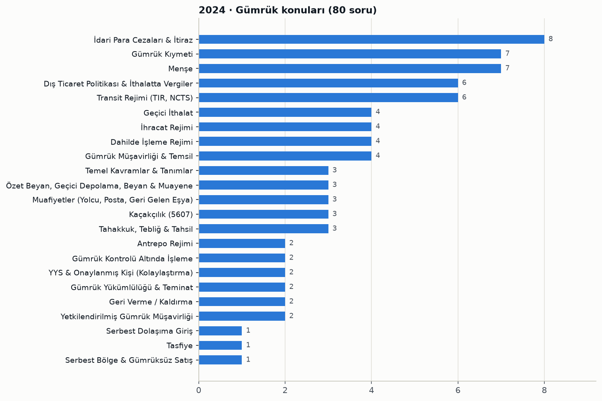

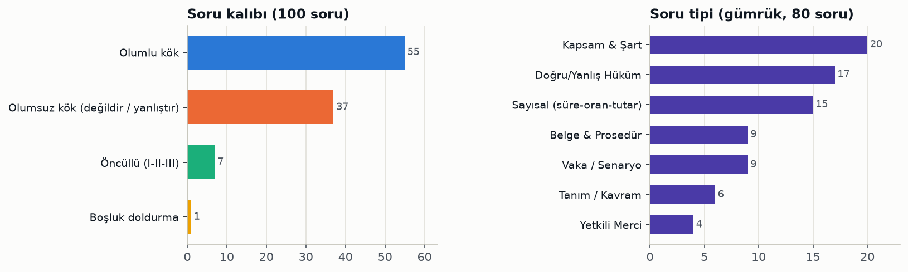

Konu tablosu ve soru numaraları

| Konu | Soru | Soru numaraları |
|---|---|---|
| İdari Para Cezaları & İtiraz | 8 | 26, 32, 48, 52, 57, 82, 85, 95 |
| Gümrük Kıymeti | 7 | 21, 22, 23, 24, 25, 27, 28 |
| Menşe | 7 | 29, 33, 34, 38, 40, 41, 68 |
| Dış Ticaret Politikası & İthalatta Vergiler | 6 | 31, 35, 36, 37, 42, 44 |
| Transit Rejimi (TIR, NCTS) | 6 | 56, 58, 59, 60, 61, 92 |
| Geçici İthalat | 4 | 39, 69, 70, 72 |
| İhracat Rejimi | 4 | 45, 49, 55, 97 |
| Dahilde İşleme Rejimi | 4 | 50, 51, 53, 54 |
| Gümrük Müşavirliği & Temsil | 4 | 87, 89, 90, 94 |
| Temel Kavramlar & Tanımlar | 3 | 30, 47, 93 |
| Özet Beyan, Geçici Depolama, Beyan & Muayene | 3 | 46, 86, 100 |
| Muafiyetler (Yolcu, Posta, Geri Gelen Eşya) | 3 | 62, 71, 98 |
| Kaçakçılık (5607) | 3 | 65, 66, 67 |
| Tahakkuk, Tebliğ & Tahsil | 3 | 79, 80, 81 |
| Antrepo Rejimi | 2 | 63, 64 |
| Gümrük Kontrolü Altında İşleme | 2 | 73, 74 |
| YYS & Onaylanmış Kişi (Kolaylaştırma) | 2 | 75, 76 |
| Gümrük Yükümlülüğü & Teminat | 2 | 77, 78 |
| Geri Verme / Kaldırma | 2 | 83, 84 |
| Yetkilendirilmiş Gümrük Müşavirliği | 2 | 88, 91 |
| Serbest Dolaşıma Giriş | 1 | 43 |
| Tasfiye | 1 | 96 |
| Serbest Bölge & Gümrüksüz Satış | 1 | 99 |

Tüm sorular: konu, kalıp, tip ve öğrenilecek bilgi

| No | Cvp | Konu / alt konu | Kalıp | Tip | Öğrenilecek bilgi |
|---|---|---|---|---|---|
| 1 | C | Yazım & Noktalama · Birleşik fiillerin yazımı | Olumsuz kök (değildir / yanlıştır) | Dil Kuralı | Ses olayına uğramayan 'arz etmek' ayrı yazılır; ses olayına uğrayan emretmek, hissetmek, affetmek, darbetmek bitişik yazılır. |
| 2 | A | Sözcükte Anlam / Deyim · Sözcükte yan anlam | Olumlu kök | Dil Kuralı | 'Dağın etekleri' söyleminde 'etek' sözcüğü temel anlamıyla ilgisini koruyarak yan anlamda kullanılmıştır. |
| 3 | E | Sözcükte Anlam / Deyim · Zıt anlamlı sözcükler | Olumlu kök | Dil Kuralı | 'Dâhil' ile 'hariç' zıt anlamlıdır; örnek-misal, acemi-toy, sorumluluk-mesuliyet, alelade-sıradan eş anlamlıdır. |
| 4 | E | Yazım & Noktalama · Soru işaretinin kullanımı | Olumsuz kök (değildir / yanlıştır) | Dil Kuralı | 'Gece oldu mu' ifadesindeki 'mu' soru değil zaman/koşul anlamı katar; bu nedenle soru işareti konmaz. |
| 5 | A | Dil Bilgisi · Topluluk adı | Olumlu kök | Dil Kuralı | 'Sürü' gibi tekil biçimiyle birden çok varlığı karşılayan sözcükler topluluk adıdır. |
| 6 | C | Problemler · Havuz-musluk problemi | Olumlu kök | Hesaplama | İki eş musluk havuzu 8 saatte dolduruyorsa tek musluk iki katı sürede, yani 16 saatte doldurur. |
| 7 | B | Problemler · Doz başına miktar hesabı | Olumlu kök | Hesaplama | 30 gün x 3 doz = 90 doz olduğundan 180 / 90 = 2 ml'dir. |
| 8 | C | Geometri · Dikdörtgen ve kare çevre-alan | Olumlu kök | Hesaplama | Dikdörtgenin çevresi 2x(100+140)=480 m, karenin kenarı 120 m ve alanı 14.400 m²'dir. |
| 9 | B | Problemler · Kütle birimleriyle toplama | Olumlu kök | Hesaplama | 1.300 g + 750 g + 1.000 g + 250 g = 3.300 g, yani 3 kg 300 g'dır. |
| 10 | A | Temel İşlem & Sayılar · Birim kesir sıralaması | Olumlu kök | Hesaplama | Payı 1 olan kesirlerde payda büyüdükçe kesir küçülür; bu nedenle 1/2 > 1/3 > 1/4'tür. |
| 11 | C | Atatürk Dönemi Dış Politika · Balkan Antantı | Olumlu kök | Olgu Bilgisi | Balkan Antantı 1934'te Türkiye, Yunanistan, Yugoslavya ve Romanya arasında sınırları karşılıklı garanti etmek için imzalanmıştır. |
| 12 | D | Osmanlı Son Dönem & I. Dünya Savaşı · I. Dünya Savaşı cepheleri | Olumsuz kök (değildir / yanlıştır) | Olgu Bilgisi | Osmanlı Devleti Galiçya, Kafkasya, Makedonya ve Çanakkale gibi cephelerde savaşmış, İspanya'da bir cephesi olmamıştır. |
| 13 | B | Millî Mücadele · Başkomutanlık Meydan Muharebesi | Olumlu kök | Olgu Bilgisi | Milli Mücadele, 26 Ağustos 1922'de başlayan Başkomutanlık Meydan Muharebesi ile zaferle sonuçlanmıştır. |
| 14 | E | İnkılaplar & Atatürk İlkeleri · 1937'de Anayasa'ya giren ilkeler | Olumsuz kök (değildir / yanlıştır) | Olgu Bilgisi | 1937'de Anayasa'ya giren ilkeler cumhuriyetçilik, milliyetçilik, halkçılık, devletçilik, laiklik ve inkılapçılıktır; gerçekçilik bunlardan değildir. |
| 15 | C | İnkılaplar & Atatürk İlkeleri · İnkılapların kronolojisi | Olumsuz kök (değildir / yanlıştır) | Olgu Bilgisi | Saltanat 1 Kasım 1922'de, yani Cumhuriyet'in ilanından (29 Ekim 1923) önce kaldırılmıştır. |
| 16 | D | Yasama (TBMM) · Yasama yetkisi | Olumlu kök | Yetkili Merci | Yasama yetkisi Türk Milleti adına TBMM'nindir ve bu yetki devredilemez. |
| 17 | A | Temel Hak ve Ödevler · Ekonomik ve sosyal haklar | Olumlu kök | Kapsam & Şart | Barınma (konut) hakkı ekonomik ve sosyal haklardandır; yaşama, adil yargılanma ve özel hayatın gizliliği kişi hakları, seçme-seçilme siyasi haktır. |
| 18 | C | Yasama (TBMM) · Yasama dokunulmazlığı | Olumlu kök | Kapsam & Şart | Yasama dokunulmazlığı TBMM üyelerine (milletvekillerine) tanınır. |
| 19 | E | Temel Hukuk & Devletin Nitelikleri · Devletin yönetim şekli | Olumlu kök | Olgu Bilgisi | Anayasa'nın 1. maddesine göre Türkiye Devleti bir Cumhuriyettir. |
| 20 | E | Yargı · Yargı mercileri | Olumsuz kök (değildir / yanlıştır) | Kapsam & Şart | Kamu Denetçiliği Kurumu TBMM'ye bağlı bir idari şikâyet/denetim kurumudur, yargı mercii değildir. |
| 21 | A | Gümrük Kıymeti · Kıymet tespit yöntemleri | Olumlu kök | Kapsam & Şart | Hesaplanmış kıymet yöntemi bir gümrük kıymeti yöntemidir; diğer seçenekler transfer fiyatlandırması yöntemleridir. |
| 22 | A | Gümrük Kıymeti · Eski model eşyada amortisman indirimi | Olumlu kök | Tanım / Kavram | Eski model eşya ve taşıtlarda model yılı fiyatından gümrük vergilerine esas fiyatı bulmak için yapılan düşüme amortisman indirimi denir. |
| 23 | E | Gümrük Kıymeti · Yardımlar (GK 27/1-b) | Olumsuz kök (değildir / yanlıştır) | Kapsam & Şart | Alıcının pazarlama dahil kendi hesabına yaptığı faaliyetler GK 27/1-b kapsamındaki yardımlardan sayılmaz ve kıymete eklenmez. |
| 24 | D | Gümrük Kıymeti · Kıymete eklenecek unsurlar | Olumlu kök | Kapsam & Şart | İthal eşyasının Türkiye'deki giriş limanı veya yerine kadar yapılan nakliye ve sigorta giderleri gümrük kıymetine eklenir. |
| 25 | B | Gümrük Kıymeti · Kıymette kur çevrimi | Olumlu kök | Belge & Prosedür | Faturadaki yabancı paralar, gümrük yükümlülüğünün başladığı tarihte geçerli TCMB döviz satış kuru üzerinden TL'ye çevrilir. |
| 26 | B | İdari Para Cezaları & İtiraz · İlişkinin beyan edilmemesi cezası | Olumlu kök | Sayısal (süre-oran-tutar) | Vergi kaybı doğmasa bile GK 24 kapsamındaki ilişkinin beyan edilmemesi halinde 2024 yılı için 1.656 TL usulsüzlük cezası uygulanır. |
| 27 | E | Gümrük Kıymeti · Benzer eşya unsurları | Olumsuz kök (değildir / yanlıştır) | Kapsam & Şart | Benzer eşyada benzer özellikler ve unsurlar, kalite, itibar ve ticari marka dikkate alınır; fiyat bu unsurlardan değildir. |
| 28 | D | Gümrük Kıymeti · İlişkili kişiler | Olumsuz kök (değildir / yanlıştır) | Kapsam & Şart | Aynı sanayi kolunda faaliyet göstermek ilişki sayılmaz; yasal ortaklık, işçi-işveren ilişkisi, kontrol ve aile üyeliği ilişki sayılır. |
| 29 | A | Menşe · Menşe şahadetnamesi içeriği | Öncüllü (I-II-III) | Kapsam & Şart | Menşe şahadetnamesinde eşyanın kıymetinin bulunması zorunlu değildir; gönderen, Türkiye'deki alıcı ve eşyanın cinsi/nev'i/ağırlık bilgileri bulunmalıdır. |
| 30 | C | Temel Kavramlar & Tanımlar · Şartlı muafiyet düzenlemesi | Olumsuz kök (değildir / yanlıştır) | Kapsam & Şart | Şartlı muafiyet düzenlemesi transit, antrepo, şartlı muafiyet sistemi şeklinde DİR, GKAİ ve geçici ithalattır; geri ödeme sistemi şeklindeki DİR bu kapsamda değildir. |
| 31 | E | Dış Ticaret Politikası & İthalatta Vergiler · İthalat Rejimi Kararı listeleri | Olumsuz kök (değildir / yanlıştır) | Kapsam & Şart | VI sayılı listenin 'nihai kullanım kapsamında indirimli vergiden faydalanacak tarım ürünleri' olarak eşleştirilmesi yanlıştır; I-Tarım, III-İşlenmiş Tarım, IV-Balıkçılık, V-Gümrük vergisi askıya alınan sanayi ürünleri eşleştirmeleri doğrudur. |
| 32 | A | İdari Para Cezaları & İtiraz · Geçici ithalatta bilgisiz çıkış cezası | Olumlu kök | Vaka / Senaryo | Geçici ithal eşyasının gümrüğe bilgi verilmeden ancak süresi içinde TGB dışına çıkarıldığı kabul edilebilir belgelerle kanıtlanırsa iki kat usulsüzlük cezası uygulanır. |
| 33 | E | Menşe · Tümüyle elde edilen eşya | Olumsuz kök (değildir / yanlıştır) | Kapsam & Şart | Deniz ürünleri ancak o ülkenin bayrağını taşıyan araçlarla o ülkenin karasuları dışındaki denizlerden çıkarılırsa tümüyle elde edilmiş sayılır; 'herhangi bir ülkenin karasularından' ifadesi yanlıştır. |
| 34 | E | Menşe · Yetersiz işçilik veya işlem | Olumsuz kök (değildir / yanlıştır) | Kapsam & Şart | Yeni bir ürün imal edilmesi veya ekonomik yönden gerekli en son esaslı işçiliğin yapılması menşe kazandırır, yetersiz işçilik sayılmaz. |
| 35 | B | Dış Ticaret Politikası & İthalatta Vergiler · Ek mali yükümlülük | Olumsuz kök (değildir / yanlıştır) | Doğru/Yanlış Hüküm | Ek mali yükümlülük vergi dairesince değil, gümrük vergisinin tabi olduğu usul ve hükümlere göre gümrük idaresince tahsil edilir. |
| 36 | B | Dış Ticaret Politikası & İthalatta Vergiler · İlave gümrük vergisi | Olumsuz kök (değildir / yanlıştır) | Doğru/Yanlış Hüküm | İGV Kararının uygulanmasında eşyanın menşeinin doğru beyan edilmesinden ithalatçı sorumludur. |
| 37 | D | Dış Ticaret Politikası & İthalatta Vergiler · Kota tanımı | Olumlu kök | Tanım / Kavram | Bir takvim yılı veya belirli bir dönemde yapılmasına izin verilen ithalatın miktar ve/veya değerine kota denir. |
| 38 | A | Menşe · Menşe şahadetnamesini düzenleyen makam | Olumlu kök | Yetkili Merci | GY md. 38'e göre menşe şahadetnamesi menşe ülke veya ihracatçı ülke yetkili makamlarınca düzenlenir. |
| 39 | C | Geçici İthalat · Geçici ithalat beyan belgeleri | Olumsuz kök (değildir / yanlıştır) | Belge & Prosedür | TIR Karnesi transit belgesidir; geçici ithalat beyanı gümrük beyannamesi, sözlü beyan formu, ATA Karnesi ve Yabancı Taşıtlar Geçici Giriş Karnesi ile yapılabilir. |
| 40 | B | Menşe · Menşe ve serbest dolaşım ayrımı | Olumsuz kök (değildir / yanlıştır) | Vaka / Senaryo | İşçilik görmeden vergileri ödenerek AB'de serbest dolaşıma giren üçüncü ülke malı Almanya'da menşe kazanmaz; menşei Çin olarak kalır, yalnızca serbest dolaşım statüsü kazanır. |
| 41 | C | Menşe · GTS menşe ispat belgesi | Olumlu kök | Belge & Prosedür | GTS kapsamında kullanılan menşe ispat belgesi Form A'dır. |
| 42 | C | Dış Ticaret Politikası & İthalatta Vergiler · GTS tanımı | Olumlu kök | Tanım / Kavram | Gelişmiş ülkelerin gelişmekte olan ve en az gelişmiş ülkelere tek taraflı tanıdığı tercihli rejim Genelleştirilmiş Tercihler Sistemi'dir. |
| 43 | E | Serbest Dolaşıma Giriş · En yüksek vergili pozisyon uygulaması | Olumsuz kök (değildir / yanlıştır) | Doğru/Yanlış Hüküm | Farklı tarife pozisyonlu eşyanın tamamına en yüksek vergili pozisyon üzerinden vergi uygulanması yalnızca beyan sahibinin talebi üzerine mümkündür. |
| 44 | C | Dış Ticaret Politikası & İthalatta Vergiler · Sınır ticareti yetkisi | Boşluk doldurma | Yetkili Merci | GK'ya göre sınır ticaretinin kapsamını, merkezlerini, usul ve esaslarını belirlemeye ve tek ve maktu tarife uygulamaya Cumhurbaşkanı yetkilidir. |
| 45 | D | İhracat Rejimi · İhracatta beyanname yerine geçen belgeler | Olumsuz kök (değildir / yanlıştır) | Belge & Prosedür | İhracatta özel fatura, kumanya listesi, Form 302 ve sözlü beyan formu ile işlem yürütülebilir; A.TR bir dolaşım belgesidir, işlem belgesi değildir. |
| 46 | B | Özet Beyan, Geçici Depolama, Beyan & Muayene · İhraç eşyasının geçici depolama süresi | Olumlu kök | Sayısal (süre-oran-tutar) | GY'ye göre ihracat veya yeniden ihracat amacıyla geçici depolama yerine konulan eşya buralarda en fazla bir ay kalabilir. |
| 47 | C | Temel Kavramlar & Tanımlar · İhracat gümrük idaresi tanımı | Olumlu kök | Tanım / Kavram | TGB'yi terk edecek eşyanın risk analizine dayalı kontroller dahil GOİK işlemlerinin yapıldığı idare ihracat gümrük idaresidir. |
| 48 | B | İdari Para Cezaları & İtiraz · İhraç eşyasında %10 fark cezası | Olumlu kök | Vaka / Senaryo | 5607 saklı kalmak kaydıyla ihraç eşyasında %10'dan fazla miktar/cins farkında GK 241/1'deki miktarın iki katı usulsüzlük cezası uygulanır. |
| 49 | D | İhracat Rejimi · 1040 rejim kodu | Olumlu kök | Belge & Prosedür | 1040 rejim kodu, muafiyete tabi olmadan serbest dolaşım ile eş zamanlı yurtiçi kullanıma giren eşyanın kesin ihracatını ifade eder. |
| 50 | D | Dahilde İşleme Rejimi · Dahilde işleme izni şartları | Olumsuz kök (değildir / yanlıştır) | Doğru/Yanlış Hüküm | Ticari nitelikte olmayan dahilde işleme amaçlı ithalatta TGB dışında yerleşik kişilere de izin verilebilir; 'verilmez' ifadesi yanlıştır. |
| 51 | B | Dahilde İşleme Rejimi · Şartlı muafiyet ve geri ödeme sistemi | Olumsuz kök (değildir / yanlıştır) | Doğru/Yanlış Hüküm | Vergilerin teminata bağlanarak serbest dolaşımda olmayan eşyanın geçici ithali şartlı muafiyet sistemidir; geri ödeme sisteminde eşya serbest dolaşıma girer ve ihracat sonrası vergiler geri verilir. |
| 52 | C | İdari Para Cezaları & İtiraz · GK 235/2-a ihracat cezası | Olumlu kök | Vaka / Senaryo | GK 235/2-a kapsamındaki idari para cezası, ihracı genel düzenleyici idari işlemle yasaklanmış eşyanın ihracı halinde uygulanır. |
| 53 | E | Dahilde İşleme Rejimi · DİR'de ek süre mücbir sebepleri | Öncüllü (I-II-III) | Kapsam & Şart | DİR Tebliğine göre devlet yasakları/harp/abluka, faaliyetin kamu otoritesince kısıtlanması veya el konulması ve iflas/konkordato ek süreye dayanak olur; şahıs firması sahibinin ölümü bu listede yer almaz. |
| 54 | B | Dahilde İşleme Rejimi · Telafi edici vergi (TEV) | Olumsuz kök (değildir / yanlıştır) | Doğru/Yanlış Hüküm | TEV, ithalat değil ihracat beyannamesinin tescil tarihindeki vergi oranı ve vergilendirme unsurlarına göre hesaplanır. |
| 55 | E | İhracat Rejimi · TGB'yi terk tarihi | Öncüllü (I-II-III) | Kapsam & Şart | Demiryolu çıkışlarında taşıtın hareket tarihi ile hava taşıtlarına kumanya/ihrakiye/donatım teslimlerinde taşıtın hareket tarihi terk tarihi sayılmaz (III ve V); kumanya teslimlerinde esas eşyanın teslim edildiği tarihtir. |
| 56 | B | Transit Rejimi (TIR, NCTS) · Transitte teminat türleri | Olumlu kök | Kapsam & Şart | Ulusal ve ortak transit rejimlerinde bireysel teminatın yanı sıra kapsamlı teminat kullanılabilir. |
| 57 | A | İdari Para Cezaları & İtiraz · Transitte serbest dolaşım eşyası aykırılığı | Olumlu kök | Vaka / Senaryo | GY'ye göre transit rejiminde taşınan serbest dolaşımdaki eşyada beyana aykırılık tespit edilirse GK 241. madde (usulsüzlük cezası) uygulanır. |
| 58 | C | Transit Rejimi (TIR, NCTS) · Teminattan vazgeçme izni | Olumlu kök | Yetkili Merci | Transit rejiminde basitleştirme olan teminattan vazgeçme izni Gümrükler Genel Müdürlüğünce verilir. |
| 59 | C | Transit Rejimi (TIR, NCTS) · Transit taşıma belgeleri | Olumsuz kök (değildir / yanlıştır) | Belge & Prosedür | Transit taşıması TIR Karnesi, transit refakat belgesi, ATA Karnesi veya CIM gibi belgelerle yapılır; CMR bir taşıma sözleşmesi belgesi olup transit belgesi değildir. |
| 60 | B | Transit Rejimi (TIR, NCTS) · Transitte teminat zorunluluğu | Öncüllü (I-II-III) | Doğru/Yanlış Hüküm | Transitte teminat zorunludur; hava, deniz ve demiryolu taşımalarında teminatın 'her halde' aranmayacağı ifadesi yanlıştır. |
| 61 | B | Transit Rejimi (TIR, NCTS) · TIR'da güzergâh kat etme süresi | Olumlu kök | Sayısal (süre-oran-tutar) | TIR Tebliğine göre Nisan-Eylül aylarında verilecek azami güzergâh kat etme süresi 120 saattir. |
| 62 | E | Muafiyetler (Yolcu, Posta, Geri Gelen Eşya) · Engelli araç muafiyeti | Olumsuz kök (değildir / yanlıştır) | Doğru/Yanlış Hüküm | Engelli kişilerin serbest dolaşıma soktuğu özel tertibatlı arazi taşıtlarına muafiyet tanınmaz. |
| 63 | E | Antrepo Rejimi · Özel antrepo türleri | Öncüllü (I-II-III) | Kapsam & Şart | İşleticisi ile kullanıcısı aynı kişi olan antrepo ve gümrüksüz satış mağazası özel antrepodur. |
| 64 | A | Antrepo Rejimi · Özel antrepoda eşya devri | Olumlu kök | Sayısal (süre-oran-tutar) | Özel antrepodaki eşyanın devri, devri müteakip 5 iş günü içinde yeni bir GOİK'e tabi tutularak antrepodan çıkarılması şartıyla kabul edilir. |
| 65 | C | Kaçakçılık (5607) · Gümrük kapıları dışından sokma artırımı | Olumlu kök | Sayısal (süre-oran-tutar) | Eşyanın gümrük kapıları dışından ülkeye sokulması halinde verilecek ceza üçte birinden yarısına kadar artırılır. |
| 66 | B | Kaçakçılık (5607) · Kaçakçılıkta teşebbüs | Olumlu kök | Vaka / Senaryo | 5607 md. 3'teki kaçakçılık fiillerinin teşebbüs aşamasında kalması halinde fail tamamlanmış suç gibi cezalandırılır. |
| 67 | E | Kaçakçılık (5607) · Kaçakçılık suçunu oluşturan fiiller | Olumsuz kök (değildir / yanlıştır) | Kapsam & Şart | Antrepo veya gümrükçe izin verilen yerlerdeki sayımlarda kayıtlara göre fazla eşya çıkması kaçakçılık suçu oluşturmaz. |
| 68 | A | Menşe · Tercihsiz menşe belgesi | Olumlu kök | Belge & Prosedür | Tercihli olmayan menşei gösteren belge menşe şahadetnamesidir; EUR.1, menşe beyanı, Form A ve fatura beyanı tercihli menşe belgeleridir. |
| 69 | B | Geçici İthalat · Geçici ithalat genel hükümleri | Olumsuz kök (değildir / yanlıştır) | Doğru/Yanlış Hüküm | Geçici ithalat rejimindeki eşyanın kiralanması mümkün değildir; gümrük izniyle kiralanabileceği ifadesi yanlıştır. |
| 70 | C | Geçici İthalat · Geçici ithalata konu eşya | Olumsuz kök (değildir / yanlıştır) | Kapsam & Şart | Uluslararası etkinliklerde kullanılmak üzere getirilen tüketilebilir nitelikteki eşya, yeniden ihracı mümkün olmadığından geçici ithalata konu olamaz. |
| 71 | A | Muafiyetler (Yolcu, Posta, Geri Gelen Eşya) · Geri gelen eşyada süre aşımı | Olumlu kök | Vaka / Senaryo | Geri gelen eşya GK 168'deki üç yıllık (veya uzatılan) süreyi aşarak getirilirse 241/3-ı uyarınca usulsüzlük cezası uygulanır ve vergiler tahsil edilerek serbest dolaşıma giriş hükümleri uygulanır. |
| 72 | B | Geçici İthalat · Kısmi muafiyet ve teminat | Olumsuz kök (değildir / yanlıştır) | Doğru/Yanlış Hüküm | Kısmi muafiyette vergilerin tamamı değil, eşyanın rejimde kaldığı her ay için hesaplanan vergilerin %3'ü tahsil edilir. |
| 73 | B | Gümrük Kontrolü Altında İşleme · GKAİ rejimi tanımı | Olumlu kök | Tanım / Kavram | GKAİ, serbest dolaşıma girmemiş eşyanın ithalat vergileri ve ticaret politikası önlemlerine tabi tutulmaksızın işlenmesi ve ürünlerin gümrük vergileri üzerinden serbest dolaşıma girmesini sağlar. |
| 74 | E | Gümrük Kontrolü Altında İşleme · GKAİ izin şartları | Olumsuz kök (değildir / yanlıştır) | Doğru/Yanlış Hüküm | GKAİ rejiminde işlenmek üzere ithaline izin verilen eşyanın vergileri teminata bağlanır; 'teminata bağlanmaz' ifadesi yanlıştır. |
| 75 | B | YYS & Onaylanmış Kişi (Kolaylaştırma) · OKS faaliyet süresi şartı | Olumlu kök | Sayısal (süre-oran-tutar) | GY'ye göre onaylanmış kişi statüsü için başvuracak TGB'de yerleşik kişinin en az 2 yıldır faaliyette bulunması gerekir. |
| 76 | E | YYS & Onaylanmış Kişi (Kolaylaştırma) · YYS geçerlilik süresi | Olumlu kök | Sayısal (süre-oran-tutar) | YYS, askıya alma, geri alma veya iptal halleri saklı kalmak üzere süresiz geçerlidir. |
| 77 | C | Gümrük Yükümlülüğü & Teminat · Götürü teminatın kullanımı | Olumsuz kök (değildir / yanlıştır) | Kapsam & Şart | Götürü teminat transit rejiminde kullanılamaz; geçici ithalat, DİR, antrepo ve GKAİ rejimlerinde kullanılabilir. |
| 78 | D | Gümrük Yükümlülüğü & Teminat · Teminat türleri | Olumsuz kök (değildir / yanlıştır) | Kapsam & Şart | Gümrük mevzuatında bireysel, götürü, toplu ve kapsamlı teminat bulunur; 'yaygın toplu teminat' diye bir tür yoktur. |
| 79 | C | Tahakkuk, Tebliğ & Tahsil · Sonradan kontrolde tebligat süresi | Olumlu kök | Sayısal (süre-oran-tutar) | Denetim sonucu hiç veya noksan alındığı belirlenen gümrük vergileri, yükümlülüğün doğduğu tarihten itibaren üç yıl içinde tebliğ edilmelidir. |
| 80 | B | Tahakkuk, Tebliğ & Tahsil · Gümrük vergilerinin tebliği | Olumlu kök | Doğru/Yanlış Hüküm | Beyannamedeki vergi tutarı ile idarece hesaplanan tutar eşitse eşyanın teslimi gümrük vergilerinin yükümlüye tebliği yerine geçer. |
| 81 | E | Tahakkuk, Tebliğ & Tahsil · Noksan vergilerde ödeme süresi | Olumlu kök | Doğru/Yanlış Hüküm | Noksan alınan vergilerde ödeme süresi bitmeden yazılı istemde bulunulması ve teminat alınması şartıyla süre 30 gün daha uzatılabilir. |
| 82 | B | İdari Para Cezaları & İtiraz · Ceza tahakkuk zamanaşımı | Olumlu kök | Sayısal (süre-oran-tutar) | Gümrük vergileri alacağına bağlı idari para cezalarında tahakkuk zamanaşımı, yükümlülüğün doğduğu tarihten itibaren 3 yıldır. |
| 83 | B | Geri Verme / Kaldırma · Uluslararası anlaşmayla geri verme süresi | Olumlu kök | Sayısal (süre-oran-tutar) | Uluslararası anlaşma hükümleri çerçevesinde geri verme başvurusu, vergilerin yükümlüye tebliğinden itibaren 1 yıl içinde yapılır. |
| 84 | E | Geri Verme / Kaldırma · Geri verme başvuru ve karar usulü | Olumsuz kök (değildir / yanlıştır) | Doğru/Yanlış Hüküm | Geri verme veya kaldırma talebinin 45 gün içinde karara bağlanacağı ifadesi mevzuattaki süreyle uyuşmadığı için yanlıştır; elektronik form, başvuru sahipleri ve kusurlu eşyaya ilişkin ifadeler doğrudur. |
| 85 | B | İdari Para Cezaları & İtiraz · Cezanın birden fazla kişiye tebliği | Öncüllü (I-II-III) | Vaka / Senaryo | Cevap anahtarına göre aynı idari para cezası hem firmaya hem gümrük müşavirine tebliğ edilmişse her biri 25.000 TL'yi ayrı ayrı öder. |
| 86 | C | Özet Beyan, Geçici Depolama, Beyan & Muayene · Özet beyan verilme yeri ve süreleri | Öncüllü (I-II-III) | Doğru/Yanlış Hüküm | Özet beyan giriş gümrük idaresine verilir; demiryolunda varıştan en az 2 saat önce, kısa mesafeli uçuşlarda en geç uçağın havalandığı anda verilir; uzun mesafeli uçuşlarda 8 saat ifadesi yanlıştır. |
| 87 | D | Gümrük Müşavirliği & Temsil · Disiplin cezalarının uygulanma zamanı | Olumlu kök | Belge & Prosedür | Gümrük müşavirleri ve yardımcılarına verilen disiplin cezaları kesinleşme tarihinden itibaren uygulanır. |
| 88 | D | Yetkilendirilmiş Gümrük Müşavirliği · DR2 tespit raporu süresi | Olumlu kök | Sayısal (süre-oran-tutar) | YGM Tebliğine göre DR2 tespit raporları, gümrük idaresinin firmaya tebligatını müteakip en geç 1 ay içinde sunulur. |
| 89 | B | Gümrük Müşavirliği & Temsil · Kınama cezası tanımı | Olumlu kök | Tanım / Kavram | Meslek mensubuna görevinde ve davranışında kusurlu sayıldığının yazı ile bildirilmesi kınama cezasıdır. |
| 90 | C | Gümrük Müşavirliği & Temsil · Meslekten çıkarmada yetkili merci | Olumlu kök | Yetkili Merci | Gümrük müşavirlerine meslekten çıkarma cezası Yüksek Disiplin Kurulu tarafından verilir. |
| 91 | A | Yetkilendirilmiş Gümrük Müşavirliği · YGM rapor kodları (TP1) | Olumlu kök | Belge & Prosedür | Kapanmış beyannamelerde İthalat Rejimi Kararı md. 4 önlemlerine tabi eşyanın kapsam dışı olup olmadığının tespitine ilişkin YGM raporunun kodu TP1'dir. |
| 92 | A | Transit Rejimi (TIR, NCTS) · Transit rejiminin sona ermesi | Olumlu kök | Vaka / Senaryo | Transit rejimi, eşya ile birlikte ilgili belgelerin mevzuata uygun olarak varış gümrük idaresine sunulmasıyla sona erer. |
| 93 | E | Temel Kavramlar & Tanımlar · GOİK kapsamı | Olumsuz kök (değildir / yanlıştır) | Kapsam & Şart | GOİK; rejime tabi tutma, serbest bölgeye girme, yeniden ihraç, imha ve gümrüğe terktir; 'teslim' GOİK değildir. |
| 94 | D | Gümrük Müşavirliği & Temsil · GMY izin belgesi verilme süresi | Olumlu kök | Sayısal (süre-oran-tutar) | Koşulları sağlayanlara müracaat belgelerinin tamamlanmasından itibaren 60 gün içinde Gümrük Müşavir Yardımcılığı İzin Belgesi verilir. |
| 95 | A | İdari Para Cezaları & İtiraz · İtiraz süresi | Olumlu kök | Sayısal (süre-oran-tutar) | Tebliğ edilen gümrük vergileri, cezalar ve idari kararlara karşı tebliğden itibaren 15 gün içinde bir üst makama, yoksa aynı makama itiraz edilir. |
| 96 | B | Tasfiye · Tasfiye yöntemleri | Olumsuz kök (değildir / yanlıştır) | Kapsam & Şart | GK'daki tasfiye yöntemleri arasında tahsis, yeniden ihraç amaçlı satış, perakende satış ve imha vardır; sergi ve fuarlarda kullanım bir tasfiye yöntemi değildir. |
| 97 | E | İhracat Rejimi · İhracat beyannamesi kapatma süresi | Olumlu kök | Sayısal (süre-oran-tutar) | Geçici depolama yerine konulmadan ihraç edilecek eşyanın beyanname kapatma süresi iki ay olup gümrük müdürlüklerince makul sebeplerle en çok iki ay uzatılabilir. |
| 98 | B | Muafiyetler (Yolcu, Posta, Geri Gelen Eşya) · Yolcu beraberi kişisel eşya limitleri | Olumsuz kök (değildir / yanlıştır) | Sayısal (süre-oran-tutar) | Yolcu beraberinde muafiyet tanınan puro miktarı 100 değil 50 adettir. |
| 99 | B | Serbest Bölge & Gümrüksüz Satış · Serbest bölge genel hükümleri | Olumsuz kök (değildir / yanlıştır) | Doğru/Yanlış Hüküm | Serbest dolaşım hakkını kazanmış eşyanın serbest bölgeden AB'ye ihracında A.TR dolaşım belgesi düzenlenebilir; 'düzenlenemez' ifadesi yanlıştır. |
| 100 | A | Özet Beyan, Geçici Depolama, Beyan & Muayene · Geçici depolama yerleri | Olumsuz kök (değildir / yanlıştır) | Doğru/Yanlış Hüküm | Eşya geçici depolama yerine rejim beyanı kapsamında değil, özet beyan kapsamında konulur. |

### 2025

- Gümrük rejimleri grubu 27/80 ile beş yılın en yükseği. Dahilde İşleme (7, 54–60 bloğu), Serbest Dolaşım & Nihai Kullanım (5) ve Geçici İthalat (5) öne çıkıyor.
- En çok soru Menşe konusundan geldi: 9 soru (33–44). A.TR ile EUR.1 ayrımı, yetersiz işçilik, tümüyle elde edilen eşya, menşe şahadetnamesinin 6 ay içinde sonradan ibrazı ve basım yetkilisi TOBB/TESK/TİM soruldu.
- Soru kalıbı değişti: 17 öncüllü (önceki yıllarda 4–7) ve 5 boşluk doldurma sorusu var. Olumsuz kök %24'e indi (beş yılın en düşüğü).
- Mevzuat kaynağı genişledi. 4458'e dayanan soru 21'e düştü; tebliğler (9: Nihai Kullanım, Tarife/BTB, Seri 149, Kara Taşıtları) ve dış ticaret mevzuatı (6) zirve yaptı.
- Hesap soruları geldi: kendiliğinden başvuruda ceza tutarı, kullanılmış taşıtta yıl düşümü, EXW'den kıymet. Kaçakçılık 3 soruya geriledi. Genel yetenekte matematik çok temel günlük hayat problemleriydi.

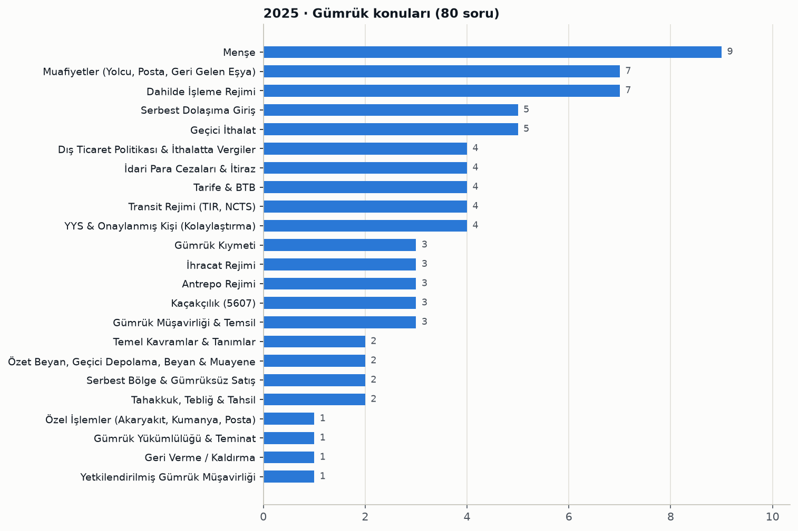

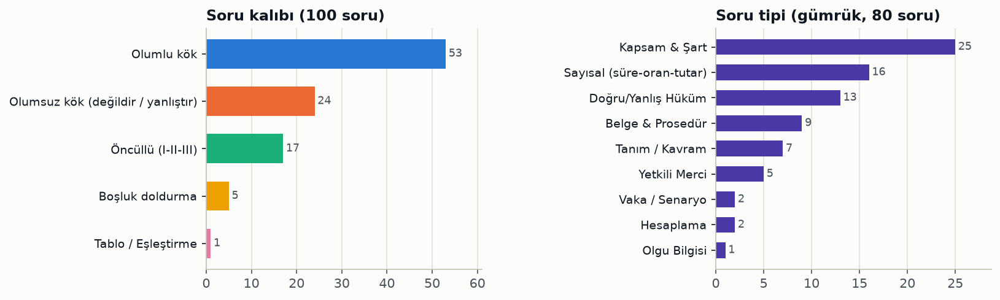

Konu tablosu ve soru numaraları

| Konu | Soru | Soru numaraları |
|---|---|---|
| Menşe | 9 | 33, 34, 35, 38, 39, 40, 41, 42, 44 |
| Muafiyetler (Yolcu, Posta, Geri Gelen Eşya) | 7 | 49, 65, 66, 67, 68, 71, 84 |
| Dahilde İşleme Rejimi | 7 | 54, 55, 56, 57, 58, 59, 60 |
| Serbest Dolaşıma Giriş | 5 | 27, 28, 30, 31, 36 |
| Geçici İthalat | 5 | 79, 80, 81, 83, 85 |
| Dış Ticaret Politikası & İthalatta Vergiler | 4 | 22, 37, 43, 45 |
| İdari Para Cezaları & İtiraz | 4 | 24, 32, 82, 96 |
| Tarife & BTB | 4 | 29, 46, 47, 94 |
| Transit Rejimi (TIR, NCTS) | 4 | 61, 62, 63, 64 |
| YYS & Onaylanmış Kişi (Kolaylaştırma) | 4 | 86, 87, 88, 89 |
| Gümrük Kıymeti | 3 | 21, 25, 26 |
| İhracat Rejimi | 3 | 52, 53, 95 |
| Antrepo Rejimi | 3 | 69, 74, 75 |
| Kaçakçılık (5607) | 3 | 76, 77, 78 |
| Gümrük Müşavirliği & Temsil | 3 | 98, 99, 100 |
| Temel Kavramlar & Tanımlar | 2 | 23, 50 |
| Özet Beyan, Geçici Depolama, Beyan & Muayene | 2 | 48, 73 |
| Serbest Bölge & Gümrüksüz Satış | 2 | 70, 72 |
| Tahakkuk, Tebliğ & Tahsil | 2 | 90, 91 |
| Özel İşlemler (Akaryakıt, Kumanya, Posta) | 1 | 51 |
| Gümrük Yükümlülüğü & Teminat | 1 | 92 |
| Geri Verme / Kaldırma | 1 | 93 |
| Yetkilendirilmiş Gümrük Müşavirliği | 1 | 97 |

Tüm sorular: konu, kalıp, tip ve öğrenilecek bilgi

| No | Cvp | Konu / alt konu | Kalıp | Tip | Öğrenilecek bilgi |
|---|---|---|---|---|---|
| 1 | A | Anlatım Bozukluğu · Gereksiz sözcük kullanımı | Olumlu kök | Dil Kuralı | “Birlikte” ve “ortak olarak” aynı anlamı taşıdığından birlikte kullanılmaları gereksiz sözcükten kaynaklanan bir anlatım bozukluğudur. |
| 2 | E | Yazım & Noktalama · Noktalama işaretlerinin işlevi | Olumsuz kök (değildir / yanlıştır) | Dil Kuralı | Metinde sıralı cümleleri ayıran virgül yoktur; eser adı ve özel vurgu için tırnak, cümle sonunda nokta ve özel isme gelen eki ayıran kesme işareti örneklenmiştir. |
| 3 | B | Paragraf · Paragrafın cevap verdiği soru | Olumlu kök | Yorum / Çıkarım | Parça, atalarımızın çok okumayı ve çok gezmeyi bir arada sürdürdüğünü anlattığı için “Çok gezen mi bilir, çok okuyan mı?” sorusuna cevaptır. |
| 4 | D | Paragraf · Metinden neden çıkarımı | Olumsuz kök (değildir / yanlıştır) | Yorum / Çıkarım | Metinde martının diğer martılarla birlikte yaşamak istediğine dair bir ifade yoktur; aksine yalnızlığı sevdiği belirtilir. |
| 5 | C | Cümlede Anlam · Koşul-sonuç ilişkisi | Olumlu kök | Dil Kuralı | “-sa/-se” şart ekiyle kurulan “çalışırsan başarılı olursun” yapısı koşul-sonuç ilişkisi bildirir. |
| 6 | D | Problemler · Litre-mililitre dönüşümü | Olumlu kök | Hesaplama | 3 × 500 ml = 1500 ml süt 12 çocuğa bölününce her çocuğa 125 ml düşer. |
| 7 | E | Problemler · Saat ve süre hesabı | Olumlu kök | Hesaplama | 13.30'a 2 saat 15 dakika eklenince bitiş saati 15.45 olur. |
| 8 | B | Problemler · Fiyat hesaplama problemi | Olumlu kök | Hesaplama | Set fiyatı 3 × 250 + 100 = 850 liradır. |
| 9 | D | Problemler · Düzenli artış problemi | Olumlu kök | Hesaplama | 80 + 15 × 30 = 530 lira olur. |
| 10 | E | Problemler · Ders-teneffüs saat hesabı | Olumlu kök | Hesaplama | 4 ders (200 dk) ile aradaki 3 teneffüs (30 dk) toplam 230 dakika olduğundan 8.40 + 3 saat 50 dakika = 12.30'dur. |
| 11 | C | Millî Mücadele · Milli Mücadele dönemi olayları | Olumsuz kök (değildir / yanlıştır) | Olgu Bilgisi | Hilafetin kaldırılması (3 Mart 1924) Milli Mücadele sonrası Cumhuriyet dönemine ait bir inkılaptır. |
| 12 | C | Millî Mücadele · Mudanya Mütarekesi | Olumlu kök | Olgu Bilgisi | Mudanya Mütarekesi (11 Ekim 1922), Büyük Taarruz sonrasında TBMM Hükümeti ile İtilaf Devletleri arasında imzalanan ateşkestir. |
| 13 | E | Millî Mücadele · Samsun'a çıkış tarihi | Olumlu kök | Olgu Bilgisi | Mustafa Kemal Paşa Milli Mücadeleyi başlatmak için 19 Mayıs 1919'da Samsun'a çıkmıştır. |
| 14 | B | Millî Mücadele · Nutuk | Olumlu kök | Olgu Bilgisi | Atatürk'ün 1927'de okuduğu Nutuk, 1919-1927 arası Milli Mücadele ve Cumhuriyet'in kuruluş sürecini anlatır. |
| 15 | A | İnkılaplar & Atatürk İlkeleri · Atatürk inkılaplarının amaçları | Olumsuz kök (değildir / yanlıştır) | Olgu Bilgisi | Atatürk inkılapları milli egemenliği ve çağdaşlaşmayı amaçlar; padişahlığı geri getirmek amaç değildir, saltanat 1922'de kaldırılmıştır. |
| 16 | B | Temel Hak ve Ödevler · Temel hakların güvencesi | Olumlu kök | Olgu Bilgisi | Temel hak ve özgürlükler normlar hiyerarşisinin en üstündeki Anayasa ile güvence altına alınmıştır. |
| 17 | B | Yürütme (Cumhurbaşkanı) · Yürütme organının görevleri | Olumlu kök | Kapsam & Şart | Kanunları uygulamak yürütmenin görevidir; kanun yapma ve değiştirme yasamaya, yargısal denetim yargıya aittir. |
| 18 | C | Yasama (TBMM) · Kanun teklif yetkisi | Olumlu kök | Yetkili Merci | 2017 Anayasa değişikliğiyle kanun teklif etme yetkisi yalnızca milletvekillerine aittir. |
| 19 | C | Temel Hak ve Ödevler · Vatandaşlara özgü haklar | Olumlu kök | Kapsam & Şart | Seçme ve seçilme hakkı siyasi bir hak olup yalnızca Türk vatandaşlarına tanınmıştır. |
| 20 | C | Seçimler · Seçme ve seçilme yaşı | Olumlu kök | Sayısal (süre-oran-tutar) | Türkiye'de 18 yaşını dolduran vatandaşlar seçme ve milletvekili seçilme hakkına sahiptir. |
| 21 | E | Gümrük Kıymeti · GATT gümrük kıymeti maddesi | Olumlu kök | Olgu Bilgisi | Gümrük kıymeti 1994 GATT'ın VII. maddesinde düzenlenmiştir; Kıymet Anlaşması bu maddenin uygulanmasına ilişkindir. |
| 22 | E | Dış Ticaret Politikası & İthalatta Vergiler · Gümrüklenmiş değer unsurları | Olumsuz kök (değildir / yanlıştır) | Kapsam & Şart | Gecikme zammı gümrüklenmiş değere dahil edilmez; ek mali yükümlülük, gümrük vergisi, KDV ve ÖTV gibi ithalatta alınan vergiler dikkate alınır. |
| 23 | E | Temel Kavramlar & Tanımlar · Gümrük vergileri deyimi | Olumsuz kök (değildir / yanlıştır) | Kapsam & Şart | Gümrük vergileri; gümrük vergisi, İGV, KDV, ÖTV gibi eşyanın ithal veya ihracına bağlı vergileri kapsar, Kurumlar Vergisi bu kapsama girmez. |
| 24 | D | İdari Para Cezaları & İtiraz · Kendiliğinden başvuruda ceza | Olumlu kök | Vaka / Senaryo | Gümrük idaresince tespit yapılmadan önce yükümlü kendiliğinden başvurursa eksik vergi için GK 234'teki vergi katı ceza yerine GK 241/1 usulsüzlük cezası (2025 için 1.191 TL) uygulanır. |
| 25 | D | Gümrük Kıymeti · Kullanılmış taşıtta yıl düşümü | Olumlu kök | Hesaplama | Kullanılmış taşıtta fatura tarihinden ithal tarihine kadar geçen her yıl için %10 düşülür; 2 yıl için 10.000 TL − %20 = 8.000 TL olur. |
| 26 | C | Gümrük Kıymeti · EXW teslimde kıymet hesabı | Olumlu kök | Hesaplama | EXW bedeline Türkiye sınırına kadarki nakliye (500 TL) ve sigorta (100 TL) eklenir, sınırdan sonraki nakliye eklenmez: 5.000 + 500 + 100 = 5.600 TL. |
| 27 | B | Serbest Dolaşıma Giriş · Nihai kullanım izninin sonradan verilmesi | Boşluk doldurma | Sayısal (süre-oran-tutar) | YYS veya OKS sahiplerine, ayniyet ya da tahsis tespiti şartıyla beyanname tescilinden itibaren 3 ay içinde başvurulursa nihai kullanım izni sonradan verilebilir. |
| 28 | E | Serbest Dolaşıma Giriş · Nihai kullanım eşyasının devri | Olumsuz kök (değildir / yanlıştır) | Doğru/Yanlış Hüküm | Nihai kullanım eşyası başka bir izin hak sahibine devredildiğinde eşyaya ilişkin hak ve yükümlülükler devralan izin hak sahibine geçer. |
| 29 | A | Tarife & BTB · BTB geçerlilik ve başvuru kuralları | Olumsuz kök (değildir / yanlıştır) | Doğru/Yanlış Hüküm | TGTC'de yapılan değişikliğe uymayan BTB, yasal sürenin dolması beklenmeden değişikliğin yürürlüğe girdiği tarihten itibaren geçerliliğini yitirir. |
| 30 | E | Serbest Dolaşıma Giriş · Tescil sonrası lehe vergi oranı | Öncüllü (I-II-III) | Kapsam & Şart | Tarımsal mali yükler dışındaki vergi oranı tescilden sonra indirilirse; beyan sahibinin talebi, indirimin vergiler ödenmeden veya teminata bağlanmadan önce yapılması ve gecikmenin beyan sahibinden kaynaklanmaması koşuluyla lehe oran uygulanır. |
| 31 | E | Serbest Dolaşıma Giriş · Serbest dolaşım statüsünün kaybı | Öncüllü (I-II-III) | Kapsam & Şart | Beyannamenin iptali, geri ödeme sistemli DİR'de vergilerin geri verilmesi, kusurlu eşya ve ihraç/geri gönderme/GOİK nedeniyle vergilerin geri verilmesi veya kaldırılması hallerinin tümünde eşya serbest dolaşım statüsünü kaybeder. |
| 32 | D | İdari Para Cezaları & İtiraz · İthali yasak eşyanın iadesi | Olumlu kök | Sayısal (süre-oran-tutar) | GK 235/1-a kapsamındaki eşya, ithalinin yasak olduğunun yükümlüye bildirildiği tarihten itibaren 30 gün içinde talep üzerine mahrecine iade edilebilir veya ilgili kurumun uygun görüşüyle üçüncü ülkeye transit edilebilir. |
| 33 | A | Menşe · Yetersiz işçilik veya işlemler | Öncüllü (I-II-III) | Kapsam & Şart | Tarife pozisyonunun değişmesine yol açan üretim yetersiz işlem değildir; nakliyat ve depolamaya ilişkin işlemler, ambalaj değişikliği ve parçaların basit montajı yetersiz işçilik sayılır. |
| 34 | E | Menşe · A.TR Dolaşım Belgesi | Olumlu kök | Belge & Prosedür | Türkiye-AB Gümrük Birliği kapsamındaki sanayi ürünleri ve işlenmiş tarım ürünlerinde eşyanın serbest dolaşımda olduğu A.TR Dolaşım Belgesi ile gösterilir. |
| 35 | C | Menşe · Menşe şahadetnamesinin içeriği | Olumsuz kök (değildir / yanlıştır) | Kapsam & Şart | Menşe şahadetnamesinde gönderen ve alıcı bilgileri, kapların marka/numara/sayısı ve veren makamın tasdik şerhi zorunludur; eşyanın kıymeti zorunlu bilgi değildir. |
| 36 | D | Serbest Dolaşıma Giriş · Serbest dolaşıma giriş tanımı | Olumlu kök | Tanım / Kavram | Ticaret politikası önlemleri uygulanarak ithali için öngörülen diğer işlemleri tamamlanan ve kanunen ödenmesi gereken vergileri tahsil edilen eşya serbest dolaşıma girmiş sayılır. |
| 37 | A | Dış Ticaret Politikası & İthalatta Vergiler · İthalat Rejimi Kararı eki listeler | Tablo / Eşleştirme | Kapsam & Şart | İthalat Rejimi Kararı eki listelerden III sayılı liste sanayi ürünlerine ait değildir; I sayılı liste tarım, IV sayılı liste balıkçılık ve su ürünleri, V ve VI sayılı listeler gümrük vergisi askıya alınan ürünlerdir. |
| 38 | E | Menşe · Tümüyle elde edilen eşya | Öncüllü (I-II-III) | Kapsam & Şart | O ülkede çıkarılan madencilik ürünleri, toplanan bitkisel ürünler ile doğan ve yetiştirilen canlı hayvanlar tümüyle elde edilmiş eşyadır; üretimi birden fazla ülkede yapılan eşya bu kapsamda değildir. |
| 39 | E | Menşe · Menşe ispat belgelerinin basımı | Öncüllü (I-II-III) | Yetkili Merci | Gümrük İşlemleri Tebliği Seri No:149'a göre menşe ispat belgelerinin basımı ve dağıtımında TOBB, TESK ve TİM yetkilidir; gümrük müşavirleri dernekleri yetkili değildir. |
| 40 | D | Menşe · Tarım ürünlerinde EUR.1 | Olumlu kök | Belge & Prosedür | Tarım ürünleri Gümrük Birliği kapsamı dışında olduğundan TR-AB ticaretinde tercihli rejimden yararlanmak için EUR.1 Dolaşım Belgesi ibraz edilir. |
| 41 | D | Menşe · Yetersiz işçilik veya işlemler | Olumsuz kök (değildir / yanlıştır) | Kapsam & Şart | İplikten kumaş üretimi esaslı bir işlem olup yetersiz işçilik sayılmaz; basit montaj, marka/etiket konulması, ambalaj değişikliği ve basit ambalajlama yetersiz işlemlerdir. |
| 42 | C | Menşe · Menşe şahadetnamesinin sonradan ibrazı | Olumlu kök | Sayısal (süre-oran-tutar) | GY md. 38 uyarınca menşe şahadetnamesi beyanname tescil tarihinden itibaren 6 ay içinde sonradan ibraz edilebilir. |
| 43 | D | Dış Ticaret Politikası & İthalatta Vergiler · Fikri ve sınai hakların korunması | Olumsuz kök (değildir / yanlıştır) | Doğru/Yanlış Hüküm | Yolcuların kişisel eşyası ile ticari mahiyette olmayan ve muafiyet sınırlarında kalan hediyelik eşyaya GK 57. madde hükümleri uygulanmaz. |
| 44 | C | Menşe · Serbest dolaşım ve menşe ilişkisi | Öncüllü (I-II-III) | Doğru/Yanlış Hüküm | Eşyanın Türkiye'de serbest dolaşıma girmesi ona Türkiye menşei kazandırmaz; menşe ile serbest dolaşım statüsü ayrı kavramlardır. |
| 45 | B | Dış Ticaret Politikası & İthalatta Vergiler · Ticaret politikası önlemleri | Olumsuz kök (değildir / yanlıştır) | Kapsam & Şart | İthalat Rejimi Kararı md. 4 kapsamında dampinge karşı vergi, gözetim, kota ve tarife kontenjanı ticaret politikası önlemidir; ilave gümrük vergisi bu kapsamda sayılmaz. |
| 46 | B | Tarife & BTB · BTB düzenleyen bölge müdürlükleri | Öncüllü (I-II-III) | Yetkili Merci | Tarife Tebliği (Seri No:14) uyarınca Orta Akdeniz ve Orta Anadolu GDTBM BTB düzenleyebilir, Orta Karadeniz GDTBM düzenleyemez. |
| 47 | D | Tarife & BTB · BTB'nin geçerliliğini kaybetmesi | Olumsuz kök (değildir / yanlıştır) | Kapsam & Şart | Hak sahibinin yeni BTB başvurusu yapması geçerliliği sona erdirmez; tarife veya nomanklatür değişikliği, sürenin dolması ve iptal/değişikliğin tebliği BTB'nin geçerliliğini sona erdirir. |
| 48 | A | Özet Beyan, Geçici Depolama, Beyan & Muayene · Sözlü beyan - cenaze | Olumlu kök | Belge & Prosedür | Cenazeler ve cenaze ile ilgili eşya için gümrük beyanı sözlü beyan formu ile yapılır. |
| 49 | D | Muafiyetler (Yolcu, Posta, Geri Gelen Eşya) · Geri gelen eşyada süre başlangıcı | Olumlu kök | Belge & Prosedür | Geri gelen eşya muafiyetinde geri getirme süresi, havayoluyla ihracatta uçağın hareket ettiği (eşyanın fiilen ihraç edildiği) tarihten başlar. |
| 50 | C | Temel Kavramlar & Tanımlar · Çıkışta gümrük gözetimi süresi | Boşluk doldurma | Kapsam & Şart | İhracat, hariçte işleme, transit veya antrepo için beyan edilen serbest dolaşımdaki eşya tescilden itibaren TGB'den çıkıncaya, imha edilinceye ya da beyanname iptal edilinceye kadar gümrük gözetimi altında kalır. |
| 51 | D | Özel İşlemler (Akaryakıt, Kumanya, Posta) · Akaryakıt ve kumanya | Olumsuz kök (değildir / yanlıştır) | Doğru/Yanlış Hüküm | Dış sefere çıkan deniz ve hava taşıtlarına serbest dolaşımda bulunan (bulunmayan değil) yakıt, yağ ve kumanyanın verilmesi ihracat hükmündedir. |
| 52 | C | İhracat Rejimi · İhracatta eksik beyan süresi | Boşluk doldurma | Sayısal (süre-oran-tutar) | İhracatta eksik beyanın tamamlanma süresi tescilden itibaren 1 ayı, gerekli hallerde verilecek ek süre ise 3 ayı geçemez. |
| 53 | B | İhracat Rejimi · İhracat rejim kodları | Olumlu kök | Belge & Prosedür | İhraç edildiği şekli ile geri gelmek üzere geçici ihraç edilen eşyanın kesin ihracatında 1023 rejim kodu kullanılır. |
| 54 | E | Dahilde İşleme Rejimi · DİR sistemleri | Öncüllü (I-II-III) | Kapsam & Şart | Dahilde işleme rejimi şartlı muafiyet ve geri ödeme sistemleriyle uygulanır; standart değişim sistemi hariçte işleme rejimine aittir. |
| 55 | C | Dahilde İşleme Rejimi · DİR izni verilme şartları | Öncüllü (I-II-III) | Kapsam & Şart | DİR izni için TGB'de yerleşik olmak, ithal eşyasının işlem görmüş üründe tespit edilebilmesi ve yerli üreticilerin temel ekonomik çıkarlarının olumsuz etkilenmemesi gerekir; DİİB alınmış olması Kanun'da sayılan şartlardan değildir. |
| 56 | B | Dahilde İşleme Rejimi · DİR tanımları | Öncüllü (I-II-III) | Tanım / Kavram | İşlem görmüş ürün, eşdeğer eşya ve verimlilik oranı tanımları doğrudur; ikincil işlem görmüş ürün atık değil işlemenin zorunlu yan ürünüdür, geri ödeme sistemi ise teminat iadesi değil tahsil edilen vergilerin geri verilmesidir. |
| 57 | E | Dahilde İşleme Rejimi · DİR genel bilgiler | Öncüllü (I-II-III) | Doğru/Yanlış Hüküm | DİİB İhracat Genel Müdürlüğünce düzenlenir, şartlı muafiyette vergiler teminata bağlanır, döviz kullanım oranı CIF ithal tutarının FOB ihraç tutarına yüzde oranıdır; geri ödeme sisteminde ise vergiler tahsil edilir. |
| 58 | A | Dahilde İşleme Rejimi · Şartlı muafiyet sistemi tanımı | Olumlu kök | Tanım / Kavram | Vergilerin teminata bağlanarak ithalat yapılıp ihracat taahhüdü gerçekleşince teminatın iade edildiği sistem şartlı muafiyet sistemidir. |
| 59 | D | Dahilde İşleme Rejimi · DİR kapsamındaki işleme faaliyetleri | Olumsuz kök (değildir / yanlıştır) | Kapsam & Şart | Cevap anahtarına göre tamir, kıymetli maden ve taşların işlenmesi, basit montaj ve ambalajlama DİR kapsamındaki işleme faaliyetleridir; makarna üretimi bu kapsamda sayılmamıştır. |
| 60 | A | Dahilde İşleme Rejimi · Önceden ihracatta beyan süresi | Olumlu kök | Belge & Prosedür | Önceden ihracat durumunda eşdeğer eşya karşılığı ithal eşyasının beyanı için süre, işlem görmüş ürünlerin ihracat beyannamesinin tescil tarihinde işlemeye başlar. |
| 61 | C | Transit Rejimi (TIR, NCTS) · NCTS transit beyanının reddi | Boşluk doldurma | Sayısal (süre-oran-tutar) | NCTS üzerinden yapılan ve 30 gün içinde kabul için hareket gümrük idaresine sunulmayan transit beyanları reddedilir. |
| 62 | E | Transit Rejimi (TIR, NCTS) · Transit rejiminin sona ermesi | Olumlu kök | Vaka / Senaryo | Transit rejimi, eşya ile belgelerinin mevzuata uygun şekilde varış gümrük idaresine (Doğubayazıt) sunulmasıyla sona erer. |
| 63 | B | Transit Rejimi (TIR, NCTS) · Varış gümrük idaresi | Olumlu kök | Yetkili Merci | Transit rejimine tabi eşya rejimin sonlandırılması için varış gümrük idaresine sunulur. |
| 64 | C | Transit Rejimi (TIR, NCTS) · Transit beyanı yerine geçen belgeler | Öncüllü (I-II-III) | Belge & Prosedür | Transit refakat belgesi, TIR Karnesi ve ATA Karnesi transit beyanı olarak kullanılabilir; fatura transit beyanı değildir. |
| 65 | D | Muafiyetler (Yolcu, Posta, Geri Gelen Eşya) · Kesin dönüşte yeniden taşıt muafiyeti | Olumlu kök | Sayısal (süre-oran-tutar) | Kesin dönüş muafiyetiyle yeniden taşıt ithal edebilmek için önceki aracın serbest dolaşıma girişinden itibaren 5 yıl geçmiş olmalıdır. |
| 66 | D | Muafiyetler (Yolcu, Posta, Geri Gelen Eşya) · Yolcu beraberi eşyanın getirilme süresi | Olumlu kök | Sayısal (süre-oran-tutar) | Yolcunun yaşantısına mahsus eşya ve seyahat eşyası yolcunun beraberinde ya da gelişinden 1 ay önce veya 3 ay sonra getirilebilir. |
| 67 | C | Muafiyetler (Yolcu, Posta, Geri Gelen Eşya) · Posta/hızlı kargoda kıymet tespiti | Öncüllü (I-II-III) | Doğru/Yanlış Hüküm | Kıymet fatura, satış fişi veya ödeme belgesine göre, belge yoksa ya da kıymet düşükse gümrük idaresince belirlenir; Türkiye'deki giriş yerine kadarki nakliye giderleri kıymete ilave edilir. |
| 68 | C | Muafiyetler (Yolcu, Posta, Geri Gelen Eşya) · Posta/hızlı kargoda tek ve maktu vergi | Boşluk doldurma | Sayısal (süre-oran-tutar) | AB dışından tüzel kişiye gelen, ticari mahiyette olmayan ve kıymeti 22 Avro'yu geçmeyen eşyada %60 tek ve maktu vergi alınır; ÖTV (IV) sayılı liste eşyası için %20 ilave edilir. |
| 69 | D | Antrepo Rejimi · Antrepo rejimi genel hükümler | Olumsuz kök (değildir / yanlıştır) | Doğru/Yanlış Hüküm | Birden fazla antreposu bulunan işleticinin yaygın götürü teminat talebi ilgili gümrük müdürlüğünce değil, üst idarece (Bakanlık) sonuçlandırılır; antrepo rejimi şartlı muafiyet düzenlemesi ve ekonomik etkili bir rejimdir. |
| 70 | B | Serbest Bölge & Gümrüksüz Satış · Serbest bölge hükümleri | Olumsuz kök (değildir / yanlıştır) | Doğru/Yanlış Hüküm | Gümrük statü belgesi eşyanın menşeini değil, gümrük statüsünü (serbest dolaşımda olduğunu) ispatlar. |
| 71 | B | Muafiyetler (Yolcu, Posta, Geri Gelen Eşya) · Yolcu eşyası ambarlarında süre | Olumlu kök | Sayısal (süre-oran-tutar) | Yolcu beraberinde getirilip yolcu eşyasına mahsus gümrük ambarlarına konulan eşya buralarda 3 ay kalabilir. |
| 72 | B | Serbest Bölge & Gümrüksüz Satış · Gümrüksüz satış mağazası türleri | Olumsuz kök (değildir / yanlıştır) | Kapsam & Şart | Yolcu giriş ve çıkış kapılarındaki mağazalar, uçakta satış ve gemilere satış mağazaları izin verilebilecek türlerdendir; diplomatik satış mağazası bu türler arasında yer almaz. |
| 73 | A | Özet Beyan, Geçici Depolama, Beyan & Muayene · Geçici depolama statüsünün sona ermesi | Olumlu kök | Kapsam & Şart | Eşyanın gümrüğe terk edilmesi bir GOİK olduğundan geçici depolama statüsünü sona erdirir; numune alma, elleçleme veya TSE kontrolü statüyü sona erdirmez. |
| 74 | B | Antrepo Rejimi · Antrepo rejiminin niteliği | Olumlu kök | Doğru/Yanlış Hüküm | Antrepoya konulan eşya gümrük gözetimi ve kontrolü altındadır. |
| 75 | B | Antrepo Rejimi · Özel antrepo açma şartları | Olumsuz kök (değildir / yanlıştır) | Kapsam & Şart | Özel antrepo açılışında gümrük müşaviri istihdamı zorunlu değildir; mahkumiyet bulunmaması, yeterli teknik donanım, mali yeterlilik ve harçların yatırılması aranır. |
| 76 | E | Kaçakçılık (5607) · Gümrüklenmiş değer tanımı | Olumlu kök | Tanım / Kavram | 5607'ye göre gümrüklenmiş değer; ithal eşyasında CIF kıymeti ile gümrük vergileri toplamı, ihraç eşyasında FOB kıymeti ile gümrük vergileri toplamıdır. |
| 77 | C | Kaçakçılık (5607) · Ulusal marker fiilleri | Öncüllü (I-II-III) | Kapsam & Şart | Ulusal markersiz veya eksik markerli akaryakıtın ticari amaçla üretilmesi, bulundurulması, nakli ile satışa arzı veya satılması cezalandırılır; kişisel kullanım amacıyla satın alınması cezalandırılmaz. |
| 78 | B | Kaçakçılık (5607) · Alıkonulan taşıtın teminatla iadesi | Olumlu kök | Belge & Prosedür | 5607 kapsamında alıkonulan kara taşıtı, kasko değeri esas alınarak belirlenen teminat karşılığında sahibine iade edilebilir. |
| 79 | B | Geçici İthalat · Geçici ithalat rejimi tanımı | Olumlu kök | Tanım / Kavram | Geçici ithalat; serbest dolaşımda olmayan eşyanın vergilerden tamamen veya kısmen muaf, ticaret politikası önlemlerine tabi tutulmadan TGB'de kullanılıp olağan yıpranma dışında değişmeden yeniden ihracıdır. |
| 80 | E | Geçici İthalat · Geçici ithalatta hak devri | Öncüllü (I-II-III) | Doğru/Yanlış Hüküm | Devir, devralanın eşyayı rejime tabi tutmasıyla mümkündür; yeni hak sahibi hakkını aynı koşulları taşıyanlara devredebilir ve devralan eşyayı teslim almakla rejim yükümlülüğü altına girer. |
| 81 | B | Geçici İthalat · ATA Karnesi tanımı | Olumlu kök | Tanım / Kavram | ATA Karnesi; taşıma araçları hariç geçici ithalatta kullanılan, vergilerin uluslararası alanda teminata bağlandığını gösteren ve beyanname yerine geçen uluslararası gümrük belgesidir. |
| 82 | D | İdari Para Cezaları & İtiraz · Geçici ithalat ihlali cezası | Olumlu kök | Sayısal (süre-oran-tutar) | Geçici ithalat rejimi ihlallerinde eşyanın gümrüklenmiş değerinin iki katı tutarında idari para cezası uygulanır. |
| 83 | E | Geçici İthalat · Geçici ithalatta rejim ihlali | Olumsuz kök (değildir / yanlıştır) | Kapsam & Şart | Eşyanın yurtta kalma süresi içinde yeniden ihracı veya başka bir GOİK'e tabi tutulması rejimin olağan sonlandırılması olup ihlal değildir. |
| 84 | C | Muafiyetler (Yolcu, Posta, Geri Gelen Eşya) · Taşıt ve yolcu eşyası depolama süresi | Olumlu kök | Sayısal (süre-oran-tutar) | Gümrük idaresince teslim alınan geçici ithal kişisel kara taşıtları ile yolcu eşyası, geçici depolama yeri addolunan bu yerlerde 3 ay kalabilir. |
| 85 | A | Geçici İthalat · Geçici ithal taşıtın plakası | Olumlu kök | Belge & Prosedür | Geçici ithalat rejimi kapsamında Türkiye'ye getirilen kişisel kullanıma mahsus yabancı plakalı kara taşıtları yabancı plakalı olarak kullanılmaya devam eder. |
| 86 | C | YYS & Onaylanmış Kişi (Kolaylaştırma) · Kamu kurumlarının YYS başvurusu | Olumlu kök | Yetkili Merci | Resmî daireler, sermayesinin tamamı devlete ait İDT/KİK'ler ve bağlı müesseselerin YYS başvuruları Orta Anadolu Gümrük ve Dış Ticaret Bölge Müdürlüğüne yapılır. |
| 87 | E | YYS & Onaylanmış Kişi (Kolaylaştırma) · YYS izleme süresi | Olumlu kök | Sayısal (süre-oran-tutar) | YYS sahibi firmaların sertifika koşullarını sağlayıp sağlamadıkları 5 yılda bir izlemeye tabi tutulur. |
| 88 | D | YYS & Onaylanmış Kişi (Kolaylaştırma) · YYS koşulları | Olumsuz kök (değildir / yanlıştır) | Kapsam & Şart | YYS için güvenilirlik, mali yeterlilik, emniyet ve güvenlik ile ticari kayıtların güvenilirliği ve izlenebilirliği koşulları aranır; kapsamlı teminata sahip olma koşulu aranmaz. |
| 89 | D | YYS & Onaylanmış Kişi (Kolaylaştırma) · OKS hak ve yetkileri | Olumsuz kök (değildir / yanlıştır) | Kapsam & Şart | OKS sahipleri götürü teminat, eksik beyan, mavi hat ve onaylanmış ihracatçı yetkilerinden yararlanabilir; izinli alıcı yetkisi OKS kapsamında yer almaz. |
| 90 | A | Tahakkuk, Tebliğ & Tahsil · Sonradan tahsilde tebligat süresi | Olumlu kök | Sayısal (süre-oran-tutar) | Kontrol sonucunda hiç alınmadığı veya noksan alındığı belirlenen vergilerin tebligatı, gümrük yükümlülüğünün doğduğu tarihten itibaren 3 yıl içinde yapılmalıdır. |
| 91 | B | Tahakkuk, Tebliğ & Tahsil · Noksan vergide ödeme süresi | Olumlu kök | Sayısal (süre-oran-tutar) | Sonradan tahakkuk ettirilen gümrük vergileri yükümlüye tebliğ edildiği tarihten itibaren 15 gün içinde ödenir. |
| 92 | D | Gümrük Yükümlülüğü & Teminat · Kabul edilmeyen teminatlar | Olumsuz kök (değildir / yanlıştır) | Kapsam & Şart | Nakit TL, bankaların süresiz teminat mektupları, DİBS ve Merkez Bankasınca kabul edilen dövizler teminat olarak kabul edilir; firmaların verdiği garanti mektupları kabul edilmez. |
| 93 | E | Geri Verme / Kaldırma · Kusurlu eşyada geri verme | Olumsuz kök (değildir / yanlıştır) | Doğru/Yanlış Hüküm | Kusurlu eşya nedeniyle geri verme veya kaldırma için başvuru süresi 3 yıl değil, vergilerin yükümlüye tebliğinden itibaren 1 yıldır. |
| 94 | C | Tarife & BTB · GTİP örneği | Olumlu kök | Tanım / Kavram | GTİP 12 haneli koddur; 45.03.90.00.00.00 bir GTİP örneğidir (4 hane pozisyon, 6 hane alt pozisyon, 8 hane KN kodu). |
| 95 | C | İhracat Rejimi · Beyanname kapatma süresinin uzatılması | Olumlu kök | Yetkili Merci | Geçici depolama yerlerine konulmaksızın ihraç edilecek eşyanın beyanname kapatma süresi makul sebeplerle gümrük müdürlüklerince uzatılabilir. |
| 96 | B | İdari Para Cezaları & İtiraz · Yanlış belge ve bilgide usulsüzlük cezası | Olumlu kök | Sayısal (süre-oran-tutar) | Gümrük idaresi kararlarına dayanak oluşturan belge ve bilgilerin yanlış verilmesi halinde GK 241/1 usulsüzlük cezası 2 kat uygulanır. |
| 97 | D | Yetkilendirilmiş Gümrük Müşavirliği · YGM hisse oranı | Olumlu kök | Sayısal (süre-oran-tutar) | Şirket ortağı yetkilendirilmiş gümrük müşavirinin antrepoya ilişkin tespit işlemi yapabilmesi için şirketteki hissesi en az %20 olmalıdır. |
| 98 | E | Gümrük Müşavirliği & Temsil · Gümrük müşavir yardımcılığı şartları | Öncüllü (I-II-III) | Kapsam & Şart | GMY olabilmek için T.C. vatandaşı olmak, medeni hakları kullanma ehliyeti, kamu haklarından mahrum olmamak ve ceza veya disiplin nedeniyle memuriyetten çıkarılmamış olmak gerekir. |
| 99 | C | Gümrük Müşavirliği & Temsil · Taşıyıcıların doğrudan temsili | Olumlu kök | Kapsam & Şart | GY md. 561 uyarınca kara, deniz ve havayolu işletmeleri ile nakliyeci kuruluş temsilcileri taşıdıkları eşyanın transit işlemlerini doğrudan temsil yoluyla takip edebilir. |
| 100 | C | Gümrük Müşavirliği & Temsil · Gümrük müşavir yardımcısının yetkileri | Öncüllü (I-II-III) | Doğru/Yanlış Hüküm | Beyanname ve belgeleri gümrük müşavirinin yanında yardımcısı da verebilir; gümrük müşavir yardımcıları tek başına iş takibi yapamaz ve fatura düzenleyemez. |

## 3. Yılların karşılaştırması

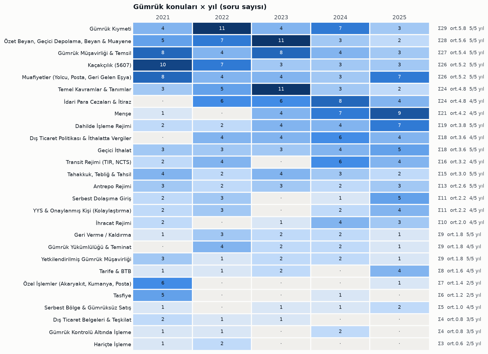

| # | Konu | 2021 | 2022 | 2023 | 2024 | 2025 | Toplam | Ort./yıl | Çıktığı yıl | Eğilim (24–25 vs 21–22) |
|---|---|---|---|---|---|---|---|---|---|---|
| 1 | Gümrük Kıymeti | 4 | 11 | 4 | 7 | 3 | 29 | 5.8 | 5/5 | ▼ -2.5 |
| 2 | Özet Beyan, Geçici Depolama, Beyan & Muayene | 5 | 7 | 11 | 3 | 2 | 28 | 5.6 | 5/5 | ▼ -3.5 |
| 3 | Gümrük Müşavirliği & Temsil | 8 | 4 | 8 | 4 | 3 | 27 | 5.4 | 5/5 | ▼ -2.5 |
| 4 | Kaçakçılık (5607) | 10 | 7 | 3 | 3 | 3 | 26 | 5.2 | 5/5 | ▼ -5.5 |
| 5 | Muafiyetler (Yolcu, Posta, Geri Gelen Eşya) | 8 | 4 | 4 | 3 | 7 | 26 | 5.2 | 5/5 | ▼ -1.0 |
| 6 | Temel Kavramlar & Tanımlar | 3 | 5 | 11 | 3 | 2 | 24 | 4.8 | 5/5 | ▼ -1.5 |
| 7 | İdari Para Cezaları & İtiraz | 0 | 6 | 6 | 8 | 4 | 24 | 4.8 | 4/5 | ▲ +3.0 |
| 8 | Menşe | 1 | 0 | 4 | 7 | 9 | 21 | 4.2 | 4/5 | ▲ +7.5 |
| 9 | Dahilde İşleme Rejimi | 2 | 2 | 4 | 4 | 7 | 19 | 3.8 | 5/5 | ▲ +3.5 |
| 10 | Dış Ticaret Politikası & İthalatta Vergiler | 0 | 4 | 4 | 6 | 4 | 18 | 3.6 | 4/5 | ▲ +3.0 |
| 11 | Geçici İthalat | 3 | 3 | 3 | 4 | 5 | 18 | 3.6 | 5/5 | ▲ +1.5 |
| 12 | Transit Rejimi (TIR, NCTS) | 2 | 4 | 0 | 6 | 4 | 16 | 3.2 | 4/5 | ▲ +2.0 |
| 13 | Tahakkuk, Tebliğ & Tahsil | 4 | 2 | 4 | 3 | 2 | 15 | 3.0 | 5/5 | ■ -0.5 |
| 14 | Antrepo Rejimi | 3 | 2 | 3 | 2 | 3 | 13 | 2.6 | 5/5 | ■ +0.0 |
| 15 | Serbest Dolaşıma Giriş | 2 | 3 | 0 | 1 | 5 | 11 | 2.2 | 4/5 | ■ +0.5 |
| 16 | YYS & Onaylanmış Kişi (Kolaylaştırma) | 2 | 3 | 0 | 2 | 4 | 11 | 2.2 | 4/5 | ■ +0.5 |
| 17 | İhracat Rejimi | 2 | 0 | 1 | 4 | 3 | 10 | 2.0 | 4/5 | ▲ +2.5 |
| 18 | Geri Verme / Kaldırma | 1 | 3 | 2 | 2 | 1 | 9 | 1.8 | 5/5 | ■ -0.5 |
| 19 | Gümrük Yükümlülüğü & Teminat | 0 | 4 | 2 | 2 | 1 | 9 | 1.8 | 4/5 | ■ -0.5 |
| 20 | Yetkilendirilmiş Gümrük Müşavirliği | 3 | 1 | 2 | 2 | 1 | 9 | 1.8 | 5/5 | ■ -0.5 |
| 21 | Tarife & BTB | 1 | 1 | 2 | 0 | 4 | 8 | 1.6 | 4/5 | ▲ +1.0 |
| 22 | Özel İşlemler (Akaryakıt, Kumanya, Posta) | 6 | 0 | 0 | 0 | 1 | 7 | 1.4 | 2/5 | ▼ -2.5 |
| 23 | Tasfiye | 5 | 0 | 0 | 1 | 0 | 6 | 1.2 | 2/5 | ▼ -2.0 |
| 24 | Serbest Bölge & Gümrüksüz Satış | 1 | 0 | 1 | 1 | 2 | 5 | 1.0 | 4/5 | ▲ +1.0 |
| 25 | Dış Ticaret Belgeleri & Teşkilat | 2 | 1 | 1 | 0 | 0 | 4 | 0.8 | 3/5 | ▼ -1.5 |
| 26 | Gümrük Kontrolü Altında İşleme | 1 | 1 | 0 | 2 | 0 | 4 | 0.8 | 3/5 | ■ +0.0 |
| 27 | Hariçte İşleme | 1 | 2 | 0 | 0 | 0 | 3 | 0.6 | 2/5 | ▼ -1.5 |

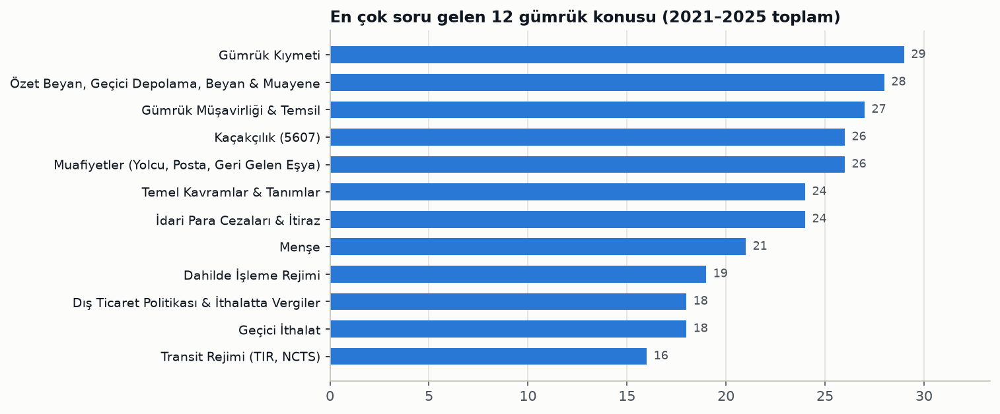

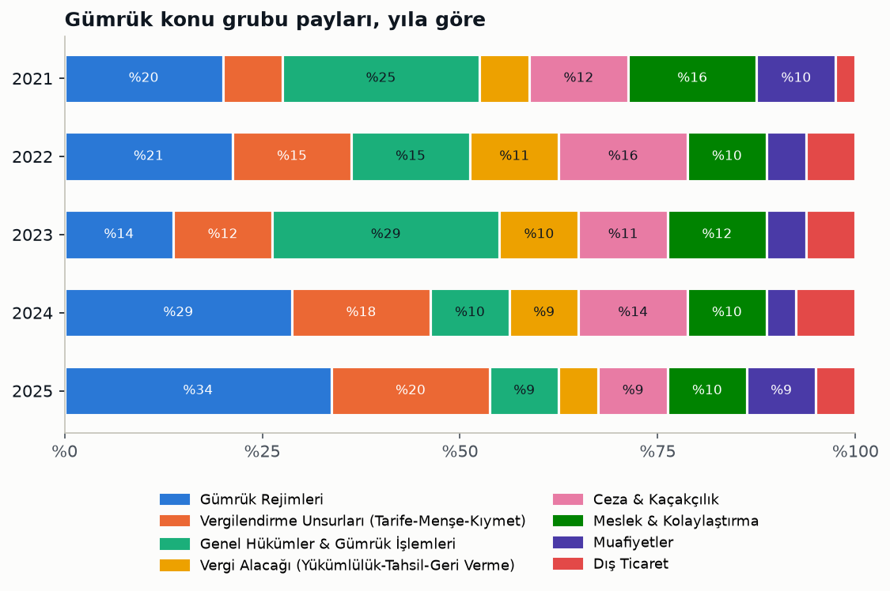

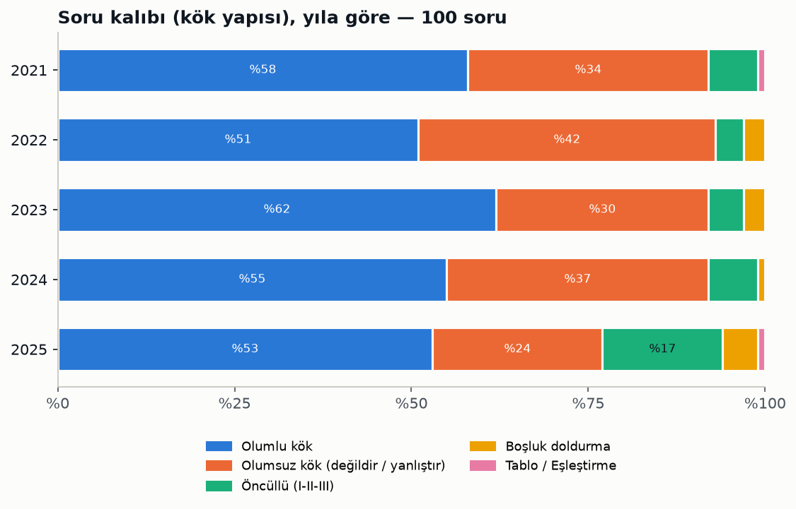

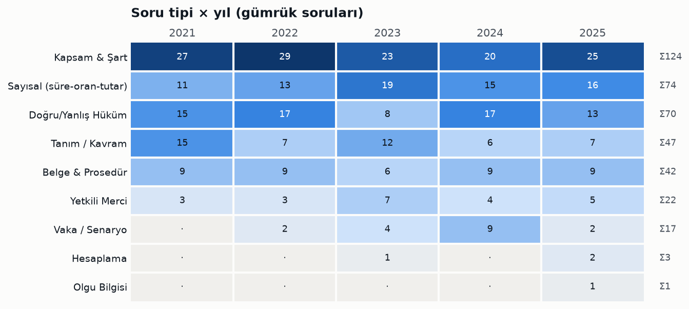

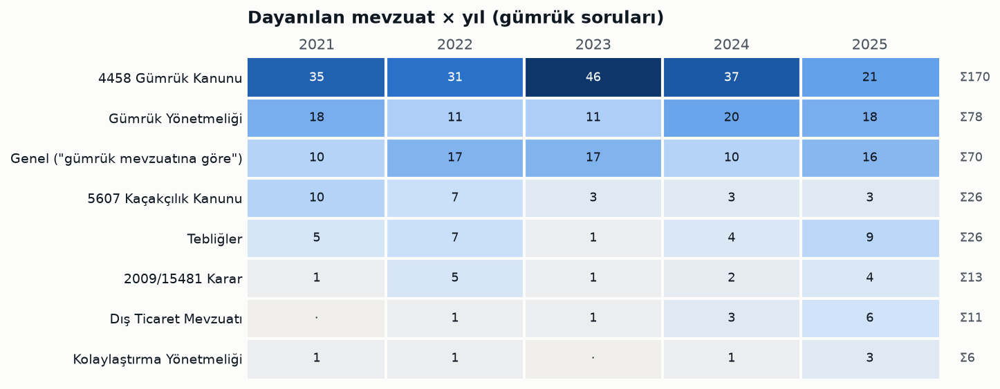

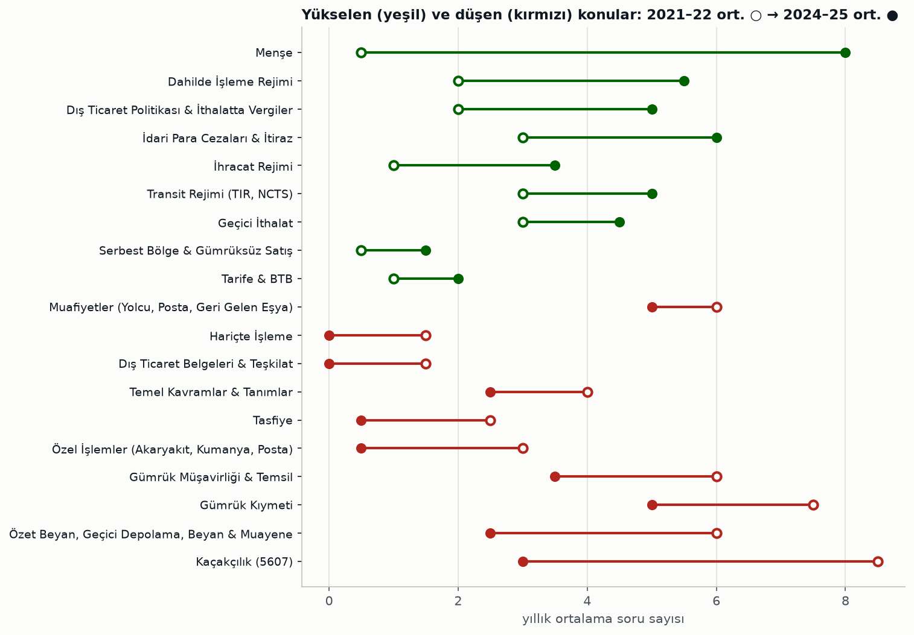

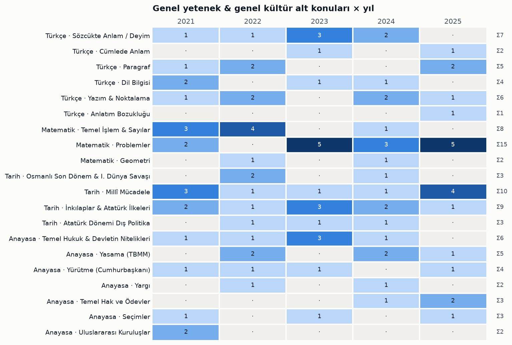

### Zorluk ve doğru şık dağılımı

|  | 2021 | 2022 | 2023 | 2024 | 2025 |
|---|---|---|---|---|---|
| Kolay | 39 | 36 | 49 | 31 | 42 |
| Orta | 52 | 53 | 43 | 52 | 48 |
| Zor | 9 | 11 | 8 | 17 | 10 |
| Doğru şık A | 20 | 14 | 11 | 17 | 11 |
| Doğru şık B | 18 | 19 | 20 | 28 | 21 |
| Doğru şık C | 21 | 19 | 26 | 21 | 24 |
| Doğru şık D | 19 | 23 | 23 | 12 | 22 |
| Doğru şık E | 22 | 25 | 20 | 22 | 22 |

### Tekrar eden soru kalıpları

| Soru kalıbı | Konu | 2021 | 2022 | 2023 | 2024 | 2025 | Doğru bilgi |
|---|---|---|---|---|---|---|---|
| Antrepo tipleri (A–F; genel/özel) | Antrepo Rejimi | 54 | 68, 72 | 85 | 63 | · | Genel antrepo: A, B ve F tipi; özel antrepo: C, D ve E tipi. A tipinde işletici stok kaydını tutar ve noksanlıktan sorumludur; E tipinde stok kaydı eşya izin hak sahibinin depolama yerine ulaşınca yapılır. |
| Özet beyan sonrası GOİK verilme süresi | Özet Beyan, Geçici Depolama, Beyan & Muayene | 36 | 32 | 39, 74 | · | · | Denizyolu ile gelen eşyada 45 gün, diğer yollarda 20 gün. |
| Geri gelen eşyada süre ve süre aşımı | Muafiyetler (Yolcu, Posta, Geri Gelen Eşya) | 30, 64 | · | 53 | 71 | 49 | İhraçtan itibaren 3 yıl içinde geri gelirse muafiyet; süre fiilî ihraç (ör. uçağın hareketi) tarihinden başlar. |
| Yolcu eşyası ambarı / depolama süresi | Muafiyetler (Yolcu, Posta, Geri Gelen Eşya) | 40 | · | 50 | · | 71, 84 | Yolcu eşyası ambarlarında ve geçici depolama yerlerinde 3 ay. |
| Geçici ithalat rejiminin tanımı | Geçici İthalat | 45, 75 | · | 54 | · | 79 | Serbest dolaşımda olmayan eşyanın tam/kısmi muafiyetle kullanılıp olağan yıpranma dışında değişmeden yeniden ihracı. |
| Kısmi muafiyette aylık vergi oranı | Geçici İthalat | 53 | · | 37 | 72 | · | Rejimde kalınan her ay için, serbest dolaşıma girseydi alınacak vergilerin %3'ü. |
| Sonradan tespit edilen vergide tebligat zamanaşımı | Tahakkuk, Tebliğ & Tahsil | · | · | 70 | 79 | 90 | Gümrük yükümlülüğünün doğduğu tarihten itibaren 3 yıl. |
| Ek tahakkukta ödeme süresi | Tahakkuk, Tebliğ & Tahsil | · | 88 | · | 81 | 91 | Tebliğden itibaren 15 gün; yazılı istem ve teminatla 30 güne kadar uzatılabilir. |
| İtiraz süresi ve karar süresi (GK 242) | İdari Para Cezaları & İtiraz | · | 66 | 77 | 95 | · | Tebliğden itibaren 15 gün içinde bir üst makama; itiraz 30 gün içinde karara bağlanır. |
| Kaçakçılıkla mücadelede görevli olmayan | Kaçakçılık (5607) | 93 | 25 | 22 | · | · | Mülki amirler, Emniyet, Jandarma, Sahil Güvenlik ve gümrük muhafaza görevlidir; askerî birlikler ve özel güvenlik görevli değildir. |
| Alıcı ile satıcı arasında ilişki sayılan haller | Gümrük Kıymeti | · | 99 | 98 | 28 | · | Tek acentelik veya aynı sanayi kolunda faaliyet göstermek tek başına ilişki sayılmaz. |
| Kıymette yabancı paranın çevrilmesi | Gümrük Kıymeti | 35 | 55 | · | 25 | · | Yükümlülüğün başladığı tarihte geçerli TCMB döviz satış kuru. |
| Alıcının kendi hesabına pazarlama faaliyeti | Gümrük Kıymeti | 31 | 52 | · | 23 | · | Satıcıya dolaylı ödeme sayılmaz, kıymete eklenmez (GK 27/1-b yardımı da değildir). |
| Aynı / benzer eşya unsurları | Gümrük Kıymeti | · | 48, 98 | · | 27 | · | Benzer eşyada kalite, itibar ve ticari marka dikkate alınır; fiyat bir unsur değildir. |
| Gümrük rejimi olan/olmayan, ekonomik etkili rejimler | Temel Kavramlar & Tanımlar | 26, 43 | 28, 33 | 63 | · | · | Kanun'da 8 rejim var. Geçici ihracat ve nihai kullanım rejim değildir; transit ekonomik etkili rejim değildir. |
| Şartlı muafiyet düzenlemesinin kapsamı | Temel Kavramlar & Tanımlar | · | 62 | 83 | 30 | · | Transit, antrepo, şartlı muafiyet sistemli DİR, GKAİ ve geçici ithalat; geri ödeme sistemi ve ihracat değildir. |
| GOİK (gümrükçe onaylanmış işlem veya kullanım) kapsamı | Temel Kavramlar & Tanımlar | · | 31 | 31 | 93 | · | Rejime tabi tutma, serbest bölgeye girme, yeniden ihraç, imha ve gümrüğe terk. Teslim ve geçici depolama GOİK değildir. |
| Telafi edici vergi (DİR'de tercihli tarife) | Dahilde İşleme Rejimi | 89 | 46 | · | 54 | · | Tercihli tarife, bünyedeki serbest dolaşımda olmayan eşyanın vergilerinin ödenmesine bağlıysa TEV doğar ve ihracat beyannamesinin tescil tarihine göre hesaplanır. |
| Serbest dolaşım statüsünün kaybı | Serbest Dolaşıma Giriş | 42 | 39 | · | · | 31 | Beyannamenin iptali ve geri ödeme sistemli DİR'de vergilerin geri verilmesi statüyü kaybettirir; nihai kullanım kaybettirmez. |
| Tümüyle elde edilen eşya / yetersiz işçilik | Menşe | · | · | 64 | 33, 34 | 33, 38, 41 | İthal girdiyle üretilen ürün tümüyle elde edilmiş sayılmaz. Tarife pozisyonu değişikliği ve iplikten kumaş üretimi yetersiz işçilik değildir. |
| Rejim kodunun açıklaması | İhracat Rejimi | · | · | 52 | 49 | 53 | 1000: daha önce rejime tabi tutulmamış eşyanın kesin ihracatı. 1040: muafiyete tabi olmadan serbest dolaşım ile eş zamanlı yurt içi kullanıma giren eşyanın kesin ihracatı. 1023: geri gelmek üzere geçici ihraç edilen eşyanın kesin ihracatı. |
| İthalat Rejimi Kararı eki listeler | Dış Ticaret Politikası & İthalatta Vergiler | · | 35 | · | 31 | 37 | I tarım ürünleri, II sanayi ürünleri, III işlenmiş tarım ürünleri, IV balıkçılık ve su ürünleri, V gümrük vergisi askıya alınan sanayi ürünleri, VI sivil hava taşıtlarında kullanılacak ürünler. |
| Gümrük müşavir yardımcısı olma şartları | Gümrük Müşavirliği & Temsil | 83 | 63 | · | · | 98 | T.C. vatandaşlığı, medeni hakları kullanma ehliyeti, kamu haklarından mahrum olmamak, memuriyetten çıkarılmamış olmak, sayılan suçlardan hüküm giymemiş olmak. |
| Yetkilendirilmiş yükümlü ve onaylanmış kişi şartları ve süreleri | YYS & Onaylanmış Kişi (Kolaylaştırma) | 25 | 93 | · | 75, 76 | 87, 88 | YYS için en az 3 yıl faaliyet, OKS için 2 yıl; YYS süresizdir ve 5 yılda bir izlenir. |
| Teminat olarak kabul edilmeyen değer | Gümrük Yükümlülüğü & Teminat | · | 92 | · | · | 92 | Kabul edilenler: nakit TL, süresiz banka teminat mektubu, DİBS ve TCMB'nin kabul ettiği dövizler. Soru iki yılda da 92. sırada. |
| Bilgi değişikliğini bildirme süresi | Gümrük Müşavirliği & Temsil | 84 | · | 26 | · | · | İzin belgesi numarası, şirket adı, temsilci gibi bilgilerdeki değişiklik bir hafta içinde bildirilir. |
| İlişkinin beyan edilmemesi cezası | İdari Para Cezaları & İtiraz | · | · | 43 | 26 | · | Vergi kaybı olmasa da 241/1'deki tutarın iki katı usulsüzlük cezası. |
| Çeki listesinin tanımı | Dış Ticaret Belgeleri & Teşkilat | 49 | 81 | · | · | · | Kaplardaki eşya miktarını gösteren belge çeki listesidir. Soru metni iki yılda birebir aynı. |

## 4. Sonuç: en çok neyden, nasıl soruluyor?

### En çok soru gelen konular

- Puanın %80'i gümrük mevzuatından geliyor (her yıl 80/100). Genel yetenek ve genel kültür sabit 20 soru.
- Konu grubu olarak zirvede Gümrük Rejimleri: 400 sorunun 94'ü (%23,5). Ardından Genel Hükümler & Gümrük İşlemleri (70), Vergilendirme Unsurları (58), Ceza & Kaçakçılık (50) ve Meslek & Kolaylaştırma (47) geliyor.
- Tek konu olarak ilk sekiz: Gümrük Kıymeti (29), Özet Beyan/Beyan & Muayene (28), Gümrük Müşavirliği & Temsil (27), Muafiyetler (26), Kaçakçılık (26), Temel Kavramlar (24), İdari Para Cezaları & İtiraz (24), Menşe (21). Bu sekiz konu gümrük sorularının %51'ini oluşturuyor.
- 12 konu beş sınavın hepsinde çıktı: Kıymet, Özet Beyan/Beyan & Muayene, Meslek, Muafiyetler, Kaçakçılık, Temel Kavramlar, Dahilde İşleme, Geçici İthalat, Tahakkuk-Tahsil, Antrepo, YGM ve Geri Verme.
- Genel yetenek ve genel kültürde en çok matematik problemleri (15), Millî Mücadele (10), İnkılaplar & Atatürk İlkeleri (9), temel işlem (8) ve sözcükte anlam (7) soruldu.

### Eğilim: sınav nereye kayıyor?

- Yükselenler (2021–22 ortalaması → 2024–25 ortalaması): Menşe 0,5 → 8, Dahilde İşleme 2 → 5,5, Dış Ticaret Politikası 2 → 5, Transit 3 → 5.
- Düşenler: Kaçakçılık 8,5 → 3, Özet Beyan/Beyan & Muayene 6 → 2,5, Meslek 6 → 3,5, Kıymet 7,5 → 5. Özel işlemler ve tasfiye neredeyse hiç sorulmuyor.
- Mevzuat kaynağı da değişiyor. 2023'te gümrük sorularının 46'sı doğrudan 4458'e dayanıyordu; 2025'te bu sayı 21'e indi. Yerini Gümrük Yönetmeliği, tebliğler (Nihai Kullanım, BTB, Kara Taşıtları) ve dış ticaret mevzuatı aldı.
- 2025'te soru kalıbı değişti: 17 öncüllü (I-II-III) ve 5 boşluk doldurma sorusu geldi. Önceki yıllarda öncüllü soru sayısı 4–7 arasındaydı.

### Hangi soru tipi, hangi kalıpla soruluyor?

- 500 sorunun %56'sı olumlu, %33'ü olumsuz köklü ("değildir / yanlıştır / yer almaz"), %8'i öncüllü. Gümrük bölümünde olumsuz kök oranı %35,5.
- Gümrük sorularında en sık tip Kapsam & Şart (%31), ardından Sayısal (%18,5), Doğru/Yanlış Hüküm (%17,5), Tanım (%12), Belge & Prosedür (%10,5), Yetkili Merci (%5,5) ve Vaka (%4) geliyor.
- Kapsam & şart sorularının üçte ikisi olumsuz köklü (124 sorunun 82'si). Tipik GMY sorusu şu kalıpta: "… göre aşağıdakilerden hangisi X'in şartları / kapsamı arasında yer almaz?"
- Sayısal sorular neredeyse her zaman olumlu köklü (74 sorunun 65'i) ve süre soruyor: kaç gün, kaç yıl, yüzde kaç. Doğru/yanlış hüküm sorularının 50/70'i "hangisi yanlıştır" biçiminde.
- Doğru şıklar dengeli dağılmış (A 73, B 106, C 111, D 99, E 111). Şık tahminine dayanan bir strateji işe yaramaz.

### Çalışma stratejisi

- Önce 4458 sayılı Kanun + Gümrük Yönetmeliği çalışılmalı: gümrük sorularının yaklaşık %62'si doğrudan bu ikisine dayanıyor.
- Bir süreler ve oranlar tablosu hazırlanmalı: 45/20 gün, 3 yıl tebligat, 15 gün ödeme ve itiraz, %3 kısmi muafiyet, 3 ay yolcu eşyası, 1 ay ihraç amaçlı depolama, BTB 6 yıl, BMB 3 yıl, 5 yıl belge saklama, menşe şahadetnamesi için 6 ay.
- Sayılan listeler ezberlenmeli, çünkü olumsuz köklü kapsam soruları bunlardan geliyor: rejimler, GOİK, şartlı muafiyet düzenlemesi, ilişkili kişiler, kabul edilmeyen teminatlar, kaçakçılıkla görevliler, disiplin cezaları, antrepo tipleri, tasfiye yöntemleri.
- Son iki yılın yönüne göre menşe, dahilde işleme, transit, nihai kullanım, BTB, geçici ithalat ve İthalat Rejimi Kararı konularına ağırlık verilmeli. Öncüllü ve boşluk doldurma sorularıyla pratik yapılmalı.
- Tekrar eden soru kalıpları tablosundaki bilgiler mutlaka bilinmeli. Bazı sorular yıllar içinde neredeyse aynı metinle tekrar soruldu (çeki listesi, ilişki beyanı cezası, teminat, bildirim süresi).

### Çalışma öncelik listesi (gümrük konuları)

**Öncelik 1 — yılda ort. 4+ soru:** Gümrük Kıymeti (5.8), Özet Beyan, Geçici Depolama, Beyan & Muayene (5.6), Gümrük Müşavirliği & Temsil (5.4), Kaçakçılık (5607) (5.2), Muafiyetler (Yolcu, Posta, Geri Gelen Eşya) (5.2), Temel Kavramlar & Tanımlar (4.8), İdari Para Cezaları & İtiraz (4.8), Menşe (4.2)

**Öncelik 2 — yılda ort. 2–4 soru:** Dahilde İşleme Rejimi (3.8), Dış Ticaret Politikası & İthalatta Vergiler (3.6), Geçici İthalat (3.6), Transit Rejimi (TIR, NCTS) (3.2), Tahakkuk, Tebliğ & Tahsil (3.0), Antrepo Rejimi (2.6), Serbest Dolaşıma Giriş (2.2), YYS & Onaylanmış Kişi (Kolaylaştırma) (2.2), İhracat Rejimi (2.0)

**Öncelik 3 — yılda ort. 2'den az:** Geri Verme / Kaldırma (1.8), Gümrük Yükümlülüğü & Teminat (1.8), Yetkilendirilmiş Gümrük Müşavirliği (1.8), Tarife & BTB (1.6), Özel İşlemler (Akaryakıt, Kumanya, Posta) (1.4), Tasfiye (1.2), Serbest Bölge & Gümrüksüz Satış (1.0), Dış Ticaret Belgeleri & Teşkilat (0.8), Gümrük Kontrolü Altında İşleme (0.8), Hariçte İşleme (0.6)

## 5. Yöntem ve dosyalar

Kaynak, depodaki beş A kitapçığı PDF'i: 2021 (Ankara Üniversitesi ASYM), 2022–2025 (Hacettepe Üniversitesi). Doğru cevaplar PDF'lerde kırmızıyla işaretlenmiş seçeneklerden otomatik okundu ve 500 sorunun hepsi için bulundu. 2022'nin görsel olan 7. ve 8. soruları sayfa görüntüsünden doğrulandı. Her soru sabit bir taksonomiye göre sınıflandırıldı: bölüm, 47 konu (27'si gümrük), 8 gümrük konu grubu, 5 soru kalıbı, 11 soru tipi, 8 mevzuat kaynağı ve zorluk. Soru kalıbı ayrıca metin kalıbı taramasıyla çapraz kontrol edildi. Konu, tip ve zorluk atamaları yoruma dayanır; sınırda kalan sorular, kökünde geçen kavrama göre atandı. "Öğrenilecek bilgi" alanı resmî cevap anahtarına dayanır. Bu bilgiler, özellikle her yıl güncellenen ceza tutarları ve süreler, mevzuatın güncel metninden ayrıca kontrol edilmelidir.

| Dosya | İçerik |
|---|---|
| `GMY_Soru_Atlasi.html` | Etkileşimli rapor: optik form şeması, yıl sekmeleri, filtrelenebilir soru listesi, ısı haritaları |
| `gmy_soru_siniflandirma.csv` | 500 sorunun tamamı: konu, alt konu, kalıp, tip, mevzuat, zorluk, özet, öğrenilecek bilgi (Excel'de açılır) |
| `gmy_soru_siniflandirma.json` | Aynı veri, JSON |
| `grafikler/` | Bu rapordaki PNG grafikler |
| `kaynak/` | PDF'ten soru/cevap çıkarma ve rapor üretme betikleri, taksonomi |
