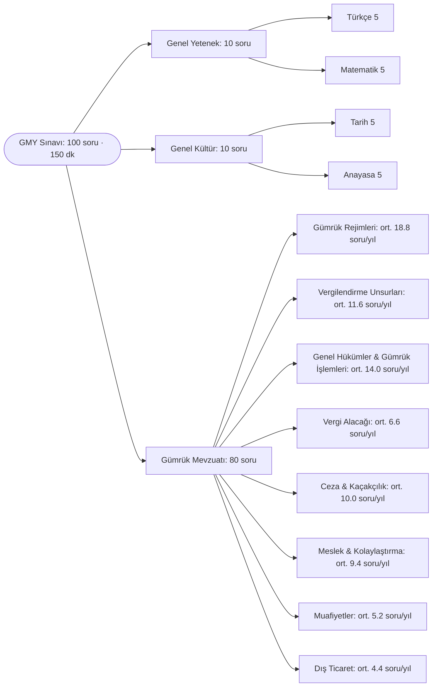

# GMY Soru Atlası 2021–2025

Gümrük Müşavir Yardımcılığı sınavının 2021, 2022, 2023, 2024 ve 2025 yıllarına ait A kitapçıklarındaki **500 sorunun** konu, soru kalıbı, soru tipi ve dayandığı mevzuata göre analizi. Etkileşimli sürüm: `GMY_Soru_Atlasi.html` (tarayıcıda açın).

## İçindekiler

1. [Sınavın yapısı](#1-sınavın-yapısı)
2. [Yıl yıl analiz](#2-yıl-yıl-analiz)
3. [Yılların karşılaştırması](#3-yılların-karşılaştırması)
4. [Sonuç: en çok neyden, nasıl soruluyor?](#4-sonuç-en-çok-neyden-nasıl-soruluyor)
5. [Yöntem ve dosyalar](#5-yöntem-ve-dosyalar)

## 1. Sınavın yapısı

| Bölüm | Soru no | 2021 | 2022 | 2023 | 2024 | 2025 |
|---|---|---|---|---|---|---|
| Türkçe | 1–5 | 5 | 5 | 5 | 5 | 5 |
| Matematik | 6–10 | 5 | 5 | 5 | 5 | 5 |
| Tarih (İnkılap) | 11–15 | 5 | 5 | 5 | 5 | 5 |
| Anayasa / Vatandaşlık | 16–20 | 5 | 5 | 5 | 5 | 5 |
| Gümrük Mevzuatı | 21–100 | 80 | 80 | 80 | 80 | 80 |

Sınav her yıl 100 soru / 150 dakika; puanın **%80'i gümrük mevzuatından** geliyor.

## 2. Yıl yıl analiz

### 2021

- Sınavı Ankara Üniversitesi (ASYM) hazırladı; 2022'den itibaren Hacettepe Üniversitesi hazırlıyor. 2021'in konu dağılımı bu yüzden diğer yıllardan belirgin biçimde farklı.
- En çok soru Kaçakçılık (5607) konusundan geldi: 10 soru, üstelik 91–100 arası bloğun tamamı. Beş yıl içinde tek bir konudan yılda gelen en yüksek ikinci sayı bu.
- Gümrük Müşavirliği & Temsil ve Muafiyetler 8'er soruyla ikinci sırada. Liman bayileri, kabotaj, posta kolisi listesi gibi özel işlemler (6 soru) ile tasfiye (5 soru) yalnızca bu yıl bu kadar ağırlık taşıdı.
- Gümrük Kanunu'nun idari para cezaları (md. 234–241) hiç sorulmadı. Ceza ağırlığı tamamen 5607'de.
- Soru tipinde tanım soruları zirvede (15). "Ne ad verilir" kalıbı çok sık (çeki listesi, proforma fatura, üçgen trafik, ulusal transit).
- Kalıp: %58 olumlu, %34 olumsuz kök, 7 öncüllü ve 1 eşleştirme (kontrol hatlarının renkleri). Matematikte işlem ve örüntü, tarihte Millî Mücadele ağırlıktaydı.

Konu tablosu ve soru numaraları

| Konu | Soru | Soru numaraları |
|---|---|---|
| Kaçakçılık (5607) | 10 | 91, 92, 93, 94, 95, 96, 97, 98, 99, 100 |
| Gümrük Müşavirliği & Temsil | 8 | 22, 37, 76, 77, 83, 84, 85, 86 |
| Muafiyetler (Yolcu, Posta, Geri Gelen Eşya) | 8 | 30, 40, 58, 64, 72, 73, 74, 90 |
| Özel İşlemler (Akaryakıt, Kumanya, Posta) | 6 | 32, 59, 65, 67, 69, 70 |
| Özet Beyan, Geçici Depolama, Beyan & Muayene | 5 | 24, 33, 36, 50, 51 |
| Tasfiye | 5 | 34, 56, 60, 62, 63 |
| Gümrük Kıymeti | 4 | 29, 31, 35, 39 |
| Tahakkuk, Tebliğ & Tahsil | 4 | 78, 79, 81, 88 |
| Antrepo Rejimi | 3 | 23, 41, 54 |
| Temel Kavramlar & Tanımlar | 3 | 26, 43, 66 |
| Geçici İthalat | 3 | 45, 53, 75 |
| Yetkilendirilmiş Gümrük Müşavirliği | 3 | 48, 57, 87 |
| Dahilde İşleme Rejimi | 2 | 21, 89 |
| YYS & Onaylanmış Kişi (Kolaylaştırma) | 2 | 25, 82 |
| Transit Rejimi (TIR, NCTS) | 2 | 28, 47 |
| Serbest Dolaşıma Giriş | 2 | 42, 55 |
| Dış Ticaret Belgeleri & Teşkilat | 2 | 49, 61 |
| İhracat Rejimi | 2 | 68, 71 |
| Tarife & BTB | 1 | 27 |
| Menşe | 1 | 38 |
| Gümrük Kontrolü Altında İşleme | 1 | 44 |
| Serbest Bölge & Gümrüksüz Satış | 1 | 46 |
| Hariçte İşleme | 1 | 52 |
| Geri Verme / Kaldırma | 1 | 80 |

### 2022

- Yılın konusu Gümrük Kıymeti: 11 soru (47–56 ve 98–99) ile beş yılın tek konudan gelen en yüksek sayısı. Aynı eşya, benzer eşya, ilişkili kişiler, royalti, hesaplanmış kıymet, komisyonlar ve kur çevrimi soruldu.
- Sınav Kaçakçılık bloğuyla açıldı (21–27, 7 soru). Ardından özet beyan, geçici depolama, beyan ve muayene (7) ile GK idari para cezaları ve itiraz (6) geliyor.
- Olumsuz kök oranı %42 ile beş yılın en yüksek değeri. "Hangisi yanlıştır / değildir" kalıbı her 5 sorudan 2'sinde var.
- 2009/15481 Karar'dan 5 soru geldi (hediyelik eşya limiti 150/430 Avro, taşıt muafiyeti, kişisel/şahsi eşya). Ayrıca o yıla ait 241/1 usulsüzlük cezası tutarı (235 TL) soruldu; güncel tutarlar takip edilmeli.
- Matematik okul düzeyinde temel işlemdi (denklem, bileşik kesir, üslü sayılar, bölünebilme).

Konu tablosu ve soru numaraları

| Konu | Soru | Soru numaraları |
|---|---|---|
| Gümrük Kıymeti | 11 | 44, 47, 48, 49, 50, 51, 52, 53, 55, 98, 99 |
| Kaçakçılık (5607) | 7 | 21, 22, 23, 24, 25, 26, 27 |
| Özet Beyan, Geçici Depolama, Beyan & Muayene | 7 | 32, 45, 77, 78, 80, 82, 96 |
| İdari Para Cezaları & İtiraz | 6 | 36, 42, 65, 66, 69, 70 |
| Temel Kavramlar & Tanımlar | 5 | 28, 31, 33, 41, 62 |
| Gümrük Yükümlülüğü & Teminat | 4 | 29, 34, 87, 92 |
| Dış Ticaret Politikası & İthalatta Vergiler | 4 | 30, 35, 38, 43 |
| Gümrük Müşavirliği & Temsil | 4 | 63, 64, 79, 100 |
| Transit Rejimi (TIR, NCTS) | 4 | 73, 74, 75, 76 |
| Muafiyetler (Yolcu, Posta, Geri Gelen Eşya) | 4 | 83, 84, 85, 86 |
| Serbest Dolaşıma Giriş | 3 | 37, 39, 40 |
| Geçici İthalat | 3 | 57, 60, 61 |
| Geri Verme / Kaldırma | 3 | 89, 90, 91 |
| YYS & Onaylanmış Kişi (Kolaylaştırma) | 3 | 93, 94, 95 |
| Dahilde İşleme Rejimi | 2 | 46, 97 |
| Tahakkuk, Tebliğ & Tahsil | 2 | 54, 88 |
| Hariçte İşleme | 2 | 58, 59 |
| Antrepo Rejimi | 2 | 68, 72 |
| Gümrük Kontrolü Altında İşleme | 1 | 56 |
| Yetkilendirilmiş Gümrük Müşavirliği | 1 | 67 |
| Tarife & BTB | 1 | 71 |
| Dış Ticaret Belgeleri & Teşkilat | 1 | 81 |

### 2023

- Kanun'un genel hükümleri yılı: Temel Kavramlar (11) ve Özet Beyan / Beyan & Muayene (11) birlikte gümrük sorularının %27,5'ini oluşturuyor. Gümrük idaresi, gümrük statüsü, yükümlü, Türkiye Gümrük Bölgesi, Kanun'un amacı ve brüt ağırlık tanımları soruldu.
- Sorular "Gümrük Kanunu'na göre…" diye başlıyor: 46/80 soru doğrudan 4458'e dayanıyor (beş yılın en yükseği).
- Meslek mevzuatı 8 soru: disiplin cezaları (uyarma, kınama, 6 ay–1 yıl alıkoyma, meslekten çıkarma), sınava en fazla 3 kez giriş hakkı, 5 yıl belge saklama.
- Sayısal sorular zirvede (19): BTB 6 yıl, BMB 3 yıl, 45/20 gün, tebligat zamanaşımı 3 yıl, kısmi muafiyet %3.
- En kolay sınav: 49 soru kolay, yalnızca 8 soru zor. Transit, serbest dolaşım, kolaylaştırma (YYS/OKS) ve tasfiyeden hiç soru gelmedi. Matematiğin 5 sorusu da günlük hayat problemiydi.

Konu tablosu ve soru numaraları

| Konu | Soru | Soru numaraları |
|---|---|---|
| Temel Kavramlar & Tanımlar | 11 | 31, 57, 63, 66, 67, 71, 75, 83, 91, 92, 97 |
| Özet Beyan, Geçici Depolama, Beyan & Muayene | 11 | 38, 39, 40, 74, 78, 80, 81, 84, 90, 93, 95 |
| Gümrük Müşavirliği & Temsil | 8 | 23, 24, 25, 26, 27, 28, 89, 94 |
| İdari Para Cezaları & İtiraz | 6 | 21, 29, 30, 33, 43, 60 |
| Dış Ticaret Politikası & İthalatta Vergiler | 4 | 36, 45, 49, 72 |
| Menşe | 4 | 41, 42, 64, 87 |
| Tahakkuk, Tebliğ & Tahsil | 4 | 44, 61, 70, 77 |
| Gümrük Kıymeti | 4 | 46, 47, 79, 98 |
| Muafiyetler (Yolcu, Posta, Geri Gelen Eşya) | 4 | 48, 50, 53, 59 |
| Dahilde İşleme Rejimi | 4 | 55, 56, 65, 99 |
| Kaçakçılık (5607) | 3 | 22, 51, 73 |
| Geçici İthalat | 3 | 34, 37, 54 |
| Antrepo Rejimi | 3 | 35, 62, 85 |
| Yetkilendirilmiş Gümrük Müşavirliği | 2 | 32, 82 |
| Gümrük Yükümlülüğü & Teminat | 2 | 68, 88 |
| Geri Verme / Kaldırma | 2 | 69, 76 |
| Tarife & BTB | 2 | 86, 96 |
| İhracat Rejimi | 1 | 52 |
| Serbest Bölge & Gümrüksüz Satış | 1 | 58 |
| Dış Ticaret Belgeleri & Teşkilat | 1 | 100 |

### 2024

- Ağırlık rejimlere ve vergilendirme unsurlarına kaydı. İdari para cezaları (8), Kıymet (7), Menşe (7), Dış Ticaret Politikası (6) ve Transit (6) öne çıkıyor.
- En zor sınav (17 zor soru) ve vaka sorularının zirvesi (9). Rejim içinde hangi cezanın uygulanacağı soruldu: geçici ithalatta bilgisiz çıkış, ihraçta %10 fark, 235/2-a, transitte aykırılık, kaçakçılıkta teşebbüs, Erenköy→Sarp transitinin sona ermesi.
- Menşe bloğu (29–41): tümüyle elde edilen eşya, yetersiz işçilik, menşe şahadetnamesinin içeriği, GTS'de Form A, Çin→Almanya→Türkiye trafiğinde menşe ve serbest dolaşım ayrımı.
- Dış ticaret politikasında İthalat Rejimi Kararı listeleri, ek mali yükümlülük, İGV, kota, GTS ve sınır ticareti soruldu. Gümrük Yönetmeliği'ne dayanan 20 soru ile beş yılın en yükseği.
- Olumsuz kök %37, 7 öncüllü soru var. Doğru şıklarda B 28 kez çıktı; D ise yalnızca 12 kez.

Konu tablosu ve soru numaraları

| Konu | Soru | Soru numaraları |
|---|---|---|
| İdari Para Cezaları & İtiraz | 8 | 26, 32, 48, 52, 57, 82, 85, 95 |
| Gümrük Kıymeti | 7 | 21, 22, 23, 24, 25, 27, 28 |
| Menşe | 7 | 29, 33, 34, 38, 40, 41, 68 |
| Dış Ticaret Politikası & İthalatta Vergiler | 6 | 31, 35, 36, 37, 42, 44 |
| Transit Rejimi (TIR, NCTS) | 6 | 56, 58, 59, 60, 61, 92 |
| Geçici İthalat | 4 | 39, 69, 70, 72 |
| İhracat Rejimi | 4 | 45, 49, 55, 97 |
| Dahilde İşleme Rejimi | 4 | 50, 51, 53, 54 |
| Gümrük Müşavirliği & Temsil | 4 | 87, 89, 90, 94 |
| Temel Kavramlar & Tanımlar | 3 | 30, 47, 93 |
| Özet Beyan, Geçici Depolama, Beyan & Muayene | 3 | 46, 86, 100 |
| Muafiyetler (Yolcu, Posta, Geri Gelen Eşya) | 3 | 62, 71, 98 |
| Kaçakçılık (5607) | 3 | 65, 66, 67 |
| Tahakkuk, Tebliğ & Tahsil | 3 | 79, 80, 81 |
| Antrepo Rejimi | 2 | 63, 64 |
| Gümrük Kontrolü Altında İşleme | 2 | 73, 74 |
| YYS & Onaylanmış Kişi (Kolaylaştırma) | 2 | 75, 76 |
| Gümrük Yükümlülüğü & Teminat | 2 | 77, 78 |
| Geri Verme / Kaldırma | 2 | 83, 84 |
| Yetkilendirilmiş Gümrük Müşavirliği | 2 | 88, 91 |
| Serbest Dolaşıma Giriş | 1 | 43 |
| Tasfiye | 1 | 96 |
| Serbest Bölge & Gümrüksüz Satış | 1 | 99 |

### 2025

- Gümrük rejimleri grubu 27/80 ile beş yılın en yükseği. Dahilde İşleme (7, 54–60 bloğu), Serbest Dolaşım & Nihai Kullanım (5) ve Geçici İthalat (5) öne çıkıyor.
- En çok soru Menşe konusundan geldi: 9 soru (33–44). A.TR ile EUR.1 ayrımı, yetersiz işçilik, tümüyle elde edilen eşya, menşe şahadetnamesinin 6 ay içinde sonradan ibrazı ve basım yetkilisi TOBB/TESK/TİM soruldu.
- Soru kalıbı değişti: 17 öncüllü (önceki yıllarda 4–7) ve 5 boşluk doldurma sorusu var. Olumsuz kök %24'e indi (beş yılın en düşüğü).
- Mevzuat kaynağı genişledi. 4458'e dayanan soru 21'e düştü; tebliğler (9: Nihai Kullanım, Tarife/BTB, Seri 149, Kara Taşıtları) ve dış ticaret mevzuatı (6) zirve yaptı.
- Hesap soruları geldi: kendiliğinden başvuruda ceza tutarı, kullanılmış taşıtta yıl düşümü, EXW'den kıymet. Kaçakçılık 3 soruya geriledi. Genel yetenekte matematik çok temel günlük hayat problemleriydi.

Konu tablosu ve soru numaraları

| Konu | Soru | Soru numaraları |
|---|---|---|
| Menşe | 9 | 33, 34, 35, 38, 39, 40, 41, 42, 44 |
| Muafiyetler (Yolcu, Posta, Geri Gelen Eşya) | 7 | 49, 65, 66, 67, 68, 71, 84 |
| Dahilde İşleme Rejimi | 7 | 54, 55, 56, 57, 58, 59, 60 |
| Serbest Dolaşıma Giriş | 5 | 27, 28, 30, 31, 36 |
| Geçici İthalat | 5 | 79, 80, 81, 83, 85 |
| Dış Ticaret Politikası & İthalatta Vergiler | 4 | 22, 37, 43, 45 |
| İdari Para Cezaları & İtiraz | 4 | 24, 32, 82, 96 |
| Tarife & BTB | 4 | 29, 46, 47, 94 |
| Transit Rejimi (TIR, NCTS) | 4 | 61, 62, 63, 64 |
| YYS & Onaylanmış Kişi (Kolaylaştırma) | 4 | 86, 87, 88, 89 |
| Gümrük Kıymeti | 3 | 21, 25, 26 |
| İhracat Rejimi | 3 | 52, 53, 95 |
| Antrepo Rejimi | 3 | 69, 74, 75 |
| Kaçakçılık (5607) | 3 | 76, 77, 78 |
| Gümrük Müşavirliği & Temsil | 3 | 98, 99, 100 |
| Temel Kavramlar & Tanımlar | 2 | 23, 50 |
| Özet Beyan, Geçici Depolama, Beyan & Muayene | 2 | 48, 73 |
| Serbest Bölge & Gümrüksüz Satış | 2 | 70, 72 |
| Tahakkuk, Tebliğ & Tahsil | 2 | 90, 91 |
| Özel İşlemler (Akaryakıt, Kumanya, Posta) | 1 | 51 |
| Gümrük Yükümlülüğü & Teminat | 1 | 92 |
| Geri Verme / Kaldırma | 1 | 93 |
| Yetkilendirilmiş Gümrük Müşavirliği | 1 | 97 |

## 3. Yılların karşılaştırması

| # | Konu | 2021 | 2022 | 2023 | 2024 | 2025 | Toplam | Ort./yıl | Çıktığı yıl | Eğilim (24–25 vs 21–22) |
|---|---|---|---|---|---|---|---|---|---|---|
| 1 | Gümrük Kıymeti | 4 | 11 | 4 | 7 | 3 | 29 | 5.8 | 5/5 | ▼ -2.5 |
| 2 | Özet Beyan, Geçici Depolama, Beyan & Muayene | 5 | 7 | 11 | 3 | 2 | 28 | 5.6 | 5/5 | ▼ -3.5 |
| 3 | Gümrük Müşavirliği & Temsil | 8 | 4 | 8 | 4 | 3 | 27 | 5.4 | 5/5 | ▼ -2.5 |
| 4 | Kaçakçılık (5607) | 10 | 7 | 3 | 3 | 3 | 26 | 5.2 | 5/5 | ▼ -5.5 |
| 5 | Muafiyetler (Yolcu, Posta, Geri Gelen Eşya) | 8 | 4 | 4 | 3 | 7 | 26 | 5.2 | 5/5 | ▼ -1.0 |
| 6 | Temel Kavramlar & Tanımlar | 3 | 5 | 11 | 3 | 2 | 24 | 4.8 | 5/5 | ▼ -1.5 |
| 7 | İdari Para Cezaları & İtiraz | 0 | 6 | 6 | 8 | 4 | 24 | 4.8 | 4/5 | ▲ +3.0 |
| 8 | Menşe | 1 | 0 | 4 | 7 | 9 | 21 | 4.2 | 4/5 | ▲ +7.5 |
| 9 | Dahilde İşleme Rejimi | 2 | 2 | 4 | 4 | 7 | 19 | 3.8 | 5/5 | ▲ +3.5 |
| 10 | Dış Ticaret Politikası & İthalatta Vergiler | 0 | 4 | 4 | 6 | 4 | 18 | 3.6 | 4/5 | ▲ +3.0 |
| 11 | Geçici İthalat | 3 | 3 | 3 | 4 | 5 | 18 | 3.6 | 5/5 | ▲ +1.5 |
| 12 | Transit Rejimi (TIR, NCTS) | 2 | 4 | 0 | 6 | 4 | 16 | 3.2 | 4/5 | ▲ +2.0 |
| 13 | Tahakkuk, Tebliğ & Tahsil | 4 | 2 | 4 | 3 | 2 | 15 | 3.0 | 5/5 | ■ -0.5 |
| 14 | Antrepo Rejimi | 3 | 2 | 3 | 2 | 3 | 13 | 2.6 | 5/5 | ■ +0.0 |
| 15 | Serbest Dolaşıma Giriş | 2 | 3 | 0 | 1 | 5 | 11 | 2.2 | 4/5 | ■ +0.5 |
| 16 | YYS & Onaylanmış Kişi (Kolaylaştırma) | 2 | 3 | 0 | 2 | 4 | 11 | 2.2 | 4/5 | ■ +0.5 |
| 17 | İhracat Rejimi | 2 | 0 | 1 | 4 | 3 | 10 | 2.0 | 4/5 | ▲ +2.5 |
| 18 | Geri Verme / Kaldırma | 1 | 3 | 2 | 2 | 1 | 9 | 1.8 | 5/5 | ■ -0.5 |
| 19 | Gümrük Yükümlülüğü & Teminat | 0 | 4 | 2 | 2 | 1 | 9 | 1.8 | 4/5 | ■ -0.5 |
| 20 | Yetkilendirilmiş Gümrük Müşavirliği | 3 | 1 | 2 | 2 | 1 | 9 | 1.8 | 5/5 | ■ -0.5 |
| 21 | Tarife & BTB | 1 | 1 | 2 | 0 | 4 | 8 | 1.6 | 4/5 | ▲ +1.0 |
| 22 | Özel İşlemler (Akaryakıt, Kumanya, Posta) | 6 | 0 | 0 | 0 | 1 | 7 | 1.4 | 2/5 | ▼ -2.5 |
| 23 | Tasfiye | 5 | 0 | 0 | 1 | 0 | 6 | 1.2 | 2/5 | ▼ -2.0 |
| 24 | Serbest Bölge & Gümrüksüz Satış | 1 | 0 | 1 | 1 | 2 | 5 | 1.0 | 4/5 | ▲ +1.0 |
| 25 | Dış Ticaret Belgeleri & Teşkilat | 2 | 1 | 1 | 0 | 0 | 4 | 0.8 | 3/5 | ▼ -1.5 |
| 26 | Gümrük Kontrolü Altında İşleme | 1 | 1 | 0 | 2 | 0 | 4 | 0.8 | 3/5 | ■ +0.0 |
| 27 | Hariçte İşleme | 1 | 2 | 0 | 0 | 0 | 3 | 0.6 | 2/5 | ▼ -1.5 |

### Zorluk ve doğru şık dağılımı

|  | 2021 | 2022 | 2023 | 2024 | 2025 |
|---|---|---|---|---|---|
| Kolay | 39 | 36 | 49 | 31 | 42 |
| Orta | 52 | 53 | 43 | 52 | 48 |
| Zor | 9 | 11 | 8 | 17 | 10 |
| Doğru şık A | 20 | 14 | 11 | 17 | 11 |
| Doğru şık B | 18 | 19 | 20 | 28 | 21 |
| Doğru şık C | 21 | 19 | 26 | 21 | 24 |
| Doğru şık D | 19 | 23 | 23 | 12 | 22 |
| Doğru şık E | 22 | 25 | 20 | 22 | 22 |

### Tekrar eden soru kalıpları

| Soru kalıbı | Konu | 2021 | 2022 | 2023 | 2024 | 2025 | Doğru bilgi |
|---|---|---|---|---|---|---|---|
| Antrepo tipleri (A–F; genel/özel) | Antrepo Rejimi | 54 | 68, 72 | 85 | 63 | · | Genel antrepo: A, B ve F tipi; özel antrepo: C, D ve E tipi. A tipinde işletici stok kaydını tutar ve noksanlıktan sorumludur; E tipinde stok kaydı eşya izin hak sahibinin depolama yerine ulaşınca yapılır. |
| Özet beyan sonrası GOİK verilme süresi | Özet Beyan, Geçici Depolama, Beyan & Muayene | 36 | 32 | 39, 74 | · | · | Denizyolu ile gelen eşyada 45 gün, diğer yollarda 20 gün. |
| Geri gelen eşyada süre ve süre aşımı | Muafiyetler (Yolcu, Posta, Geri Gelen Eşya) | 30, 64 | · | 53 | 71 | 49 | İhraçtan itibaren 3 yıl içinde geri gelirse muafiyet; süre fiilî ihraç (ör. uçağın hareketi) tarihinden başlar. |
| Yolcu eşyası ambarı / depolama süresi | Muafiyetler (Yolcu, Posta, Geri Gelen Eşya) | 40 | · | 50 | · | 71, 84 | Yolcu eşyası ambarlarında ve geçici depolama yerlerinde 3 ay. |
| Geçici ithalat rejiminin tanımı | Geçici İthalat | 45, 75 | · | 54 | · | 79 | Serbest dolaşımda olmayan eşyanın tam/kısmi muafiyetle kullanılıp olağan yıpranma dışında değişmeden yeniden ihracı. |
| Kısmi muafiyette aylık vergi oranı | Geçici İthalat | 53 | · | 37 | 72 | · | Rejimde kalınan her ay için, serbest dolaşıma girseydi alınacak vergilerin %3'ü. |
| Sonradan tespit edilen vergide tebligat zamanaşımı | Tahakkuk, Tebliğ & Tahsil | · | · | 70 | 79 | 90 | Gümrük yükümlülüğünün doğduğu tarihten itibaren 3 yıl. |
| Ek tahakkukta ödeme süresi | Tahakkuk, Tebliğ & Tahsil | · | 88 | · | 81 | 91 | Tebliğden itibaren 15 gün; yazılı istem ve teminatla 30 güne kadar uzatılabilir. |
| İtiraz süresi ve karar süresi (GK 242) | İdari Para Cezaları & İtiraz | · | 66 | 77 | 95 | · | Tebliğden itibaren 15 gün içinde bir üst makama; itiraz 30 gün içinde karara bağlanır. |
| Kaçakçılıkla mücadelede görevli olmayan | Kaçakçılık (5607) | 93 | 25 | 22 | · | · | Mülki amirler, Emniyet, Jandarma, Sahil Güvenlik ve gümrük muhafaza görevlidir; askerî birlikler ve özel güvenlik görevli değildir. |
| Alıcı ile satıcı arasında ilişki sayılan haller | Gümrük Kıymeti | · | 99 | 98 | 28 | · | Tek acentelik veya aynı sanayi kolunda faaliyet göstermek tek başına ilişki sayılmaz. |
| Kıymette yabancı paranın çevrilmesi | Gümrük Kıymeti | 35 | 55 | · | 25 | · | Yükümlülüğün başladığı tarihte geçerli TCMB döviz satış kuru. |
| Alıcının kendi hesabına pazarlama faaliyeti | Gümrük Kıymeti | 31 | 52 | · | 23 | · | Satıcıya dolaylı ödeme sayılmaz, kıymete eklenmez (GK 27/1-b yardımı da değildir). |
| Aynı / benzer eşya unsurları | Gümrük Kıymeti | · | 48, 98 | · | 27 | · | Benzer eşyada kalite, itibar ve ticari marka dikkate alınır; fiyat bir unsur değildir. |
| Gümrük rejimi olan/olmayan, ekonomik etkili rejimler | Temel Kavramlar & Tanımlar | 26, 43 | 28, 33 | 63 | · | · | Kanun'da 8 rejim var. Geçici ihracat ve nihai kullanım rejim değildir; transit ekonomik etkili rejim değildir. |
| Şartlı muafiyet düzenlemesinin kapsamı | Temel Kavramlar & Tanımlar | · | 62 | 83 | 30 | · | Transit, antrepo, şartlı muafiyet sistemli DİR, GKAİ ve geçici ithalat; geri ödeme sistemi ve ihracat değildir. |
| GOİK (gümrükçe onaylanmış işlem veya kullanım) kapsamı | Temel Kavramlar & Tanımlar | · | 31 | 31 | 93 | · | Rejime tabi tutma, serbest bölgeye girme, yeniden ihraç, imha ve gümrüğe terk. Teslim ve geçici depolama GOİK değildir. |
| Telafi edici vergi (DİR'de tercihli tarife) | Dahilde İşleme Rejimi | 89 | 46 | · | 54 | · | Tercihli tarife, bünyedeki serbest dolaşımda olmayan eşyanın vergilerinin ödenmesine bağlıysa TEV doğar ve ihracat beyannamesinin tescil tarihine göre hesaplanır. |
| Serbest dolaşım statüsünün kaybı | Serbest Dolaşıma Giriş | 42 | 39 | · | · | 31 | Beyannamenin iptali ve geri ödeme sistemli DİR'de vergilerin geri verilmesi statüyü kaybettirir; nihai kullanım kaybettirmez. |
| Tümüyle elde edilen eşya / yetersiz işçilik | Menşe | · | · | 64 | 33, 34 | 33, 38, 41 | İthal girdiyle üretilen ürün tümüyle elde edilmiş sayılmaz. Tarife pozisyonu değişikliği ve iplikten kumaş üretimi yetersiz işçilik değildir. |
| Rejim kodunun açıklaması | İhracat Rejimi | · | · | 52 | 49 | 53 | 1000: daha önce rejime tabi tutulmamış eşyanın kesin ihracatı. 1040: muafiyete tabi olmadan serbest dolaşım ile eş zamanlı yurt içi kullanıma giren eşyanın kesin ihracatı. 1023: geri gelmek üzere geçici ihraç edilen eşyanın kesin ihracatı. |
| İthalat Rejimi Kararı eki listeler | Dış Ticaret Politikası & İthalatta Vergiler | · | 35 | · | 31 | 37 | I tarım ürünleri, II sanayi ürünleri, III işlenmiş tarım ürünleri, IV balıkçılık ve su ürünleri, V gümrük vergisi askıya alınan sanayi ürünleri, VI sivil hava taşıtlarında kullanılacak ürünler. |
| Gümrük müşavir yardımcısı olma şartları | Gümrük Müşavirliği & Temsil | 83 | 63 | · | · | 98 | T.C. vatandaşlığı, medeni hakları kullanma ehliyeti, kamu haklarından mahrum olmamak, memuriyetten çıkarılmamış olmak, sayılan suçlardan hüküm giymemiş olmak. |
| Yetkilendirilmiş yükümlü ve onaylanmış kişi şartları ve süreleri | YYS & Onaylanmış Kişi (Kolaylaştırma) | 25 | 93 | · | 75, 76 | 87, 88 | YYS için en az 3 yıl faaliyet, OKS için 2 yıl; YYS süresizdir ve 5 yılda bir izlenir. |
| Teminat olarak kabul edilmeyen değer | Gümrük Yükümlülüğü & Teminat | · | 92 | · | · | 92 | Kabul edilenler: nakit TL, süresiz banka teminat mektubu, DİBS ve TCMB'nin kabul ettiği dövizler. Soru iki yılda da 92. sırada. |
| Bilgi değişikliğini bildirme süresi | Gümrük Müşavirliği & Temsil | 84 | · | 26 | · | · | İzin belgesi numarası, şirket adı, temsilci gibi bilgilerdeki değişiklik bir hafta içinde bildirilir. |
| İlişkinin beyan edilmemesi cezası | İdari Para Cezaları & İtiraz | · | · | 43 | 26 | · | Vergi kaybı olmasa da 241/1'deki tutarın iki katı usulsüzlük cezası. |
| Çeki listesinin tanımı | Dış Ticaret Belgeleri & Teşkilat | 49 | 81 | · | · | · | Kaplardaki eşya miktarını gösteren belge çeki listesidir. Soru metni iki yılda birebir aynı. |

## 4. Sonuç: en çok neyden, nasıl soruluyor?

### En çok soru gelen konular

- Puanın %80'i gümrük mevzuatından geliyor (her yıl 80/100). Genel yetenek ve genel kültür sabit 20 soru.
- Konu grubu olarak zirvede Gümrük Rejimleri: 400 sorunun 94'ü (%23,5). Ardından Genel Hükümler & Gümrük İşlemleri (70), Vergilendirme Unsurları (58), Ceza & Kaçakçılık (50) ve Meslek & Kolaylaştırma (47) geliyor.
- Tek konu olarak ilk sekiz: Gümrük Kıymeti (29), Özet Beyan/Beyan & Muayene (28), Gümrük Müşavirliği & Temsil (27), Muafiyetler (26), Kaçakçılık (26), Temel Kavramlar (24), İdari Para Cezaları & İtiraz (24), Menşe (21). Bu sekiz konu gümrük sorularının %51'ini oluşturuyor.
- 12 konu beş sınavın hepsinde çıktı: Kıymet, Özet Beyan/Beyan & Muayene, Meslek, Muafiyetler, Kaçakçılık, Temel Kavramlar, Dahilde İşleme, Geçici İthalat, Tahakkuk-Tahsil, Antrepo, YGM ve Geri Verme.
- Genel yetenek ve genel kültürde en çok matematik problemleri (15), Millî Mücadele (10), İnkılaplar & Atatürk İlkeleri (9), temel işlem (8) ve sözcükte anlam (7) soruldu.

### Eğilim: sınav nereye kayıyor?

- Yükselenler (2021–22 ortalaması → 2024–25 ortalaması): Menşe 0,5 → 8, Dahilde İşleme 2 → 5,5, Dış Ticaret Politikası 2 → 5, Transit 3 → 5.
- Düşenler: Kaçakçılık 8,5 → 3, Özet Beyan/Beyan & Muayene 6 → 2,5, Meslek 6 → 3,5, Kıymet 7,5 → 5. Özel işlemler ve tasfiye neredeyse hiç sorulmuyor.
- Mevzuat kaynağı da değişiyor. 2023'te gümrük sorularının 46'sı doğrudan 4458'e dayanıyordu; 2025'te bu sayı 21'e indi. Yerini Gümrük Yönetmeliği, tebliğler (Nihai Kullanım, BTB, Kara Taşıtları) ve dış ticaret mevzuatı aldı.
- 2025'te soru kalıbı değişti: 17 öncüllü (I-II-III) ve 5 boşluk doldurma sorusu geldi. Önceki yıllarda öncüllü soru sayısı 4–7 arasındaydı.

### Hangi soru tipi, hangi kalıpla soruluyor?

- 500 sorunun %56'sı olumlu, %33'ü olumsuz köklü ("değildir / yanlıştır / yer almaz"), %8'i öncüllü. Gümrük bölümünde olumsuz kök oranı %35,5.
- Gümrük sorularında en sık tip Kapsam & Şart (%31), ardından Sayısal (%18,5), Doğru/Yanlış Hüküm (%17,5), Tanım (%12), Belge & Prosedür (%10,5), Yetkili Merci (%5,5) ve Vaka (%4) geliyor.
- Kapsam & şart sorularının üçte ikisi olumsuz köklü (124 sorunun 82'si). Tipik GMY sorusu şu kalıpta: "… göre aşağıdakilerden hangisi X'in şartları / kapsamı arasında yer almaz?"
- Sayısal sorular neredeyse her zaman olumlu köklü (74 sorunun 65'i) ve süre soruyor: kaç gün, kaç yıl, yüzde kaç. Doğru/yanlış hüküm sorularının 50/70'i "hangisi yanlıştır" biçiminde.
- Doğru şıklar dengeli dağılmış (A 73, B 106, C 111, D 99, E 111). Şık tahminine dayanan bir strateji işe yaramaz.

### Çalışma stratejisi

- Önce 4458 sayılı Kanun + Gümrük Yönetmeliği çalışılmalı: gümrük sorularının yaklaşık %62'si doğrudan bu ikisine dayanıyor.
- Bir süreler ve oranlar tablosu hazırlanmalı: 45/20 gün, 3 yıl tebligat, 15 gün ödeme ve itiraz, %3 kısmi muafiyet, 3 ay yolcu eşyası, 1 ay ihraç amaçlı depolama, BTB 6 yıl, BMB 3 yıl, 5 yıl belge saklama, menşe şahadetnamesi için 6 ay.
- Sayılan listeler ezberlenmeli, çünkü olumsuz köklü kapsam soruları bunlardan geliyor: rejimler, GOİK, şartlı muafiyet düzenlemesi, ilişkili kişiler, kabul edilmeyen teminatlar, kaçakçılıkla görevliler, disiplin cezaları, antrepo tipleri, tasfiye yöntemleri.
- Son iki yılın yönüne göre menşe, dahilde işleme, transit, nihai kullanım, BTB, geçici ithalat ve İthalat Rejimi Kararı konularına ağırlık verilmeli. Öncüllü ve boşluk doldurma sorularıyla pratik yapılmalı.
- Tekrar eden soru kalıpları tablosundaki bilgiler mutlaka bilinmeli. Bazı sorular yıllar içinde neredeyse aynı metinle tekrar soruldu (çeki listesi, ilişki beyanı cezası, teminat, bildirim süresi).

### Çalışma öncelik listesi (gümrük konuları)

**Öncelik 1 — yılda ort. 4+ soru:** Gümrük Kıymeti (5.8), Özet Beyan, Geçici Depolama, Beyan & Muayene (5.6), Gümrük Müşavirliği & Temsil (5.4), Kaçakçılık (5607) (5.2), Muafiyetler (Yolcu, Posta, Geri Gelen Eşya) (5.2), Temel Kavramlar & Tanımlar (4.8), İdari Para Cezaları & İtiraz (4.8), Menşe (4.2)

**Öncelik 2 — yılda ort. 2–4 soru:** Dahilde İşleme Rejimi (3.8), Dış Ticaret Politikası & İthalatta Vergiler (3.6), Geçici İthalat (3.6), Transit Rejimi (TIR, NCTS) (3.2), Tahakkuk, Tebliğ & Tahsil (3.0), Antrepo Rejimi (2.6), Serbest Dolaşıma Giriş (2.2), YYS & Onaylanmış Kişi (Kolaylaştırma) (2.2), İhracat Rejimi (2.0)

**Öncelik 3 — yılda ort. 2'den az:** Geri Verme / Kaldırma (1.8), Gümrük Yükümlülüğü & Teminat (1.8), Yetkilendirilmiş Gümrük Müşavirliği (1.8), Tarife & BTB (1.6), Özel İşlemler (Akaryakıt, Kumanya, Posta) (1.4), Tasfiye (1.2), Serbest Bölge & Gümrüksüz Satış (1.0), Dış Ticaret Belgeleri & Teşkilat (0.8), Gümrük Kontrolü Altında İşleme (0.8), Hariçte İşleme (0.6)

## 5. Yöntem ve dosyalar

Kaynak, depodaki beş A kitapçığı PDF'i: 2021 (Ankara Üniversitesi ASYM), 2022–2025 (Hacettepe Üniversitesi). Doğru cevaplar PDF'lerde kırmızıyla işaretlenmiş seçeneklerden otomatik okundu ve 500 sorunun hepsi için bulundu. 2022'nin görsel olan 7. ve 8. soruları sayfa görüntüsünden doğrulandı. Her soru sabit bir taksonomiye göre sınıflandırıldı: bölüm, 47 konu (27'si gümrük), 8 gümrük konu grubu, 5 soru kalıbı, 11 soru tipi, 8 mevzuat kaynağı ve zorluk. Soru kalıbı ayrıca metin kalıbı taramasıyla çapraz kontrol edildi. Konu, tip ve zorluk atamaları yoruma dayanır; sınırda kalan sorular, kökünde geçen kavrama göre atandı. "Öğrenilecek bilgi" alanı resmî cevap anahtarına dayanır. Bu bilgiler, özellikle her yıl güncellenen ceza tutarları ve süreler, mevzuatın güncel metninden ayrıca kontrol edilmelidir.

| Dosya | İçerik |
|---|---|
| `GMY_Soru_Atlasi.html` | Etkileşimli rapor: optik form şeması, yıl sekmeleri, ısı haritaları, tekrar eden soru kalıpları |
| `GMY_Soru_Atlasi.pdf` | Raporun yazdırılabilir A4 sürümü: beş yılın analizi art arda, ardından karşılaştırma ve sonuç |
| `gmy_soru_siniflandirma.csv` | 500 sorunun tamamı: konu, alt konu, kalıp, tip, mevzuat, zorluk, özet, öğrenilecek bilgi (Excel'de açılır) |
| `gmy_soru_siniflandirma.json` | Aynı veri, JSON |
| `grafikler/` | Bu rapordaki PNG grafikler |
| `kaynak/` | PDF'ten soru/cevap çıkarma ve rapor üretme betikleri, taksonomi |
