# GM Soru Atlası 2021–2025

Gümrük Müşavirliği sınavının 2021–2025 yıllarına ait **500 sorusunun** konu, soru kalıbı, soru tipi, mevzuat, tarife faslı ve hesap türüne göre analizi. Etkileşimli sürüm: `GM_Soru_Atlasi.html`, yazdırılabilir sürüm: `GM_Soru_Atlasi.pdf`.

## İçindekiler

1. [Sınavın yapısı](#1-sınavın-yapısı)
2. [Yıl yıl analiz](#2-yıl-yıl-analiz)
3. [Yılların karşılaştırması](#3-yılların-karşılaştırması)
4. [Derinlemesine: tarife, hesap ve sayısal bilgiler](#4-derinlemesine-tarife-hesap-ve-sayısal-bilgiler)
5. [Sonuç](#5-sonuç-en-çok-neyden-nasıl-soruluyor)

## 1. Sınavın yapısı

Her yıl 100 soru / 150 dakika; genel yetenek ve genel kültür bölümü yok, soruların tamamı mesleki. 2022 dosyası B kitapçığıdır (soru sırası A'dan farklı).

| Konu grubu | 2021 | 2022 | 2023 | 2024 | 2025 | Ort./yıl |
|---|---|---|---|---|---|---|
| Tarife & Sınıflandırma | 13 | 13 | 18 | 18 | 17 | 15.8 |
| Gümrük Rejimleri | 5 | 15 | 15 | 24 | 24 | 16.6 |
| Gümrük Kıymeti | 8 | 11 | 11 | 10 | 5 | 9.0 |
| Genel Hükümler, İşlemler & Meslek | 31 | 16 | 16 | 13 | 15 | 18.2 |
| Menşe & Tercihli Ticaret | 2 | 6 | 8 | 9 | 8 | 6.6 |
| Vergi Alacağı, Ceza & Kaçakçılık | 21 | 7 | 7 | 7 | 8 | 10.0 |
| İç Vergiler, Kambiyo & Fonlar | 6 | 11 | 12 | 11 | 13 | 10.6 |
| Dış Ticaret Politikası & Uluslararası Ticaret | 14 | 21 | 13 | 8 | 10 | 13.2 |

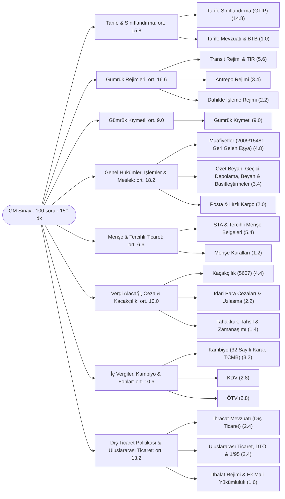
```mermaid
%%{init: {"flowchart": {"nodeSpacing": 10, "rankSpacing": 60}}}%%
flowchart LR
  S([GM Sınavı: 100 soru · 150 dk])
  S --> G0["Tarife & Sınıflandırma: ort. 15.8"]
  G0 --> G0K0["Tarife Sınıflandırma (GTİP) (14.8)"]
  G0 --> G0K1["Tarife Mevzuatı & BTB (1.0)"]
  S --> G1["Gümrük Rejimleri: ort. 16.6"]
  G1 --> G1K0["Transit Rejimi & TIR (5.6)"]
  G1 --> G1K1["Antrepo Rejimi (3.4)"]
  G1 --> G1K2["Dahilde İşleme Rejimi (2.2)"]
  S --> G2["Gümrük Kıymeti: ort. 9.0"]
  G2 --> G2K0["Gümrük Kıymeti (9.0)"]
  S --> G3["Genel Hükümler, İşlemler & Meslek: ort. 18.2"]
  G3 --> G3K0["Muafiyetler (2009/15481, Geri Gelen Eşya) (4.8)"]
  G3 --> G3K1["Özet Beyan, Geçici Depolama, Beyan & Basitleştirmeler (3.4)"]
  G3 --> G3K2["Posta & Hızlı Kargo (2.0)"]
  S --> G4["Menşe & Tercihli Ticaret: ort. 6.6"]
  G4 --> G4K0["STA & Tercihli Menşe Belgeleri (5.4)"]
  G4 --> G4K1["Menşe Kuralları (1.2)"]
  S --> G5["Vergi Alacağı, Ceza & Kaçakçılık: ort. 10.0"]
  G5 --> G5K0["Kaçakçılık (5607) (4.4)"]
  G5 --> G5K1["İdari Para Cezaları & Uzlaşma (2.2)"]
  G5 --> G5K2["Tahakkuk, Tahsil & Zamanaşımı (1.4)"]
  S --> G6["İç Vergiler, Kambiyo & Fonlar: ort. 10.6"]
  G6 --> G6K0["Kambiyo (32 Sayılı Karar, TCMB) (3.2)"]
  G6 --> G6K1["KDV (2.8)"]
  G6 --> G6K2["ÖTV (2.8)"]
  S --> G7["Dış Ticaret Politikası & Uluslararası Ticaret: ort. 13.2"]
  G7 --> G7K0["İhracat Mevzuatı (Dış Ticaret) (2.4)"]
  G7 --> G7K1["Uluslararası Ticaret, DTÖ & 1/95 (2.4)"]
  G7 --> G7K2["İthalat Rejimi & Ek Mali Yükümlülük (1.6)"]
```

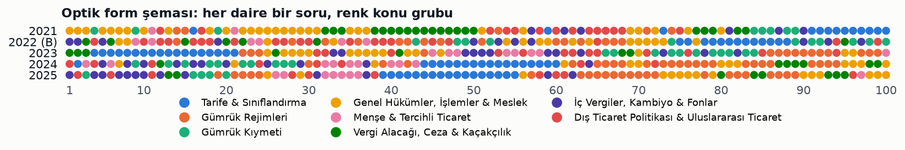

## 2. Yıl yıl analiz

### 2021

- Sınav konu bloklarıyla kurulmuş: 1–40 genel hükümler, beyan ve muafiyetler; 41–50 tamamen kaçakçılık (5607 ve akaryakıt/elkonulan eşya yönetmelikleri); 51–80 dış ticaret, kambiyo ve rejimler; 81–90 hesap bloğu; 91–100 tarife sınıflandırma.
- En çok soru Kaçakçılık (10) ve Tarife Sınıflandırma (10) konularından geldi; ardından Gümrük Kıymeti (8) ve Özet Beyan–Geçici Depolama (8) var. Kaçakçılığa 10 soru ayrılan tek yıl bu; sonraki yıllarda 2–4 soruya iniyor.
- Genel hükümler ve tanımlar (7 soru: risk, gizlilik, çalışma saatleri, gümrük vergileri tanımı) bu yıl belirgin; 2023'ten itibaren bu başlıkta hiç soru yok. STA ve tercihli menşe belgelerinden hiç soru gelmedi; sonraki dört yılda yılda 5–8 soru çıkıyor.
- Soru kalıbında olumsuz kök %56 ile beş yılın en yüksek oranında; öncüllü (I-II-III) soru yalnızca 4. Doğrudan 4458 sayılı Kanun'a dayanan 36 soru da beş yılın zirvesi: 2021 sınavı kanun metnini ölçen, en klasik sınav.
- Hesap bloğu 10 soru: kıymet 5, KDV matrahı 3, uzlaşma ve ceza 1'er. Kültür fonunun uzlaşmaya konu olmaması (82) ve lisans ücretinde 3 yıllık zamanaşımı (83) gibi ayrıntılar hesapla birlikte soruluyor.
- Beş yılın en kolay sınavı: 26 kolay, 54 orta, 20 zor. Tarife soruları 13 farklı fasıla yayılıyor; 96. fasıl 3 soruyla öne çıkıyor.

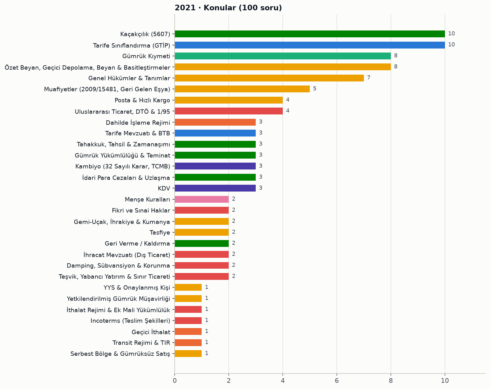

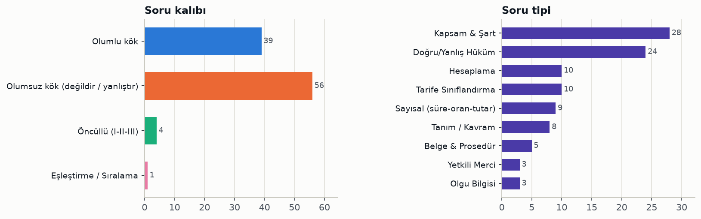

Konu tablosu ve soru numaraları

| Konu | Soru | Soru numaraları |
|---|---|---|
| Kaçakçılık (5607) | 10 | 41, 42, 43, 44, 45, 46, 47, 48, 49, 50 |
| Tarife Sınıflandırma (GTİP) | 10 | 91, 92, 93, 94, 95, 96, 97, 98, 99, 100 |
| Gümrük Kıymeti | 8 | 4, 9, 19, 84, 85, 86, 88, 89 |
| Özet Beyan, Geçici Depolama, Beyan & Basitleştirmeler | 8 | 7, 8, 10, 20, 23, 30, 35, 36 |
| Genel Hükümler & Tanımlar | 7 | 1, 2, 3, 5, 6, 13, 72 |
| Muafiyetler (2009/15481, Geri Gelen Eşya) | 5 | 22, 24, 27, 37, 76 |
| Posta & Hızlı Kargo | 4 | 28, 56, 69, 70 |
| Uluslararası Ticaret, DTÖ & 1/95 | 4 | 52, 60, 62, 64 |
| Dahilde İşleme Rejimi | 3 | 14, 15, 53 |
| Tarife Mevzuatı & BTB | 3 | 16, 59, 73 |
| Tahakkuk, Tahsil & Zamanaşımı | 3 | 32, 33, 78 |
| Gümrük Yükümlülüğü & Teminat | 3 | 38, 39, 77 |
| Kambiyo (32 Sayılı Karar, TCMB) | 3 | 57, 61, 63 |
| İdari Para Cezaları & Uzlaşma | 3 | 79, 82, 83 |
| KDV | 3 | 81, 87, 90 |
| Menşe Kuralları | 2 | 11, 21 |
| Fikri ve Sınai Haklar | 2 | 12, 17 |
| Gemi-Uçak, İhrakiye & Kumanya | 2 | 25, 26 |
| Tasfiye | 2 | 29, 51 |
| Geri Verme / Kaldırma | 2 | 34, 40 |
| İhracat Mevzuatı (Dış Ticaret) | 2 | 54, 68 |
| Damping, Sübvansiyon & Korunma | 2 | 58, 65 |
| Teşvik, Yabancı Yatırım & Sınır Ticareti | 2 | 66, 75 |
| YYS & Onaylanmış Kişi | 1 | 18 |
| Yetkilendirilmiş Gümrük Müşavirliği | 1 | 31 |
| İthalat Rejimi & Ek Mali Yükümlülük | 1 | 55 |
| Incoterms (Teslim Şekilleri) | 1 | 67 |
| Geçici İthalat | 1 | 71 |
| Transit Rejimi & TIR | 1 | 74 |
| Serbest Bölge & Gümrüksüz Satış | 1 | 80 |

### 2022 (B kitapçığı)

- Elimizdeki dosya B kitapçığı; sorular A kitapçığına göre karışık sıralandığından optik formda blok yapısı daha az belirgin. Yine de tarife soruları 75–88, hesap soruları 89–100 aralığında toplanıyor.
- En çok soru Tarife Sınıflandırma (12) ve Gümrük Kıymeti (11) konularından geldi. Arkasından STA–menşe belgeleri, transit ve ÖTV (5) geliyor.
- Dış ticaret politikası grubu 21 soruyla beş yılın zirvesinde: ihracat mevzuatı (konsinye, bedelsiz ihracat, 96/31 yasak mallar), ithalat rejimi ve ek mali yükümlülük, teknik düzenlemeler (4), damping ve sınır ticareti. Dayanak olarak dış ticaret mevzuatı (15 soru) ilk kez Gümrük Kanunu'nu (11) geçiyor.
- Hesap soruları 13'e çıktı: kıymet 6, ÖTV 2 (sigarada nispi/maktu vergi), asgari–azami gümrük vergisi, antrepo götürü teminatı ve kendiliğinden bildirimde ceza. 94. sorunun cevap anahtarı (466.200 TL) standart hesapla elde edilemiyor; standart kurgu 452.000 TL (B) veriyor.
- Kalıp değişimi bu yıl başlıyor: öncüllü soru 15 (2021'de 4), olumsuz kök %34. Zor soru sayısı 22.
- Tarifede HS 2022 değişiklikleri doğrudan soruldu: yenilebilir böcekler (04.10) ve elektronik sigara–24.04 ayrımı. Balina (01.06) ve ortopedik ayakkabı (90.21) gibi "fasıl dışı" tuzaklar bu yıl başlıyor ve sonraki yıllarda tekrarlanıyor.

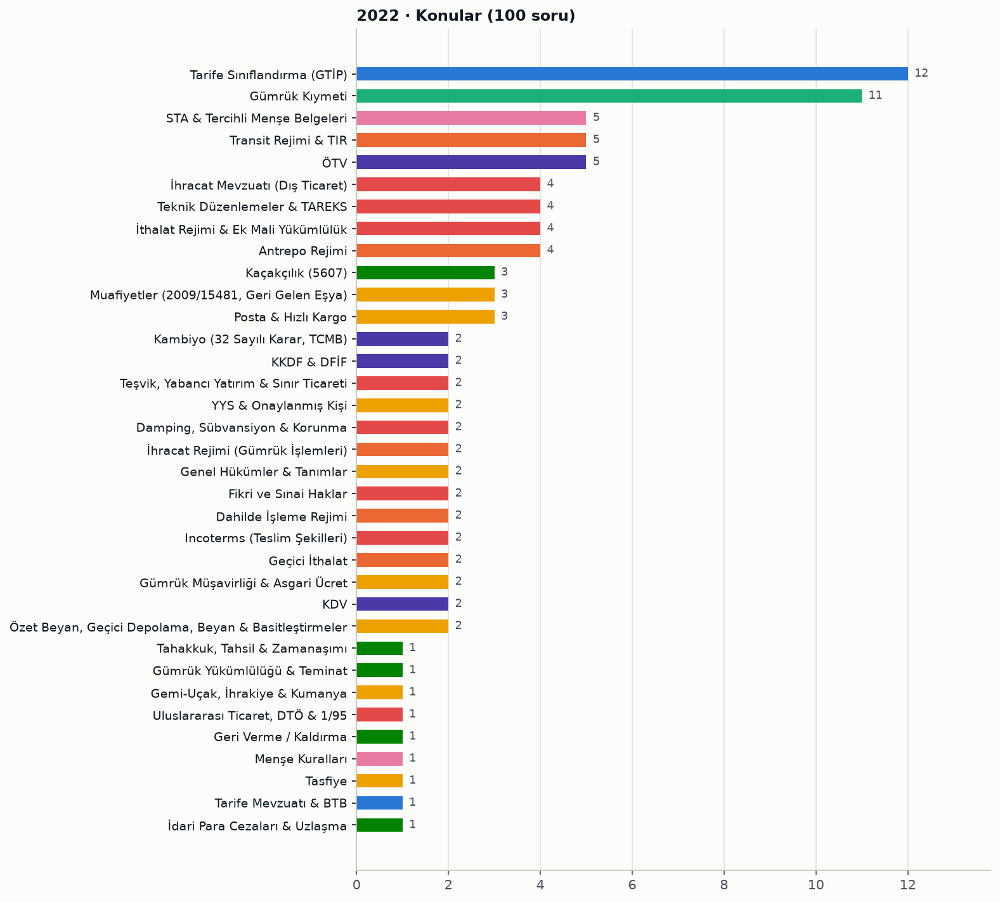

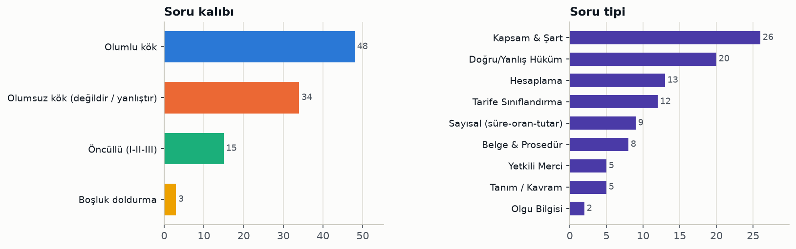

Konu tablosu ve soru numaraları

| Konu | Soru | Soru numaraları |
|---|---|---|
| Tarife Sınıflandırma (GTİP) | 12 | 75, 76, 78, 79, 80, 81, 82, 83, 85, 86, 87, 88 |
| Gümrük Kıymeti | 11 | 43, 48, 49, 52, 74, 89, 91, 92, 96, 98, 100 |
| STA & Tercihli Menşe Belgeleri | 5 | 9, 11, 23, 34, 37 |
| Transit Rejimi & TIR | 5 | 46, 51, 61, 63, 66 |
| ÖTV | 5 | 53, 55, 57, 93, 97 |
| İhracat Mevzuatı (Dış Ticaret) | 4 | 10, 35, 40, 45 |
| Teknik Düzenlemeler & TAREKS | 4 | 16, 17, 39, 47 |
| İthalat Rejimi & Ek Mali Yükümlülük | 4 | 18, 21, 94, 99 |
| Antrepo Rejimi | 4 | 41, 60, 67, 68 |
| Kaçakçılık (5607) | 3 | 15, 20, 31 |
| Muafiyetler (2009/15481, Geri Gelen Eşya) | 3 | 64, 69, 71 |
| Posta & Hızlı Kargo | 3 | 70, 72, 73 |
| Kambiyo (32 Sayılı Karar, TCMB) | 2 | 1, 19 |
| KKDF & DFİF | 2 | 2, 5 |
| Teşvik, Yabancı Yatırım & Sınır Ticareti | 2 | 4, 30 |
| YYS & Onaylanmış Kişi | 2 | 7, 62 |
| Damping, Sübvansiyon & Korunma | 2 | 12, 26 |
| İhracat Rejimi (Gümrük İşlemleri) | 2 | 14, 44 |
| Genel Hükümler & Tanımlar | 2 | 25, 54 |
| Fikri ve Sınai Haklar | 2 | 27, 38 |
| Dahilde İşleme Rejimi | 2 | 28, 42 |
| Incoterms (Teslim Şekilleri) | 2 | 29, 65 |
| Geçici İthalat | 2 | 32, 36 |
| Gümrük Müşavirliği & Asgari Ücret | 2 | 33, 56 |
| KDV | 2 | 50, 90 |
| Özet Beyan, Geçici Depolama, Beyan & Basitleştirmeler | 2 | 58, 59 |
| Tahakkuk, Tahsil & Zamanaşımı | 1 | 3 |
| Gümrük Yükümlülüğü & Teminat | 1 | 6 |
| Gemi-Uçak, İhrakiye & Kumanya | 1 | 8 |
| Uluslararası Ticaret, DTÖ & 1/95 | 1 | 13 |
| Geri Verme / Kaldırma | 1 | 22 |
| Menşe Kuralları | 1 | 24 |
| Tasfiye | 1 | 77 |
| Tarife Mevzuatı & BTB | 1 | 84 |
| İdari Para Cezaları & Uzlaşma | 1 | 95 |

### 2023

- Tarife bloğu sınavın başına alındı (4–21) ve 18 soruya çıktı: beş yılın en yüksek tarife payı (2024'le birlikte). 84. fasıl tek başına 6 soru getirdi (kültivatör, conta takımı, cep hesap makinesi, lehim makinesi, ısı değiştirici).
- Hesap ağırlığı zirvede: 16 hesap sorusu, çoğu 66–84 aralığında. Bunların 9'u kıymet hesabı. 72–73. sorular ortak senaryolu; 72'de şıklar metindeki tutarların 10 katıyla kurulmuş, 73'te anahtar (D) test ücretini de KDV matrahına katıyor, standart hesap C (5.085.000) veriyor.
- STA–menşe belgeleri (7), transit (86–93 bloğu, 7 soru) ve kambiyo (5: ihracat bedellerinin yurda getirilmesi, kıymetli maden ithali) güçlendi. Gemi–uçak, ihrakiye ve kumanya (4) bu yıl en çok soru aldığı seviyede.
- Kolay soru yalnızca 6, zor soru 27: beş yılın en az kolay soru içeren sınavı. Olumlu kök 51'e çıktı, öncüllü soru 16, vaka/senaryo sorusu 5.
- Uluslararası anlaşmalara dayanan soru 13'e yükseldi (TIR, CISG, Gümrük Kıymeti Komitesi, 1/95 OKK, TPS-OIC). Bu eğilim 2024 ve 2025'te de sürüyor.

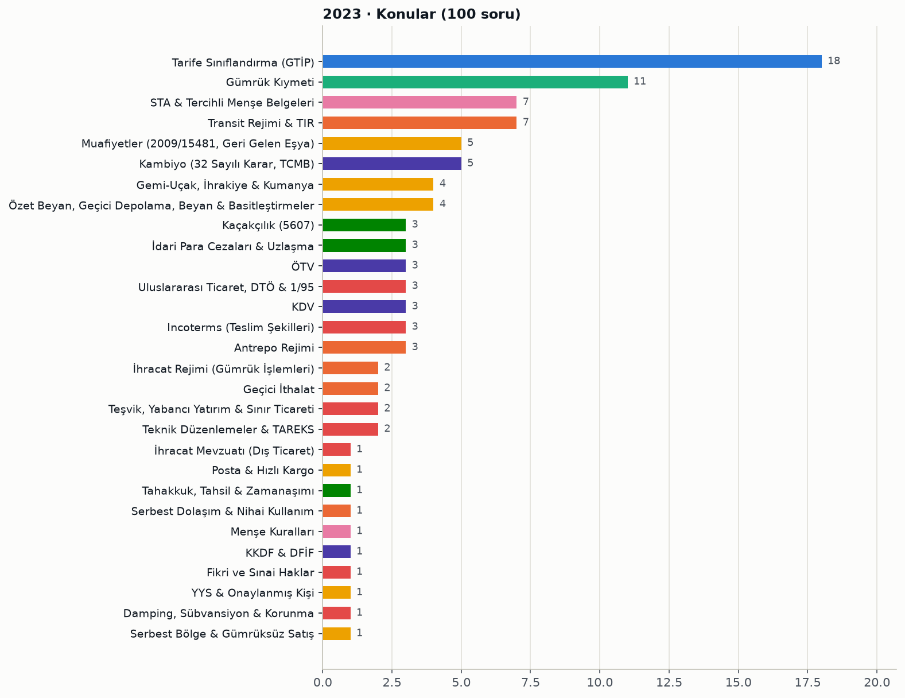

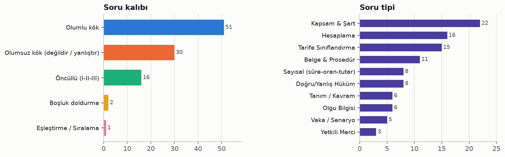

Konu tablosu ve soru numaraları

| Konu | Soru | Soru numaraları |
|---|---|---|
| Tarife Sınıflandırma (GTİP) | 18 | 4, 5, 6, 7, 8, 9, 10, 11, 12, 13, 14, 15, 16, 17, 18, 19, 20, 21 |
| Gümrük Kıymeti | 11 | 66, 67, 72, 74, 75, 77, 79, 80, 81, 83, 84 |
| STA & Tercihli Menşe Belgeleri | 7 | 47, 48, 54, 55, 57, 58, 100 |
| Transit Rejimi & TIR | 7 | 86, 87, 88, 90, 91, 92, 93 |
| Muafiyetler (2009/15481, Geri Gelen Eşya) | 5 | 27, 35, 36, 37, 38 |
| Kambiyo (32 Sayılı Karar, TCMB) | 5 | 33, 34, 49, 50, 51 |
| Gemi-Uçak, İhrakiye & Kumanya | 4 | 25, 28, 29, 30 |
| Özet Beyan, Geçici Depolama, Beyan & Basitleştirmeler | 4 | 42, 43, 46, 96 |
| Kaçakçılık (5607) | 3 | 1, 2, 3 |
| İdari Para Cezaları & Uzlaşma | 3 | 26, 68, 69 |
| ÖTV | 3 | 59, 60, 78 |
| Uluslararası Ticaret, DTÖ & 1/95 | 3 | 61, 62, 85 |
| KDV | 3 | 63, 73, 82 |
| Incoterms (Teslim Şekilleri) | 3 | 64, 65, 71 |
| Antrepo Rejimi | 3 | 97, 98, 99 |
| İhracat Rejimi (Gümrük İşlemleri) | 2 | 22, 89 |
| Geçici İthalat | 2 | 23, 24 |
| Teşvik, Yabancı Yatırım & Sınır Ticareti | 2 | 31, 40 |
| Teknik Düzenlemeler & TAREKS | 2 | 53, 94 |
| İhracat Mevzuatı (Dış Ticaret) | 1 | 32 |
| Posta & Hızlı Kargo | 1 | 39 |
| Tahakkuk, Tahsil & Zamanaşımı | 1 | 41 |
| Serbest Dolaşım & Nihai Kullanım | 1 | 44 |
| Menşe Kuralları | 1 | 45 |
| KKDF & DFİF | 1 | 52 |
| Fikri ve Sınai Haklar | 1 | 56 |
| YYS & Onaylanmış Kişi | 1 | 70 |
| Damping, Sübvansiyon & Korunma | 1 | 76 |
| Serbest Bölge & Gümrüksüz Satış | 1 | 95 |

### 2024

- Tarife 18 soru (çoğu 44–60 aralığında) ve 26 farklı fasıl: beş yılın en geniş fasıl yayılımı. 85. fasıl 4 soru (düz panel ekran modülü, LED, akıllı kart); kauçuk–silikon, ayakkabı aksamı, römorkör ve buz pisti makinesi gibi tek tek eşya soruları ağırlıkta.
- Gümrük rejimleri grubu 24 soruyla öne çıktı: transit 7 (TIR karnesi, kefil, LRN), antrepo 6 (götürü teminat, kapatma, geri gönderme), DİR 4 ve geçici ithalat 3.
- Kıymet (10) ve hesap (11) soruları bu kez sınavın başında, 9–29 aralığında. Royalti–lisans (13, 15, 23), satın alma komisyonu, kullanılmış taşıt amortismanı ve gözetim farkı KDV'si soruldu.
- Beş yılın en zor sınavı: 32 zor soru. Antrepo götürü teminatı ve DİR süreleri gibi tebliğ ayrıntısı isteyen sorular zorluğu artırıyor. Olumsuz kök %38, öncüllü 15.
- Muafiyetler 7 soruyla en yüksek seviyede; bunların 3'ü geri gelen eşya (istisnalar, elde olmayan sebepler, sürenin başlangıcı). STA–menşe belgeleri 8 soru: anlaşma–belge eşleştirmeleri ve taraf ülkeler.

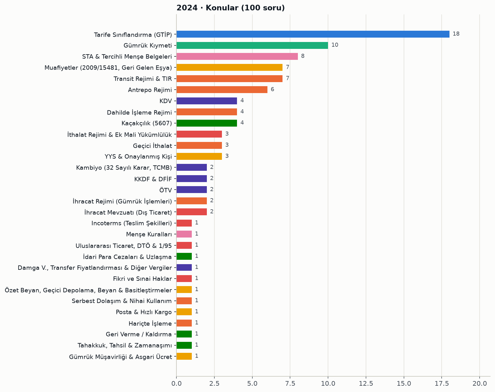

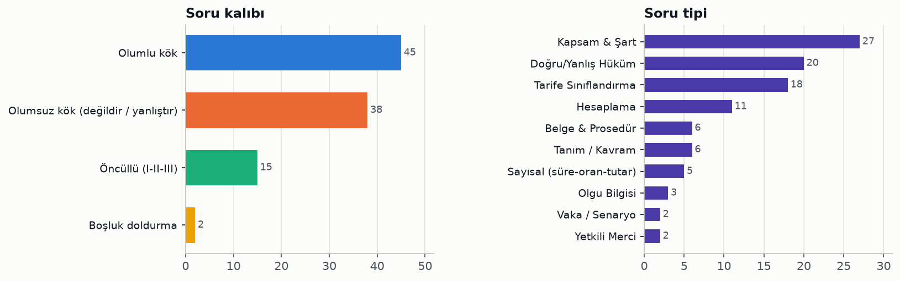

Konu tablosu ve soru numaraları

| Konu | Soru | Soru numaraları |
|---|---|---|
| Tarife Sınıflandırma (GTİP) | 18 | 2, 44, 45, 46, 47, 48, 49, 50, 51, 52, 53, 54, 55, 56, 57, 58, 59, 60 |
| Gümrük Kıymeti | 10 | 9, 13, 15, 18, 19, 22, 23, 26, 27, 28 |
| STA & Tercihli Menşe Belgeleri | 8 | 3, 32, 33, 35, 36, 40, 41, 43 |
| Muafiyetler (2009/15481, Geri Gelen Eşya) | 7 | 7, 21, 61, 69, 70, 80, 81 |
| Transit Rejimi & TIR | 7 | 73, 74, 75, 76, 77, 78, 79 |
| Antrepo Rejimi | 6 | 30, 39, 83, 84, 85, 86 |
| KDV | 4 | 8, 10, 25, 29 |
| Dahilde İşleme Rejimi | 4 | 65, 66, 67, 68 |
| Kaçakçılık (5607) | 4 | 87, 88, 89, 90 |
| İthalat Rejimi & Ek Mali Yükümlülük | 3 | 4, 24, 34 |
| Geçici İthalat | 3 | 91, 92, 94 |
| YYS & Onaylanmış Kişi | 3 | 95, 96, 97 |
| Kambiyo (32 Sayılı Karar, TCMB) | 2 | 5, 37 |
| KKDF & DFİF | 2 | 14, 64 |
| ÖTV | 2 | 16, 17 |
| İhracat Rejimi (Gümrük İşlemleri) | 2 | 62, 71 |
| İhracat Mevzuatı (Dış Ticaret) | 2 | 63, 72 |
| Incoterms (Teslim Şekilleri) | 1 | 1 |
| Menşe Kuralları | 1 | 6 |
| Uluslararası Ticaret, DTÖ & 1/95 | 1 | 11 |
| İdari Para Cezaları & Uzlaşma | 1 | 12 |
| Damga V., Transfer Fiyatlandırması & Diğer Vergiler | 1 | 20 |
| Fikri ve Sınai Haklar | 1 | 31 |
| Özet Beyan, Geçici Depolama, Beyan & Basitleştirmeler | 1 | 38 |
| Serbest Dolaşım & Nihai Kullanım | 1 | 42 |
| Posta & Hızlı Kargo | 1 | 82 |
| Hariçte İşleme | 1 | 93 |
| Geri Verme / Kaldırma | 1 | 98 |
| Tahakkuk, Tahsil & Zamanaşımı | 1 | 99 |
| Gümrük Müşavirliği & Asgari Ücret | 1 | 100 |

### 2025

- Tarife 16 soru (39–55), transit 8 soruluk tek blok (65–72), STA–menşe belgeleri 7. Bu üç konu birlikte sınavın üçte birini oluşturuyor.
- Yeni başlıklar geldi: damga vergisi ve transfer fiyatlandırması (1, 4, 5), GATT VII isteğe bağlı kıymet unsurları (3), TKA ön karar kapsamı (6), nihai kullanım ve gümrük statü belgesi (21–24). İç vergiler, kambiyo ve fonlar grubu 13 soruyla beş yılın en yükseği.
- Gümrük Kıymeti 5 soruya düştü: beş yılın en düşük seviyesi. Hesap soruları da 9 ile en az; çoğu 12–20 aralığında. 12. soruda anahtar (464) ardiyeyi KDV matrahına katmıyor; ardiye eklenirse 484 (E) çıkıyor.
- En çeşitli soru kalıbı bu yılda: öncüllü 18 (beş yılın zirvesi), boşluk doldurma 5, eşleştirme/sıralama 3. Olumlu kök 40'a geriledi.
- Sınav sonu yine meslek ve kolaylaştırma soruları: YYS ve OKS (3), YGM tespit kodları (98, 100) ve asgari ücret tarifesi (99). Zorluk: 15 kolay, 63 orta, 22 zor.

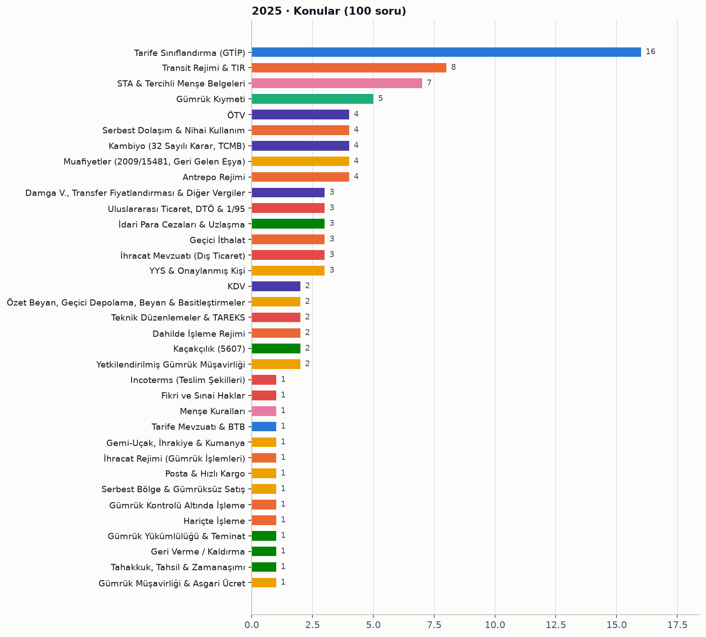

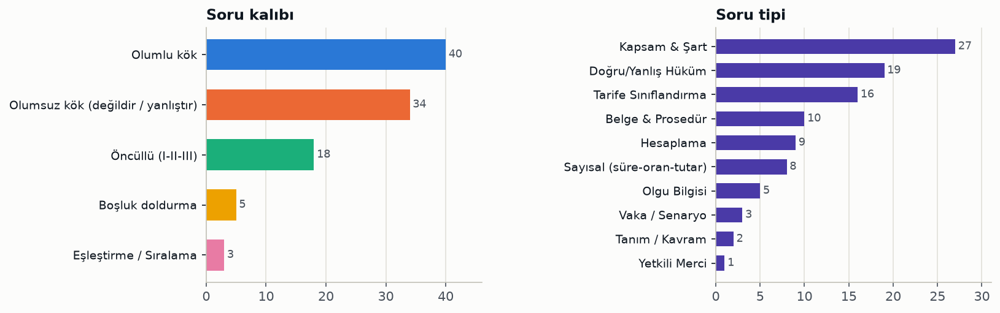

Konu tablosu ve soru numaraları

| Konu | Soru | Soru numaraları |
|---|---|---|
| Tarife Sınıflandırma (GTİP) | 16 | 39, 40, 41, 42, 43, 44, 45, 46, 47, 48, 49, 50, 51, 52, 54, 55 |
| Transit Rejimi & TIR | 8 | 65, 66, 67, 68, 69, 70, 71, 72 |
| STA & Tercihli Menşe Belgeleri | 7 | 26, 27, 32, 33, 34, 36, 97 |
| Gümrük Kıymeti | 5 | 3, 16, 17, 18, 20 |
| ÖTV | 4 | 7, 8, 9, 15 |
| Serbest Dolaşım & Nihai Kullanım | 4 | 21, 22, 23, 24 |
| Kambiyo (32 Sayılı Karar, TCMB) | 4 | 31, 37, 59, 62 |
| Muafiyetler (2009/15481, Geri Gelen Eşya) | 4 | 73, 74, 75, 76 |
| Antrepo Rejimi | 4 | 78, 81, 82, 83 |
| Damga V., Transfer Fiyatlandırması & Diğer Vergiler | 3 | 1, 4, 5 |
| Uluslararası Ticaret, DTÖ & 1/95 | 3 | 2, 6, 96 |
| İdari Para Cezaları & Uzlaşma | 3 | 13, 14, 80 |
| Geçici İthalat | 3 | 19, 87, 88 |
| İhracat Mevzuatı (Dış Ticaret) | 3 | 58, 60, 61 |
| YYS & Onaylanmış Kişi | 3 | 90, 91, 92 |
| KDV | 2 | 10, 12 |
| Özet Beyan, Geçici Depolama, Beyan & Basitleştirmeler | 2 | 25, 29 |
| Teknik Düzenlemeler & TAREKS | 2 | 30, 38 |
| Dahilde İşleme Rejimi | 2 | 63, 64 |
| Kaçakçılık (5607) | 2 | 84, 85 |
| Yetkilendirilmiş Gümrük Müşavirliği | 2 | 98, 100 |
| Incoterms (Teslim Şekilleri) | 1 | 11 |
| Fikri ve Sınai Haklar | 1 | 28 |
| Menşe Kuralları | 1 | 35 |
| Tarife Mevzuatı & BTB | 1 | 53 |
| Gemi-Uçak, İhrakiye & Kumanya | 1 | 56 |
| İhracat Rejimi (Gümrük İşlemleri) | 1 | 57 |
| Posta & Hızlı Kargo | 1 | 77 |
| Serbest Bölge & Gümrüksüz Satış | 1 | 79 |
| Gümrük Kontrolü Altında İşleme | 1 | 86 |
| Hariçte İşleme | 1 | 89 |
| Gümrük Yükümlülüğü & Teminat | 1 | 93 |
| Geri Verme / Kaldırma | 1 | 94 |
| Tahakkuk, Tahsil & Zamanaşımı | 1 | 95 |
| Gümrük Müşavirliği & Asgari Ücret | 1 | 99 |

## 3. Yılların karşılaştırması

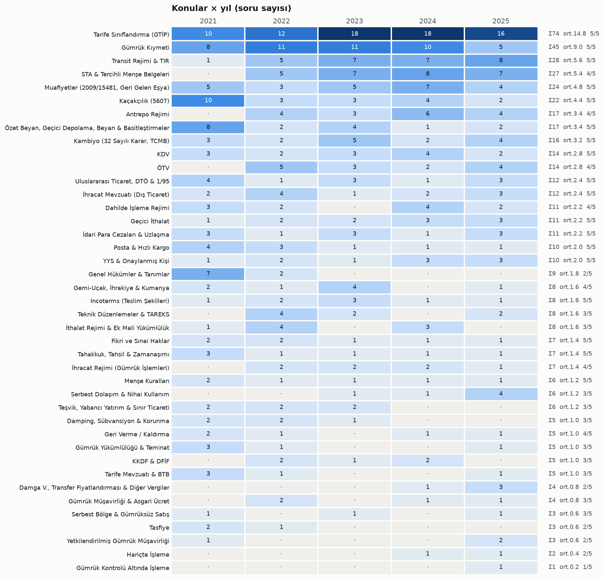

| # | Konu | 2021 | 2022 | 2023 | 2024 | 2025 | Toplam | Ort./yıl | Çıktığı yıl | Eğilim |
|---|---|---|---|---|---|---|---|---|---|---|
| 1 | Tarife Sınıflandırma (GTİP) | 10 | 12 | 18 | 18 | 16 | 74 | 14.8 | 5/5 | ▲ +6.0 |
| 2 | Gümrük Kıymeti | 8 | 11 | 11 | 10 | 5 | 45 | 9.0 | 5/5 | ▼ -2.0 |
| 3 | Transit Rejimi & TIR | 1 | 5 | 7 | 7 | 8 | 28 | 5.6 | 5/5 | ▲ +4.5 |
| 4 | STA & Tercihli Menşe Belgeleri | 0 | 5 | 7 | 8 | 7 | 27 | 5.4 | 4/5 | ▲ +5.0 |
| 5 | Muafiyetler (2009/15481, Geri Gelen Eşya) | 5 | 3 | 5 | 7 | 4 | 24 | 4.8 | 5/5 | ▲ +1.5 |
| 6 | Kaçakçılık (5607) | 10 | 3 | 3 | 4 | 2 | 22 | 4.4 | 5/5 | ▼ -3.5 |
| 7 | Antrepo Rejimi | 0 | 4 | 3 | 6 | 4 | 17 | 3.4 | 4/5 | ▲ +3.0 |
| 8 | Özet Beyan, Geçici Depolama, Beyan & Basitleştirmeler | 8 | 2 | 4 | 1 | 2 | 17 | 3.4 | 5/5 | ▼ -3.5 |
| 9 | Kambiyo (32 Sayılı Karar, TCMB) | 3 | 2 | 5 | 2 | 4 | 16 | 3.2 | 5/5 | ■ +0.5 |
| 10 | KDV | 3 | 2 | 3 | 4 | 2 | 14 | 2.8 | 5/5 | ■ +0.5 |
| 11 | ÖTV | 0 | 5 | 3 | 2 | 4 | 14 | 2.8 | 4/5 | ■ +0.5 |
| 12 | Uluslararası Ticaret, DTÖ & 1/95 | 4 | 1 | 3 | 1 | 3 | 12 | 2.4 | 5/5 | ■ -0.5 |
| 13 | İhracat Mevzuatı (Dış Ticaret) | 2 | 4 | 1 | 2 | 3 | 12 | 2.4 | 5/5 | ■ -0.5 |
| 14 | Dahilde İşleme Rejimi | 3 | 2 | 0 | 4 | 2 | 11 | 2.2 | 4/5 | ■ +0.5 |
| 15 | Geçici İthalat | 1 | 2 | 2 | 3 | 3 | 11 | 2.2 | 5/5 | ▲ +1.5 |
| 16 | İdari Para Cezaları & Uzlaşma | 3 | 1 | 3 | 1 | 3 | 11 | 2.2 | 5/5 | ■ +0.0 |
| 17 | Posta & Hızlı Kargo | 4 | 3 | 1 | 1 | 1 | 10 | 2.0 | 5/5 | ▼ -2.5 |
| 18 | YYS & Onaylanmış Kişi | 1 | 2 | 1 | 3 | 3 | 10 | 2.0 | 5/5 | ▲ +1.5 |
| 19 | Genel Hükümler & Tanımlar | 7 | 2 | 0 | 0 | 0 | 9 | 1.8 | 2/5 | ▼ -4.5 |
| 20 | Gemi-Uçak, İhrakiye & Kumanya | 2 | 1 | 4 | 0 | 1 | 8 | 1.6 | 4/5 | ▼ -1.0 |
| 21 | Incoterms (Teslim Şekilleri) | 1 | 2 | 3 | 1 | 1 | 8 | 1.6 | 5/5 | ■ -0.5 |
| 22 | Teknik Düzenlemeler & TAREKS | 0 | 4 | 2 | 0 | 2 | 8 | 1.6 | 3/5 | ▼ -1.0 |
| 23 | İthalat Rejimi & Ek Mali Yükümlülük | 1 | 4 | 0 | 3 | 0 | 8 | 1.6 | 3/5 | ▼ -1.0 |
| 24 | Fikri ve Sınai Haklar | 2 | 2 | 1 | 1 | 1 | 7 | 1.4 | 5/5 | ▼ -1.0 |
| 25 | Tahakkuk, Tahsil & Zamanaşımı | 3 | 1 | 1 | 1 | 1 | 7 | 1.4 | 5/5 | ▼ -1.0 |
| 26 | İhracat Rejimi (Gümrük İşlemleri) | 0 | 2 | 2 | 2 | 1 | 7 | 1.4 | 4/5 | ■ +0.5 |
| 27 | Menşe Kuralları | 2 | 1 | 1 | 1 | 1 | 6 | 1.2 | 5/5 | ■ -0.5 |
| 28 | Serbest Dolaşım & Nihai Kullanım | 0 | 0 | 1 | 1 | 4 | 6 | 1.2 | 3/5 | ▲ +2.5 |
| 29 | Teşvik, Yabancı Yatırım & Sınır Ticareti | 2 | 2 | 2 | 0 | 0 | 6 | 1.2 | 3/5 | ▼ -2.0 |
| 30 | Damping, Sübvansiyon & Korunma | 2 | 2 | 1 | 0 | 0 | 5 | 1.0 | 3/5 | ▼ -2.0 |
| 31 | Geri Verme / Kaldırma | 2 | 1 | 0 | 1 | 1 | 5 | 1.0 | 4/5 | ■ -0.5 |
| 32 | Gümrük Yükümlülüğü & Teminat | 3 | 1 | 0 | 0 | 1 | 5 | 1.0 | 3/5 | ▼ -1.5 |
| 33 | KKDF & DFİF | 0 | 2 | 1 | 2 | 0 | 5 | 1.0 | 3/5 | ■ +0.0 |
| 34 | Tarife Mevzuatı & BTB | 3 | 1 | 0 | 0 | 1 | 5 | 1.0 | 3/5 | ▼ -1.5 |
| 35 | Damga V., Transfer Fiyatlandırması & Diğer Vergiler | 0 | 0 | 0 | 1 | 3 | 4 | 0.8 | 2/5 | ▲ +2.0 |
| 36 | Gümrük Müşavirliği & Asgari Ücret | 0 | 2 | 0 | 1 | 1 | 4 | 0.8 | 3/5 | ■ +0.0 |
| 37 | Serbest Bölge & Gümrüksüz Satış | 1 | 0 | 1 | 0 | 1 | 3 | 0.6 | 3/5 | ■ +0.0 |
| 38 | Tasfiye | 2 | 1 | 0 | 0 | 0 | 3 | 0.6 | 2/5 | ▼ -1.5 |
| 39 | Yetkilendirilmiş Gümrük Müşavirliği | 1 | 0 | 0 | 0 | 2 | 3 | 0.6 | 2/5 | ■ +0.5 |
| 40 | Hariçte İşleme | 0 | 0 | 0 | 1 | 1 | 2 | 0.4 | 2/5 | ▲ +1.0 |
| 41 | Gümrük Kontrolü Altında İşleme | 0 | 0 | 0 | 0 | 1 | 1 | 0.2 | 1/5 | ■ +0.5 |

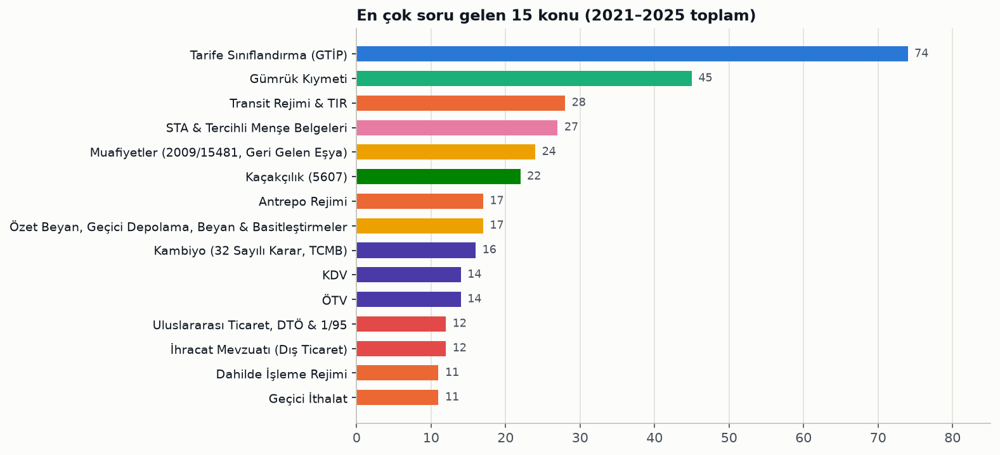

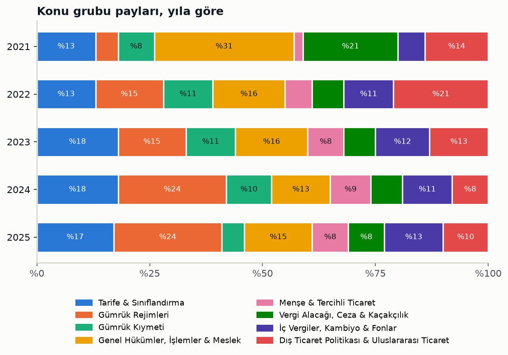

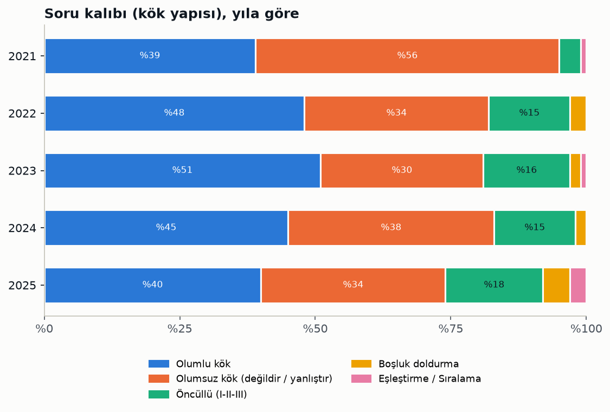

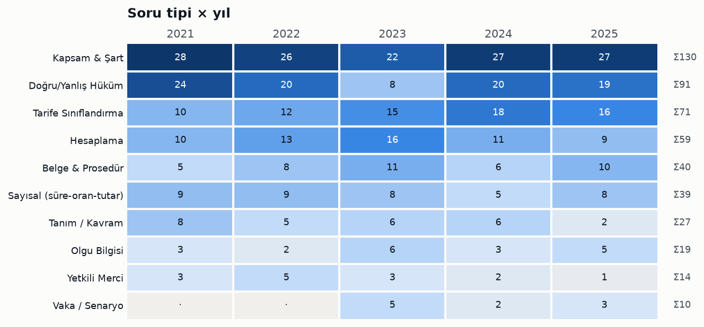

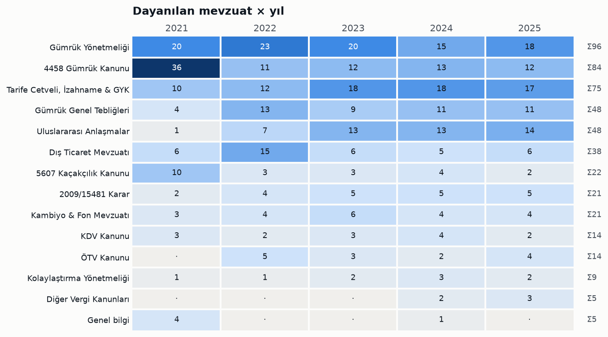

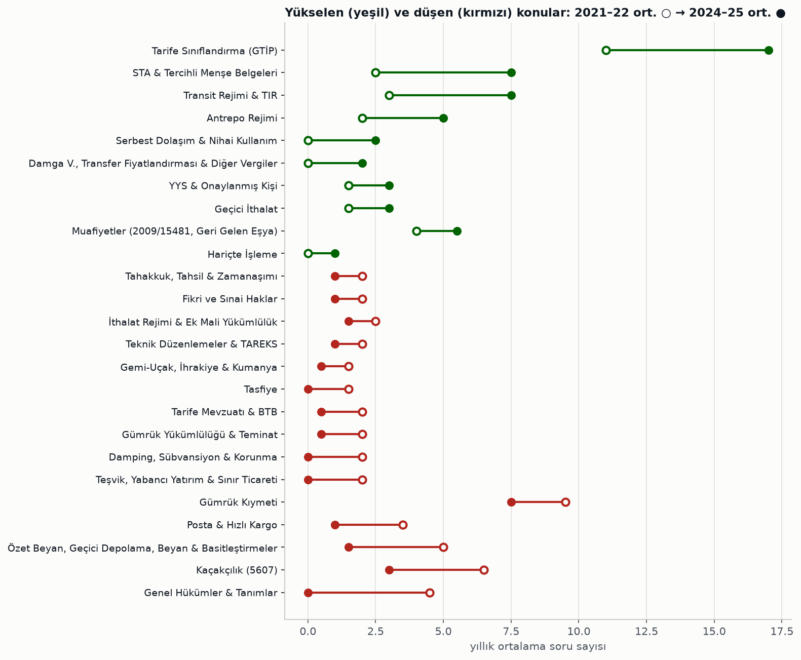

## 4. Derinlemesine: tarife, hesap ve sayısal bilgiler

### Tarife sınıflandırma

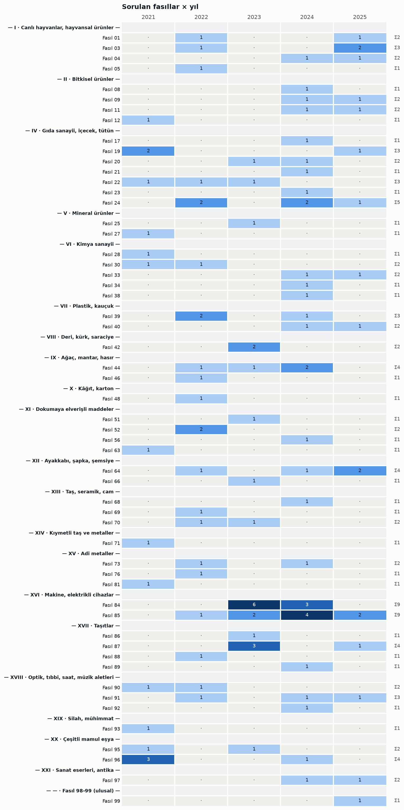

Tarife soruları nereden geliyor?5 yılda 74 tarife sınıflandırma sorusu var (yılda 10→16) ve bu sorular 55 farklı fasla dağılıyor. En çok soru gelen fasıllar 84 ve 85 (9'ar soru), ardından 24 (5), 44, 64, 87 ve 96 (4'er).Bölüm bazında makine ve elektrikli cihazlar (XVI) ile gıda, içecek ve tütün (IV) açık ara önde. Canlı hayvanlar (I) ve kimya (VI) izliyor.Soruların 33'ü olumsuz köklü: "hangisi farklı fasılda yer alır", "hangisi bu pozisyonda değildir". Tek eşyanın pozisyonunu soran sorudan çok, fasıl ve pozisyon kapsamını bilmeyi ölçen karşılaştırmalı sorular ağırlıkta.HS 2022 değişiklikleri her yıl soruluyor: yenilebilir böcekler 04.10 (2022/79, 2024/2), elektronik sigara ve 24.04 (2022/86, 2025/52), düz panel ekran modülleri 85.24 (2024/56), sıcak izostatik presler 85.14 (2025/45).Fasıl ve bölüm notları en verimli çalışma alanı: 64. fasıl not 2 (ayakkabı aksamı; 2024 ve 2025), 3. fasıl notu (memeliler 01.06'da; 2022 ve 2025), 42.02 pozisyon metni (2023'te iki soru) ve ısıtma tertibatlı ön camın taşıt aksamı sayılması (2023 ve 2025) tekrar soruldu.

### Hesap soruları

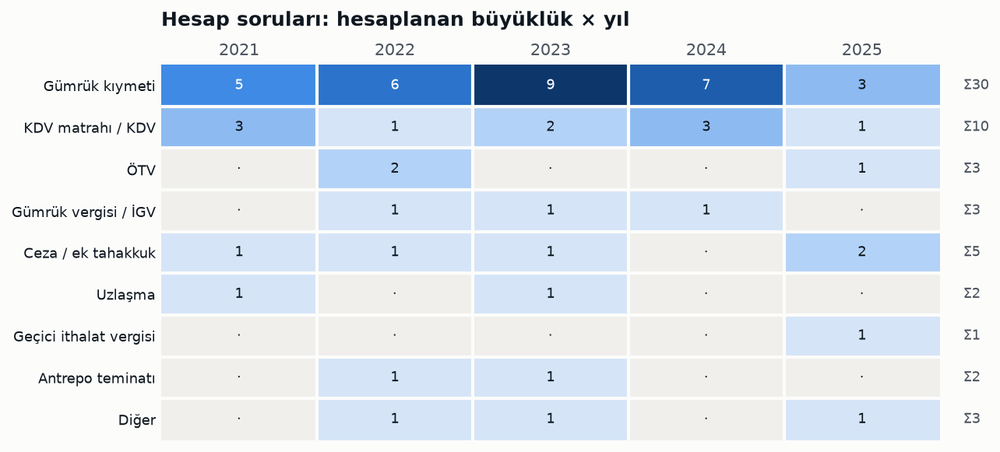

Hesap sorularında neler öne çıkıyor?5 yılda 59 hesap sorusu var (yılda 9–16). Bunların 30'u gümrük kıymeti, 10'u KDV matrahı veya KDV tutarı. Hesap sorularının 30'u zor düzeyde.Kıymet hesabında hep aynı ayrımlar sınanıyor: satış komisyonu eklenir, satın alma komisyonu eklenmez; satış şartı olan royalti eklenir, Türkiye'de çoğaltma hakkı eklenmez; alıcının bedelsiz sağladığı girdiler eklenir; ithalat sonrası montaj ve Türkiye'deki nakliye eklenmez.KDV matrahına gümrük kıymetine ek olarak tescile kadar yapılan giderler (ardiye, fazla mesai, varış yerine kadar taşıma) eklenir, tescil sonrası giderler eklenmez. Kullanılmış taşıt amortismanı dört yılda soruldu ve 3 yıllık zamanaşımı hesap sorusunun içine yerleştiriliyor.Hesap bloğunun yeri yıldan yıla değişiyor: 2021'de 81–90, 2022'de 89–100, 2023'te 66–84, 2024'te 9–29, 2025'te 12–20.Cevap anahtarı tartışmalı hesaplar: 2022/94 (anahtar 466.200; standart hesap 452.000), 2023/72–73 (şıklar metindeki tutarların 10 katı; 73'te standart hesap 5.085.000, anahtar 5.095.000), 2025/12 (anahtar 464; ardiye KDV matrahına eklenirse 484) ve 2025/16 (anahtar model yılından sayıyor; fatura yılından sayılırsa 7.000). Hesap dışında 2021/4'ün anahtarı da itiraza açık: Türkiye'de çoğaltma hakkı için yapılan ödemeler de kıymete dahil edilmeyen unsurlardandır.

### GM ve GMY karşılaştırması

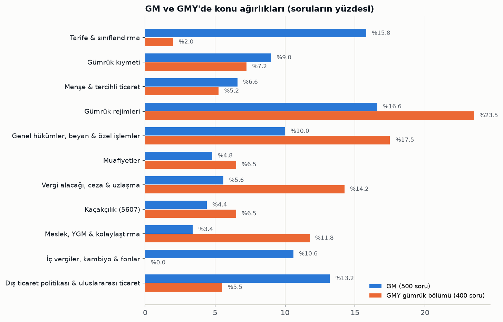

| Alan | GM % | GM soru | GMY % | GMY soru |
|---|---|---|---|---|
| Tarife & sınıflandırma | 15.8 | 79 | 2.0 | 8 |
| Gümrük kıymeti | 9.0 | 45 | 7.2 | 29 |
| Menşe & tercihli ticaret | 6.6 | 33 | 5.2 | 21 |
| Gümrük rejimleri | 16.6 | 83 | 23.5 | 94 |
| Genel hükümler, beyan & özel işlemler | 10.0 | 50 | 17.5 | 70 |
| Muafiyetler | 4.8 | 24 | 6.5 | 26 |
| Vergi alacağı, ceza & uzlaşma | 5.6 | 28 | 14.2 | 57 |
| Kaçakçılık (5607) | 4.4 | 22 | 6.5 | 26 |
| Meslek, YGM & kolaylaştırma | 3.4 | 17 | 11.8 | 47 |
| İç vergiler, kambiyo & fonlar | 10.6 | 53 | 0.0 | 0 |
| Dış ticaret politikası & uluslararası ticaret | 13.2 | 66 | 5.5 | 22 |

### Sınavda sorulan süre, oran ve tutarlar

| Konu | Değer | Bilgi | Yıl/Soru |
|---|---|---|---|
| Antrepo Rejimi | 5 yıl | İzin geri alınanlara yasak süresi: Antrepo izni geri alınan şirketin sermayesinde %10'dan fazla paya sahip gerçek kişi ortaklarına, iznin geri alındığı tarihten itibaren 5 yıl süreyle yeniden antrepo açma izni verilmez. | 2022/67 |
| Antrepo Rejimi | 30 gün | Antrepodan geri gönderme süresi: Beyannamesi tescil edilip antrepoya alınmış eşya, muayenede beyana uygunluğu anlaşılmak kaydıyla transit beyannamesi veya TIR karnesiyle 30 gün içinde geri gönderilir. | 2024/30 |
| Antrepo Rejimi | 5 iş günü | Özel antrepoda eşya devri: Özel antrepodaki eşyanın devri, devri müteakip 5 iş günü içinde gümrükçe onaylanmış yeni bir işlemle antrepodan çıkarılması şartıyla kabul edilir; aşılan her gün için antrepo işleticisi ve devralana ayrı ayrı GK 241/1 uyarınca ceza uygulanır. | 2025/81 |
| Dahilde İşleme Rejimi | Belge: süre sonundan itibaren 3 ay; belge/izin süresi azami 12 ay | DİR Tebliği süreleri: Cevap anahtarına göre yanlış ifade C'dir (dahilde işleme iznine ilişkin haklı sebep başvurusu Tebliğde C'de yazıldığı şekilde düzenlenmemiştir); belge/izin süresinin sektöre göre azami 12 aya kadar tespiti, belge için süre sonundan itibaren 3 ay içinde Bakanlığa elektronik başvuru ve gemi inşa, komple tesis ile savunma sanayi ürünlerinde proje süresi/ek süre imkanı doğrudur. | 2024/66 |
| Geçici İthalat | %3 | Kısmi muafiyette aylık vergi: Kısmi muafiyetle geçici ithal edilen eşyadan her ay için, tescil tarihinde serbest dolaşıma girseydi alınacak vergilerin %3'ü alınır. | 2021/71 |
| Gemi-Uçak, İhrakiye & Kumanya | Ağırlık itibarıyla yarısından fazlası | Türk bayraklı gemilerde dış sefer: Yükün ağırlık itibarıyla yarısından fazlası ihraç veya transit eşyası ise Türk bayraklı geminin rotasındaki Türk limanına serbest dolaşımdaki eşya taşıması dış sefer halini bozmaz. | 2023/29 |
| Gemi-Uçak, İhrakiye & Kumanya | Teslimi izleyen ayın ilk 7 iş günü | İhrakiye tamamlayıcı beyan süresi: Basitleştirilmiş usulle yapılan serbest dolaşımdaki yakıt (ihrakiye) teslimlerinde tamamlayıcı beyan, teslimin yapıldığı ayı izleyen ayın ilk 7 iş günü içinde verilir (20 Haziran teslimi için Temmuz'un ilk 7 iş günü). | 2023/30 |
| Genel Hükümler & Tanımlar | 5 yıl (31.12.2027) | Belge saklama süresi: GK md. 13'e göre belgeler 5 yıl saklanır; serbest dolaşıma giriş/ihracatta süre beyannamenin tescil edildiği yılı izleyen takvim yılı başından başlar. 1 Mart 2022'de tescilli beyanname için süre 31 Aralık 2027 mesai bitiminde sona erer. | 2022/54 |
| Gümrük Müşavirliği & Asgari Ücret | 10 gün | Disiplin savunma süresi: Gümrük müşavirleri ve yardımcıları hakkında disiplin cezası verilmeden önce yetkili disiplin kurulunca istenen savunma için verilecek süre 10 günden az olamaz. | 2022/33 |
| Gümrük Müşavirliği & Asgari Ücret | %35 / %50 | Asgari ücret tarifesi indirim oranları: Bir takvim yılında aynı müşavirlikten hizmet alınarak sektörel dış ticaret şirketi adına tescil edilen ihracat beyannamesi sayısı 1.000'i aşınca sonraki beyannamelerde %35, 2.500'ü aşınca %50 indirim uygulanabilir. | 2022/56 |
| Gümrük Müşavirliği & Asgari Ücret | 44.085 TL | Asgari ücret tarifesi üst sınırı: Cevap anahtarına göre 2024 yılı Asgari Ücret Tarifesi Tebliğinde İTH-13 hizmet kodunda toplam müşavirlik ücretinin 44.085 TL'yi aşan kısmı tarafların anlaşmasıyla belirlenir. | 2024/100 |
| Muafiyetler (2009/15481, Geri Gelen Eşya) | 3 yıl | Geri gelen eşyada süre: Serbest dolaşımdayken ihraç edilen eşya 3 yıl içinde yeniden serbest dolaşıma girerse, beyan sahibinin talebiyle ithalat vergilerinden muaf tutulur. | 2021/76 |
| Muafiyetler (2009/15481, Geri Gelen Eşya) | İşyeri nakli: 12 ay (3 yıl değil) | Muafen ithal eşyada devir kısıtları: İşyeri nakli kapsamında muafen ithal edilen sermaye malları için devir/satış kısıtı üç yıl değil 12 aydır; ev eşyasında 1 yıl, engelli araçlarında 10 yıl (vefatta varis için 5 yıl), hibe ambulanslarda 5/10 yıllık kısıtlar doğrudur. | 2023/38 |
| Muafiyetler (2009/15481, Geri Gelen Eşya) | 5 yıl | Ambulans muafiyetinde devir yasağı: 2009/15481 sayılı Karara göre muafen serbest dolaşıma sokulan ambulans ve kurtarma araçları, beyanname tescil tarihinden itibaren 5 yıl geçmedikçe gümrük vergileri tahsil edilmeden satılamaz, hibe veya devredilemez. | 2024/80 |
| Muafiyetler (2009/15481, Geri Gelen Eşya) | 430 Avro / 3.000 Avro | Evlilik hediyelerinde muafiyet limitleri: Evlilik nedeniyle yerleşim yeri yabancı ülkede olanlarca gönderilen, ticari mahiyette olmayan hediyelere her biri 430 Avro ve toplam 3.000 Avro'yu aşmamak kaydıyla muafiyet tanınır. | 2025/74 |
| Muafiyetler (2009/15481, Geri Gelen Eşya) | 5 adet | Yolcu beraberi kişisel eşya listesi: Yolcu beraberi kişisel eşya listesinde her cinsten 5 adet olmak üzere cilt bakım ürünü ve makyaj malzemesi muafiyet kapsamındadır; diğer seçeneklerdeki çay, pipo tütünü, alkollü içki ve müzik aleti miktarları liste limitlerini aşar. | 2025/76 |
| Posta & Hızlı Kargo | 1 ay | Posta ihracat eşyasının antrepo süresi: Posta yoluyla yurt dışına gönderilecek ticari eşya, antrepo beyannamesinin tescilinden itibaren posta idaresinin sorumluluğundaki genel antrepoda 1 ay bekletilebilir. | 2021/69 |
| Posta & Hızlı Kargo | 30 Avro; %30; %20 | Posta-hızlı kargoda tek ve maktu vergi: AB'den posta/hızlı kargo ile gerçek kişiye gelen, kıymeti 30 Avro'yu geçmeyen ticari olmayan eşyaya (ilaç ve kitap hariç) %30, ÖTV (IV) sayılı listedeki eşya için ilave %20 tek ve maktu vergi uygulanır. | 2025/77 |
| Tasfiye | 30 gün | Tasfiye idaresinin teslim alma süresi: Tespit ve tahakkuk belgeleri intikal ettirilen tasfiyelik eşyayı tasfiye idaresi 30 gün içinde teslim almakla mükelleftir. | 2021/29 |
| Tasfiye | 1 ay | Tahlilden arta kalan numuneler: GK md. 66'ya göre tahlilden arta kalan numuneler, tahlil sonuçlarının ilgilisine bildiriminden itibaren 1 ay içinde alınmazsa gümrüğe terk edilmiş sayılır. | 2022/77 |
| YYS & Onaylanmış Kişi | 30 işçi | OKS istihdam şartı: OKS özel koşulları gereği başvuru sahibinin, YGM ile ön inceleme sözleşmesi yaptığı tarihten geriye dönük bir yıl içinde ortalama en az 30 işçi istihdam etmesi gerekir. | 2021/18 |
| YYS & Onaylanmış Kişi | 2 yıl | OKS belgesi geçerlilik süresi: Cevap anahtarına göre Onaylanmış Kişi Statüsü Tebliği (Sıra No:1) uyarınca statü belgesi 2 yıl süreyle geçerlidir. | 2022/62 |
| YYS & Onaylanmış Kişi | 2 milyon / 4 milyon FOB ABD doları | OKS dış ticaret performans kriteri: Cevap anahtarına göre OKS performans kriteri, YGM ön inceleme sözleşmesinden geriye iki yıldaki on iki aylık iki dönemin her birinde en az 2 milyon FOB/ABD doları fiili ihracattır; 2 ve 4 milyon dolarlık ihracat bu şartı karşılar. | 2025/91 |
| Özet Beyan, Geçici Depolama, Beyan & Basitleştirmeler | en az 2 saat (4 saat değil) | Özet beyan verilme süreleri: Karadeniz/Akdeniz'deki yabancı limanlar ve AB limanları ile Türk limanları arasındaki kısa mesafeli deniz taşımasında özet beyan ilk varış limanına gelmeden en az 2 saat önce verilir (4 saat değil). Konteyner: yüklemeden 24 saat önce; demiryolu: varıştan 2 saat önce; kısa mesafeli uçuş: havalanma anı. | 2021/7 |
| STA & Tercihli Menşe Belgeleri | 10 ay (Singapur için yanlış) | Sonradan kontrol süreleri (Seri No:10): Cevap anahtarına göre Singapur menşe beyanı için 10 aylık sonradan kontrol süresi yanlıştır; AB A.TR, Birleşik Krallık ve Güney Kore menşe beyanı ile Gürcistan EUR.1 için süre 10 aydır. | 2023/57 |
| STA & Tercihli Menşe Belgeleri | 10 ay | Menşe belgelerinin ibraz süreleri: Form A menşe belgesi ihracatçı ülkede düzenlendiği tarihten itibaren 10 ay geçerlidir; A.TR (ilk, ikinci nüsha, sonradan verilen) ve Malezya belgesine ilişkin seçeneklerdeki süreler hatalıdır. | 2023/58 |
| Geri Verme / Kaldırma | 1 yıl | Kusurlu eşyada geri verme süresi: Tescil tarihi itibarıyla kusurlu veya sözleşmeye aykırı olduğu için kabul edilmeyen eşyaya ilişkin ithalat vergilerinin geri verilmesi için başvuru 1 yıl içinde yapılmalıdır. | 2021/40 |
| Geri Verme / Kaldırma | 45 gün | Beyanname iptalinde geri verme süresi: Cevap anahtarına göre deniz yoluyla gelen eşyada beyannamenin teslimden önce iptali halinde ödenmiş vergilerin geri verilmesi, özet beyan tarihinden itibaren 45 gün (deniz yolu geçici depolama süresi) içinde talep edilmelidir. | 2022/22 |
| Geri Verme / Kaldırma | 1 yıl | Uluslararası anlaşmayla geri verme süresi: Türkiye'nin taraf olduğu uluslararası anlaşmalar çerçevesinde geri verme, gümrük vergilerinin yükümlüye tebliğinden itibaren 1 yıl içinde ilgili gümrük idaresine başvuru üzerine yapılır. | 2025/94 |
| Kaçakçılık (5607) | Bandrol taklidi imali (alt sınır en yüksek) | Kaçakçılık suçlarında hapis alt sınırları: Cevap anahtarına göre tütün mamulü ambalajlarına uygulanan bandrollerin taklitlerini imal etme suçu, seçeneklerdeki suçlar arasında hapis cezası alt sınırı en yüksek olandır. | 2023/1 |
| Tahakkuk, Tahsil & Zamanaşımı | 15 gün | Noksan alınan vergilerin ödeme süresi: Noksan alındığı tespit edilip yükümlüye tebliğ edilen gümrük vergileri tebliğ tarihinden itibaren 15 gün içinde ödenir. Cevap anahtarına göre diğer seçeneklerdeki ifadeler Kanuna uygun değildir: süre uzatımı (teminatla 3 ay / teminatsız 30 gün), tecil faizi alınmaması ve kalan kısmın 6 ayda ödenmesi. | 2025/95 |
| İdari Para Cezaları & Uzlaşma | 2 katı | İhracat vergili eşyada usulsüz çıkış: Gümrük vergileri ödenerek ihraç edilebilen eşyayı gümrük işlemine tabi tutmadan veya vergileri ödemeden TGB'den çıkaranlara, vergilerin yanı sıra bu vergilerin 2 katı idari para cezası verilir. | 2021/79 |
| KKDF & DFİF | %0 (kesinti yapılmaz) | Kıymetli maden ithalinde KKDF: Borsa İstanbul'da işlem görmek üzere ithal edilen standart işlenmemiş kıymetli madenlerde KKDF kesintisi yapılmaz. | 2023/52 |
| Kambiyo (32 Sayılı Karar, TCMB) | Fuar: bitimden sonra 180 gün; kredili/kiralama: vadeyi izleyen 90 gün; geçici ihracat satışı: 90 gün | İhracat bedellerinin yurda getirilme süreleri: Fuar/sergide satılan malların bedeli fuar bitimini izleyen 180 gün, kredili veya kiralama yoluyla ihracatta vade tarihlerini izleyen 90 gün, geçici ihracatta kesin satış tarihinden itibaren 90 gün içinde getirilir; yurt dışı müteahhit firmalarca yapılan ihracat için 180 gün zorunluluğu yoktur (II yanlış). | 2023/34 |
| Kambiyo (32 Sayılı Karar, TCMB) | 185.000 TL | Yolcu beraberi Türk parası çıkışı: Yolcu beraberinde 185.000 TL'yi aşan Türk parası ve Türk parası ile ödemeyi sağlayan belge çıkışında Ticaret Bakanlığınca yayımlanan nakit beyan formu ile gümrüğe beyanda bulunulur. | 2025/59 |
| Damping, Sübvansiyon & Korunma | 45 gün | Damping şikâyetinde inceleme süresi: İthalat Genel Müdürlüğü şikâyet üzerine veya re'sen yaptığı incelemeyi azami 45 gün içinde tamamlayarak soruşturma açılıp açılmaması konusunda İthalatta Haksız Rekabeti Değerlendirme Kuruluna teklifte bulunur. | 2022/26 |
| Fikri ve Sınai Haklar | 3 iş günü | Re'sen alıkoyma süresi: Henüz başvuru yokken FSMH ihlaline dair açık delil varsa gümrük idaresi, hak sahibinin geçerli başvuru yapabilmesi için eşyayı 3 iş günü re'sen alıkoyabilir. | 2021/12 |
| Fikri ve Sınai Haklar | 1 yıl | FSMH başvurusunda koruma süresi: FSMH ihlali şüphesiyle işlemlerin durdurulması/alıkonulması başvurusunda gümrük idaresinin harekete geçmesi istenen süre en fazla 1 yıl olabilir. | 2022/38 |
| İhracat Mevzuatı (Dış Ticaret) | 1 yıl; 2 yıl | Konsinye ihracatta kesin satış süresi: İhracat Yönetmeliğine göre konsinye ihraç edilen malın ihraç tarihinden itibaren bir yıl içinde kesin satışı yapılmalıdır; haklı ve zorunlu nedenlerle başvurulursa İhracatçı Birlikleri Genel Sekreterliğince iki yıl daha uzatılabilir. | 2024/63 |

### Tekrar eden soru kalıpları

| Soru kalıbı | Konu | 2021 | 2022 | 2023 | 2024 | 2025 | Doğru bilgi |
|---|---|---|---|---|---|---|---|
| Fikri ve sınai haklarda alıkoyma süreleri ve yasak işlemler | Fikri ve Sınai Haklar | 12, 17 | 27, 38 | 56 | 31 | 28 | Re'sen alıkoyma 3 iş günü; hak sahibi ihtiyati tedbiri 10 iş gününde (çabuk bozulan eşyada 3) getirir; başvuru en fazla 1 yıl için yapılır; durdurulan eşya TGB'yi terk edemez, serbest bölgeye konamaz. |
| Incoterms 2020: kurallar ve taşıma türleri | Incoterms (Teslim Şekilleri) | 67 | 29, 65 | 65, 71 | 1 | 11 | EXW, FCA, CPT, CIP, DAP, DPU ve DDP tüm taşıma türlerine; FAS, FOB, CFR ve CIF yalnız deniz ve iç su yoluna uygundur. Kuralları ICC hazırlar; DPU, DAT'ın yerini almıştır. |
| Royalti ve lisans ücretinin kıymete eklenmesi | Gümrük Kıymeti | 83, 84 | 92, 98 | · | 13, 15, 23 | 14, 17 | Satış şartı olan ve ithal eşyasıyla ilgili royalti kıymete eklenir; Türkiye'de çoğaltma hakkı bedeli eklenmez. Ödemenin ithalattan önce ya da sonra yapılması sonucu değiştirmez; 3 yıllık zamanaşımı ayrıca kontrol edilir. |
| Geri gelen eşya muafiyeti: süre, başlangıç, istisnalar | Muafiyetler (2009/15481, Geri Gelen Eşya) | 22, 24, 76 | 69 | 27 | 61, 69, 70 | · | Süre 3 yıldır ve fiili ihraç tarihinden başlar (deniz yolunda geminin hareketi, kara yolunda sınırdan fiilen çıkış). İhracı dış ticaret önlemine konu eşya muafiyetten yararlanamaz. |
| TIR karnesi ve TIR Sözleşmesi | Transit Rejimi & TIR | · | 46 | 93 | 77, 78, 79 | 71, 72 | Her taşıt veya konteyner için ayrı karne esastır. Alkol ve tütün ancak özel ibareli karneyle taşınır; geçerliliğinin son günü hareket gümrüğüne ibraz edilen karne kabul edilir. |
| Transit teminatı, kefil ve GRN | Transit Rejimi & TIR | 74 | 51, 61, 66 | · | 74, 75 | 65 | Kefil, Türkiye'de yerleşik, rejim hak sahibinden farklı bir banka veya finans kuruluşudur. Teminat mektubu, beyannameler kapanıp GRN kapatıldıktan 10 ay sonra iade edilir; kara yolu dışındaki taşımalarda kural olarak teminat aranmaz. |
| Antrepo götürü teminatı | Antrepo Rejimi | · | 41, 68 | 99 | 83, 84 | 82 | Götürü teminatı antrepo işleticisi verir; tutar alan ya da tank kapasitesi kademelerine göre hesaplanır, 40.000.000 TL'yi aşan kısım dikkate alınmaz. Tank ilavesinde yalnızca ilave edilen kısım esas alınır; işlemleri bölge müdürlüğü sonuçlandırır. |
| İşlenmemiş kıymetli maden ithalatı (32 sayılı Karar) | Kambiyo (32 Sayılı Karar, TCMB) | · | 1 | 50, 51 | 5 | 31, 37 | İşlenmemiş standart ve standart dışı kıymetli madeni yalnızca TCMB ile kıymetli madenler aracı kuruluşları ithal edebilir. Serbest bölgeye getirilmesi yasak değildir; kıymetli maden ihracı serbesttir. |
| Transit basitleştirmeleri ve izin sahibinin yükümlülükleri | Transit Rejimi & TIR | · | 63 | 87, 92 | 76 | 66, 70 | Demiryolu basitleştirmesinde CIM bilgileri iletilir. İzin sahibi manifestolara 3 yıl erişim sağlar ve havalimanı değişikliğini 15 gün önce bildirir; başvuruda finansal büyüklük kriter değildir. |
| Anlaşma tarafı ülkeler (STA, TTA, TPS-OIC, EFTA) | STA & Tercihli Menşe Belgeleri | · | 23 | 100 | 36, 40 | 26, 97 | İran, Azerbaycan, Özbekistan ve Pakistan ile STA değil tercihli ticaret anlaşması vardır; Uruguay ile STA yoktur. EFTA: İsviçre, Norveç, İzlanda, Lihtenştayn. |
| KKDF kesintisi yapılan ve yapılmayan ithalat | KKDF & DFİF | 87 | 2, 5 | 52 | 14 | · | Mal mukabili, kabul kredili ve vadeli akreditifli ithalatta KKDF kesilir. Borsa İstanbul'a gelen standart kıymetli madende ve süresinden önce ödenen istisnai kıymet bedelinde kesinti yapılmaz. |
| Kullanılmış taşıtın gümrük kıymeti (amortisman) | Gümrük Kıymeti | · | 91 | 84 | 22 | 16 | Fatura bedelinden kullanım süresi için amortisman düşülür: ilk yıl %20, sonraki yıllar %10, toplamda en çok %80. Sayımın model yılından mı fatura yılından mı başlayacağı anahtarlarda farklı ele alınmış; bu soru tipi itiraza en açık hesaplardandır. |
| Telafi edici vergi ve geri ödeme sistemi | Dahilde İşleme Rejimi | 14 | 42 | · | 67 | 63 | TEV bir ithalat vergisidir ve ihracat beyannamesinin tescilinde doğar. Miktar kısıtlaması, kota veya lisans söz konusu olduğunda geri ödeme sistemi uygulanmaz. |
| Anlaşmalara göre menşe ispat belgesi eşleştirmesi | STA & Tercihli Menşe Belgeleri | · | · | 47 | 32, 35, 41 | 33, 34, 36 | İran TTA'da İran menşe ispat belgesi, Azerbaycan TTA'da TR-AZ Menşe İspat Belgesi, Singapur STA'da menşe beyanı, Özbekistan TTA'da EUR.1 kullanılır; Form A yalnız GTS'de geçerlidir. AB ile sanayi ürünleri ve işlenmiş tarım ürünleri ticaretinde A.TR kullanılır. |
| Özet beyan ve geçici depolama yeri şartları | Özet Beyan, Geçici Depolama, Beyan & Basitleştirmeler | 7, 30, 35, 36 | 58, 59 | 96 | · | · | Geçici depolama yeri açma başvurularını bölge müdürlüğü sonuçlandırır. Çıkış özet beyanından sonra eşya 150 gün içinde çıkmazsa beyan verilmemiş sayılır; muayene bildiriminden sonra özet beyan değiştirilemez. |
| Konsinye ihracat | İhracat Mevzuatı (Dış Ticaret) | · | 10, 45 | · | 63, 72 | 60 | Başvuru İhracatçı Birlikleri Genel Sekreterliğine yapılır; kesin satış ihraçtan itibaren 1 yıl içinde gerçekleşmelidir ve haklı nedenle 2 yıl uzatılabilir. |
| 64.06 ayakkabı aksamı ve 64. fasıl notları | Tarife Sınıflandırma (GTİP) | · | 85 | · | 48, 58 | 41, 44 | Bağcık, kopça, toka ve süs eşyası 64.06 anlamında aksam sayılmaz; ortopedik ayakkabı 90.21'dedir. 64. fasıl XII. Bölümdedir. |
| ÖTV (IV) sayılı liste kapsamı | ÖTV | · | · | 60 | 16 | 8, 9 | Parfüm, kozmetik, saç spreyi, havyar ve tırnak makası (IV) sayılı listededir; sade gazoz ve çerçeveli cam ayna değildir. Diplomatik istisna (IV) sayılı listeyi kapsamaz. |
| Memeliler ve yenilebilir böcekler (HS 2022) | Tarife Sınıflandırma (GTİP) | · | 79, 83 | · | 2 | 39 | Balina ve yunus memelidir; canlı halde 01.06'da yer alır, 3. fasılda değil. HS 2022 ile insan tüketimine uygun böcekler 04.10'a alınmıştır. |
| 1/95 OKK md. 28 ve Gümrük Kıymeti Komitesi | Uluslararası Ticaret, DTÖ & 1/95 | · | · | 61, 85 | 11 | 2 | 1/95 OKK md. 28 menşe, kıymet, beyan ve serbest dolaşım gibi uyum alanlarını sayar. Gümrük Kıymeti Komitesi DTÖ'de, Teknik Komite ise DGÖ'dedir. |
| Gümrükçe vize edilen ve edilmeyen menşe belgeleri | STA & Tercihli Menşe Belgeleri | · | 9 | 54 | 33 | · | EUR.1 ve A.TR gümrükçe vize edilir. Menşe şahadetnamesini odalar onaylar, Form A'yı lehdar ülke makamları düzenler; fatura beyanı ve menşe beyanı vize gerektirmez. |
| İhracı yasak ve ön izne bağlı mallar (96/31) | İhracat Mevzuatı (Dış Ticaret) | 54 | 35 | · | · | 61 | Tütün tohumu ve sultani çekirdeksiz asma fidanının ihracı yasaktır; afyon ve haşhaş kellesi ön izne bağlıdır. |
| Gümrük müşavirliği asgari ücret tarifesi | Gümrük Müşavirliği & Asgari Ücret | · | 56 | · | 100 | 99 | Aynı beyannamede birden fazla rejim varsa yüksek ücret uygulanır. Sektörel dış ticaret şirketlerinde beyanname sayısına göre %35 veya %50 indirim yapılabilir; tutar soruları her yılın tebliğinden gelir. |
| Sınır ticaret merkezleri ve sınır ticareti | Teşvik, Yabancı Yatırım & Sınır Ticareti | 75 | 30 | 31 | · | · | Sınır ticaret merkezleri gümrük işlemlerinde TGB dışında sayılır. Altyapı, güvenlik ve işletme valiliğin görevidir; uygunluk belgesi her ürün için ayrı düzenlenir ve devredilemez. |
| İhrakiye, kumanya ve tamamlayıcı beyan | Gemi-Uçak, İhrakiye & Kumanya | 25, 26 | · | 25, 26, 30 | · | · | Gemiyle ihracatta fiili ihraç tarihi geminin hareket tarihi, ihrakiyede teslim tarihidir. Basitleştirilmiş usulle yapılan teslimlerde tamamlayıcı beyan, izleyen ayın ilk 7 iş gününde verilir. |
| YGM tespit işlemi kodları | Yetkilendirilmiş Gümrük Müşavirliği | 31 | · | · | · | 98, 100 | AN kodları antrepo, DR kodları DİR tespitleridir. Genel antrepolarda AN7, AN8 ve AN9 tespitlerini aynı YGM yapmalıdır. |
| Kaçak akaryakıtta numune ve tasfiye | Kaçakçılık (5607) | 41, 47 | · | · | 88 | · | Teknik düzenlemeye uygun olmayan kaçak akaryakıt il özel idaresi veya yatırım izleme ve koordinasyon başkanlığınca en yakın rafineriye satılır. Numuneleri gümrük idaresi saklar. |
| Isıtma tertibatlı ön cam: taşıt aksamı | Tarife Sınıflandırma (GTİP) | · | · | 6 | · | 47 | Isıtmalı ön cam 70.07'de değil, taşıt aksamı olarak sınıflandırılır: lokomotifte 86.07, otomobilde 8708.22. |
| Elektronik sigara ve 24.04 | Tarife Sınıflandırma (GTİP) | · | 86 | · | · | 52 | Yanmadan solunan tütün ve nikotin ürünleri 24.04'te, elektronik sigara cihazı 85.43'te sınıflandırılır. |

## 5. Sonuç: en çok neyden, nasıl soruluyor?

### En çok soru gelen konular

- Tarife sınıflandırma sınavın bel kemiği: 5 yılda 74 soru, son üç yılda 16–18 soru. Tarife mevzuatıyla birlikte her yıl ortalama 16 soru bu alandan geliyor.
- Gümrük kıymeti ikinci sırada (45 soru), ancak 2025'te 5 soruya düştü. Kıymet sorularının yarıdan fazlası hesap sorusu.
- Transit ve TIR (28) ile STA–tercihli menşe belgeleri (27) en hızlı yükselen konular: 2021'de 1 ve 0 soru, 2025'te 8 ve 7 soru.
- Muafiyetler (2009/15481, geri gelen eşya; 24), kaçakçılık (22), antrepo (17) ve kambiyo (16) her yıl düzenli soru alan ikinci halka.
- Düşüşte olanlar: genel hükümler ve tanımlar (2023'ten beri yok), özet beyan–geçici depolama ve kaçakçılık (2021'deki 8 ve 10 sorudan 2025'te 2'ye).

### En çok sorulan soru tipleri ve kalıpları

- Kapsam ve şart soruları (130) ve doğru/yanlış hüküm soruları (91) beş yılın toplamında ilk iki sırada; bunları tarife sınıflandırma (71) ve hesap (59) izliyor.
- Olumsuz kök ("değildir, yanlıştır, söylenemez") 5 yılda 192 soru (%38). Öncüllü soru 2021'de 4 iken 2025'te 18: tek tek öncülleri değerlendirmek giderek daha önemli.
- Soruların yalnızca %17'si doğrudan Gümrük Kanunu'na dayanıyor. Yönetmelik (96), tarife cetveli (75), tebliğler (48) ve uluslararası anlaşmalar (48) daha belirleyici.
- Süre, oran ve tutar soruları (geri gelen eşyada 3 yıl, özet beyanda 150 gün, FSMH'de 3/10 iş günü, KKDF ve tek ve maktu vergi oranları) her yıl 5–9 soru. Bu değerler mevzuat değiştikçe güncellendiği için güncel metinden çalışılmalı.

### Sınavın değişen yönü

- 2021 kanun metni ve kaçakçılık ağırlıklı, klasik bir sınavdı. 2023'ten itibaren sınav tarife, kıymet hesabı, transit ve tercihli menşe üzerine kuruluyor ve uluslararası anlaşmalar (TIR, GATT VII, TKA, 1/95 OKK, TPS-OIC) daha çok soruluyor.
- 2025 sınavı yeni konular açtı: damga vergisi, transfer fiyatlandırması, nihai kullanım ve gümrük statü belgesi. 2026 için bu başlıkların devam etmesi beklenebilir.
- Aynı bilgi yıllar içinde tekrar soruluyor: tekrar tablosundaki 29 kalıp, çıkmış soruların konu konu çalışılmasının en verimli yöntem olduğunu gösteriyor.

### Çalışma öncelik listesi

**Öncelik 1 — yılda ort. 5+ soru:** Tarife Sınıflandırma (GTİP) (14.8), Gümrük Kıymeti (9.0), Transit Rejimi & TIR (5.6), STA & Tercihli Menşe Belgeleri (5.4)

**Öncelik 2 — yılda ort. 2–5 soru:** Muafiyetler (2009/15481, Geri Gelen Eşya) (4.8), Kaçakçılık (5607) (4.4), Antrepo Rejimi (3.4), Özet Beyan, Geçici Depolama, Beyan & Basitleştirmeler (3.4), Kambiyo (32 Sayılı Karar, TCMB) (3.2), KDV (2.8), ÖTV (2.8), Uluslararası Ticaret, DTÖ & 1/95 (2.4), İhracat Mevzuatı (Dış Ticaret) (2.4), Dahilde İşleme Rejimi (2.2), Geçici İthalat (2.2), İdari Para Cezaları & Uzlaşma (2.2), Posta & Hızlı Kargo (2.0), YYS & Onaylanmış Kişi (2.0)

**Öncelik 3 — yılda ort. 2'den az:** Genel Hükümler & Tanımlar (1.8), Gemi-Uçak, İhrakiye & Kumanya (1.6), Incoterms (Teslim Şekilleri) (1.6), Teknik Düzenlemeler & TAREKS (1.6), İthalat Rejimi & Ek Mali Yükümlülük (1.6), Fikri ve Sınai Haklar (1.4), Tahakkuk, Tahsil & Zamanaşımı (1.4), İhracat Rejimi (Gümrük İşlemleri) (1.4), Menşe Kuralları (1.2), Serbest Dolaşım & Nihai Kullanım (1.2), Teşvik, Yabancı Yatırım & Sınır Ticareti (1.2), Damping, Sübvansiyon & Korunma (1.0), Geri Verme / Kaldırma (1.0), Gümrük Yükümlülüğü & Teminat (1.0), KKDF & DFİF (1.0), Tarife Mevzuatı & BTB (1.0), Damga V., Transfer Fiyatlandırması & Diğer Vergiler (0.8), Gümrük Müşavirliği & Asgari Ücret (0.8), Serbest Bölge & Gümrüksüz Satış (0.6), Tasfiye (0.6), Yetkilendirilmiş Gümrük Müşavirliği (0.6), Hariçte İşleme (0.4), Gümrük Kontrolü Altında İşleme (0.2)

## Dosyalar

| Dosya | İçerik |
|---|---|
| `GM_Soru_Atlasi.html` | Etkileşimli rapor: optik form şeması, yıl sekmeleri, ısı haritaları, fasıl ve hesap analizi |
| `GM_Soru_Atlasi.pdf` | Raporun yazdırılabilir A4 sürümü |
| `gm_soru_siniflandirma.csv` | 500 sorunun tam sınıflandırması (Excel'de açılır) |
| `gm_soru_siniflandirma.json` | Aynı veri, JSON |
| `grafikler/` | Bu rapordaki PNG grafikler |
| `kaynak/` | Soru/cevap çıkarma ve rapor üretme betikleri, taksonomi |
